# Figures: Spike-Frequency Adaptation Modulates Computational Mode in a Spiking LSM

All figures reference claims made in `results_3_16.md`. Figure numbers are cited inline in that document as **(Figure N)**.

---

## Part I: Network Architecture and Experimental Setup (Sections 1--2)

---

### Figure 1 --- Network Structure


**Caption.** Composite view of the 604-neuron LIF reservoir. (A) 3D sphere embedding with input-shell neurons on the outer surface and reservoir-core neurons in the interior. (B) Distance-dependent connectivity showing feedforward projection from shell to core with feedback connections removed. (C) Schematic of signal flow: BSA-encoded audio enters the tonotopically mapped input shell, projects unidirectionally into the reservoir core, and is read out by a linear ridge classifier.

---

### Figure 2 --- Gaussian Tuning Curves

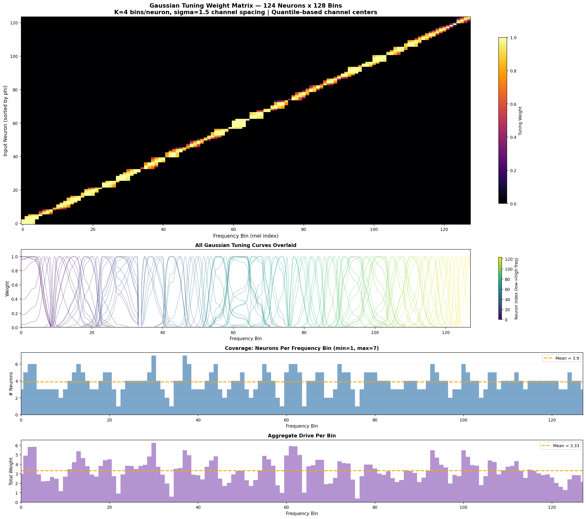

**Caption.** Tonotopic mapping of 128 mel-frequency bins to input-shell neurons via Gaussian tuning curves. Each neuron selects its K=4 nearest bin centers; weights follow a Gaussian kernel with sigma = 1.5 x mean neuron spacing. Achieves 128/128 bin coverage with mean weight 0.859.

---

### Figure 3 --- Input Parameter Grid Search

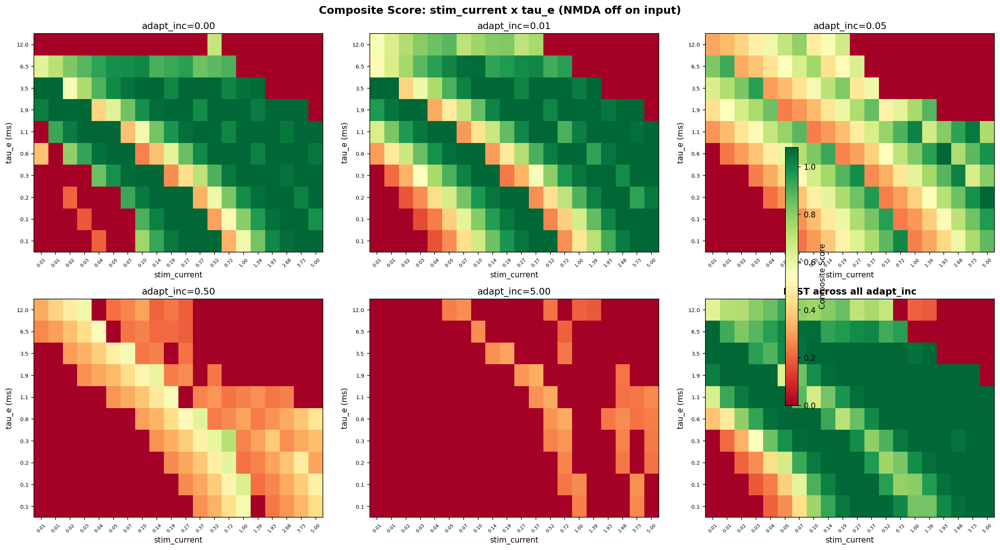

**Caption.** 8,000-point grid search over input neuron parameters (stim_current x tau_e x adapt_inc x STD). Heatmaps show the composite score landscape. The optimal region occupies a narrow band along a constant-rate isocline at ~80--95 Hz, with MI peaking at ~1.06 bits. Top-ranked configuration: stim_current = 0.0518 nA, tau_e = 1.05 ms, adapt_inc = 0.0.

---

### Figure 4 --- Task Structure Schematic

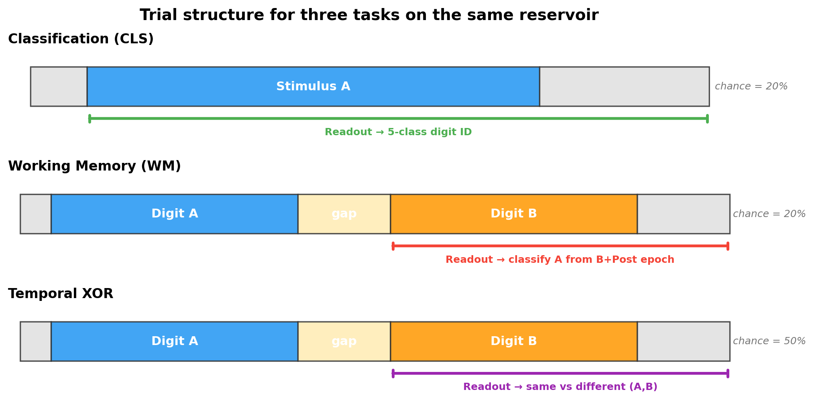

**Caption.** Trial structure for the three tasks sharing one reservoir. Classification (CLS) uses a single stimulus. Working memory (WM) presents digit A, a 150 ms silent gap, then interfering digit B; the readout must identify A from B+Post activity only. Temporal XOR classifies whether A and B are same or different from B+Post activity. All tasks use the same 20 x 15 adaptation parameter grid.

---

## Part II: Triple Dissociation (Sections 4--5)

---

### Figure 5 --- Dissociation Analysis


**Caption.** Statistical verification of the triple dissociation across CLS, WM, and XOR. Bootstrap distributions of optimal adapt_inc show zero overlap between task optima (Kruskal-Wallis H = 29,522, p ~ 0). The ordering CLS < XOR < WM holds at every tau slice (Friedman chi-squared = 14.0, p = 0.0009).

---

### Figure 6 --- Adaptation Sweep Heatmaps


**Caption.** Accuracy heatmaps across the 20 x 15 (adapt_inc x adapt_tau) grid for CLS, WM, and XOR. Task optima occupy distinct regions: CLS peaks at low inc (~0.03--0.07), XOR at weak-to-moderate inc (~0.05--0.07), WM at moderate-to-strong inc (~0.17). All tasks prefer long tau (3,000--5,000 ms).

---

### Figure 7 --- CLS/WM Pareto Frontier

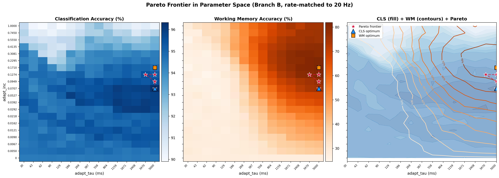

**Caption.** Pareto frontier for CLS x WM accuracy (Branch B). Only 5 of 300 grid points are Pareto-optimal. The frontier is asymmetric: moving from CLS-optimal to WM-optimal costs CLS only 1.49 pp while gaining WM 6.61 pp. CLS at the WM optimum (94.84%) still exceeds CLS at zero adaptation (94.50%).

---

## Part III: Temporal Decomposition and Spiking Regimes (Sections 6--9)

---

### Figure 8 --- Per-Bin Accuracy Traces


**Caption.** Per-bin classification accuracy profiles across adaptation levels. Low adaptation produces high peak-epoch accuracy with rapid decay (temporally diverse). High adaptation flattens the profile: late bins rise from chance to 43--57% but temporal diversity collapses (profile std: 19.1% to 1.9%). The full-feature classifier needs diverse temporal patterns; adaptation destroys this diversity.

---

### Figure 9 --- Per-Bin Sign Flip


**Caption.** The sign flip: more adaptation increases mean per-bin accuracy (positive slope, R-squared = 0.52) but decreases overall CLS accuracy (negative slope, R-squared = 0.51). The WM-optimal configuration wins in every temporal epoch individually yet loses overall CLS by 1.49 pp because the late-bin gains are redundant, not complementary.

---

### Figure 10 --- Temporal Encoding Trade-off


**Caption.** Two opposing effects of adaptation on classification. Effect 1 (positive): peak-epoch discrimination rises from 63.6% to 74.8%. Effect 2 (negative): temporal feature diversity collapses, shrinking the integration bonus from 55.5 pp to 31.8 pp. The CLS optimum at inc=0.07 balances these effects; above inc=0.13, diversity loss dominates.

---

### Figure 11 --- ISI CV Regime Dynamics


**Caption.** ISI coefficient of variation reveals two spiking regimes. Regime 1 (burst-pause, ISI CV > 2.1, inc ~ 0.01--0.10): burstier firing improves discrimination (r ~ +0.95). Regime 2 (adapted steady-state, ISI CV < 2.0, inc > 0.15): residual burstiness hurts (r ~ -0.95). The sign reversal at ISI CV ~ 2.1 marks the representational format switch from spike code to conductance code.

---

### Figure 12 --- Variance Decomposition

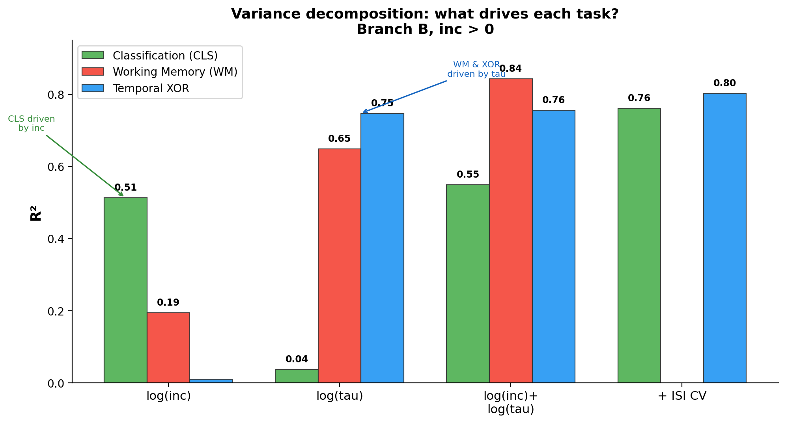

**Caption.** Variance decomposition of task accuracy by adaptation parameters and ISI CV. CLS is dominated by inc (R-squared = 0.51, negative). WM is dominated by tau (R-squared = 0.65, positive). XOR is almost entirely driven by tau alone (R-squared = 0.75). Adding ISI CV to the inc+tau model yields large incremental R-squared for CLS (+0.21) but ISI CV captures residual spike-pattern variation beyond the raw parameters.

---

## Part IV: Mechanistic Interpretability (Section 10)

---

### Figure 13 --- Mechanistic Interpretability Overview

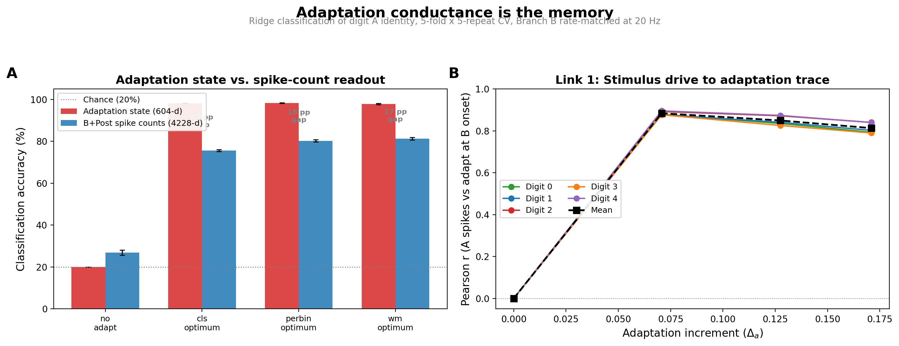

**Caption.** Headline result: 604-dimensional adaptation conductance at B onset predicts digit-A identity at 97.9--98.3% accuracy, vastly exceeding spike-count readout recovery (75.6--81.3%). The adaptation conductance is the memory substrate; the spike code is a lossy readout channel.

---

### Figure 14 --- Readout Weight Structure

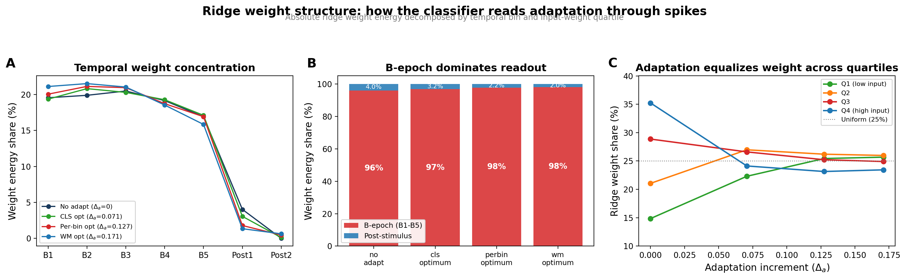

**Caption.** Ridge classifier weight distribution across temporal bins and input-weight quartiles. The classifier concentrates 96--98% of weight on B-epoch bins. Adaptation equalizes allocation across input-weight quartiles: without adaptation, Q4 carries ~36% while Q1 carries ~16%; at WM optimum, all quartiles converge toward 25%.

---

### Figure 15 --- Population Equalization

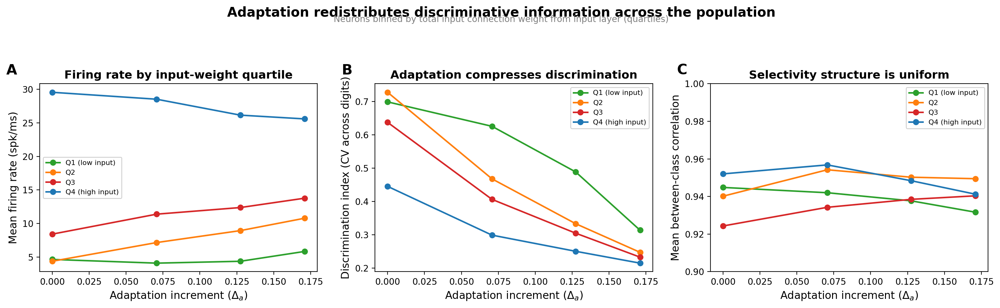

**Caption.** Adaptation compresses firing rate inequality via activity-dependent negative feedback. Q4 (strongest input) is suppressed (29.5 to 25.6 spk/ms); Q1--Q2 are recruited (Q2: 2.5x increase). Firing rate Gini drops from 0.74 to 0.47; top-10% spike share drops from 58.3% to 31.8%.

---

### Figure 16 --- Representation Structure (PCA)

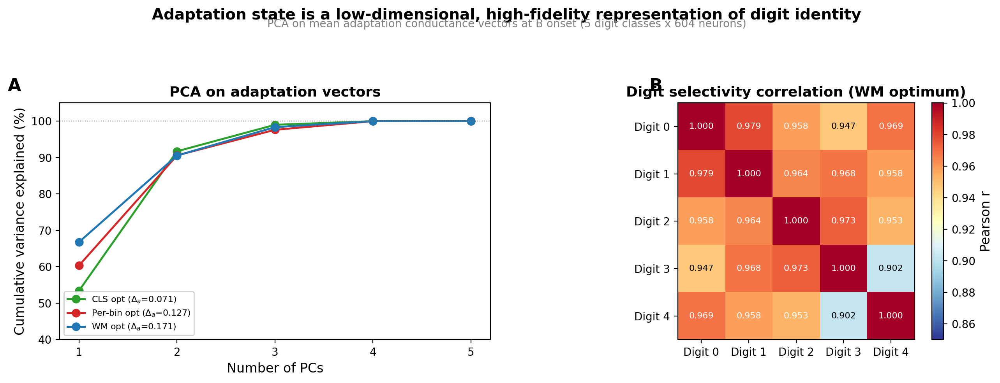

**Caption.** PCA on 5-class mean adaptation vectors. Two principal components capture >95% of variance. The representation is low-dimensional but perfectly linearly separable --- each digit class occupies a distinct region with no overlap.

---

### Figure 17 --- Computational Mode Switch

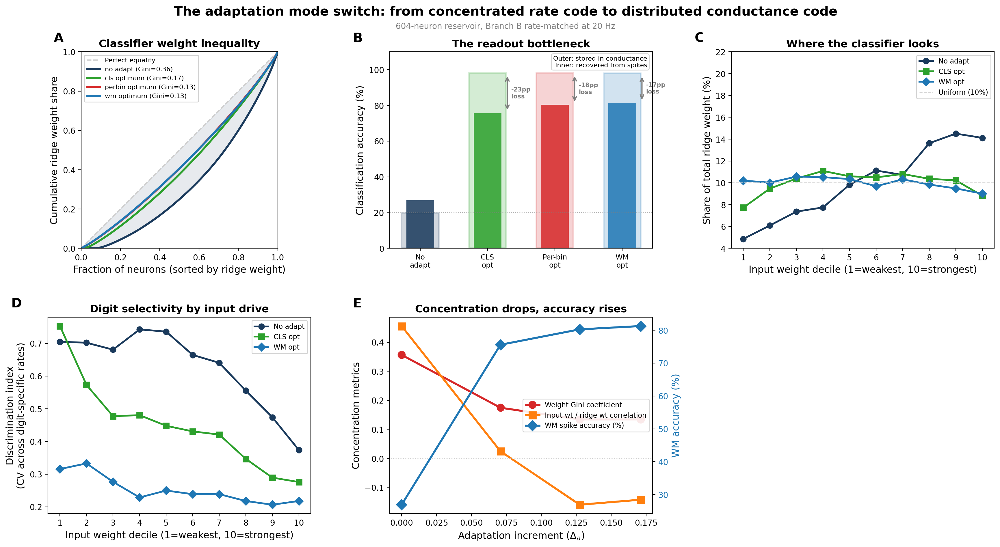

**Caption.** The mode switch from concentrated rate code to distributed conductance code. Without adaptation, the classifier relies on a few strongly-driven neurons (Weight Gini = 0.52, input/ridge correlation = +0.60). With adaptation, weight distributes uniformly (Gini = 0.31, correlation = +0.11). The switch is both temporal (transient vs persistent) and spatial (concentrated vs distributed).

---

### Figure 18 --- Spike Rasters at Diagnostic Points

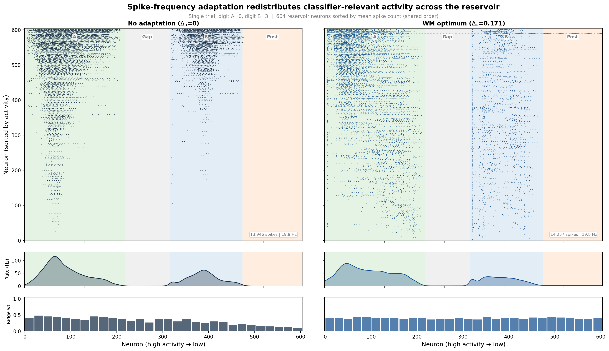

**Caption.** Spike rasters at four diagnostic adaptation levels (no_adapt, CLS optimum, per-bin optimum, WM optimum), all at tau=5000, Branch B. Visual comparison shows the transition from irregular, stimulus-locked bursting (low adaptation) to regularized, persistent firing (high adaptation).

---

### Figure 19 --- Adaptation Conductance Heatmap

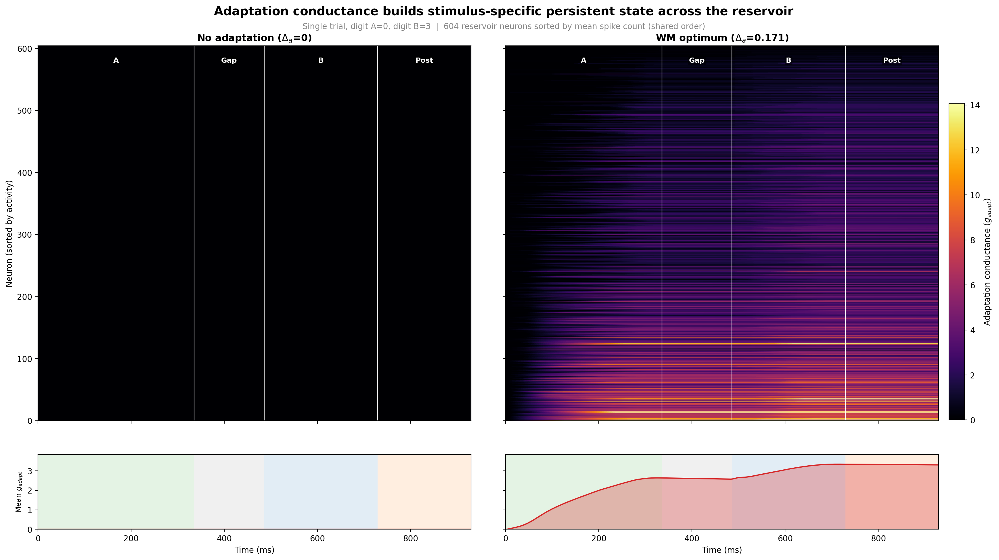

**Caption.** Neuron x time heatmap of adaptation conductance for a single compound trial (digit A=0, digit B=3), comparing no_adapt (left) vs WM optimum (right). Without adaptation, the conductance state is uniformly zero. At the WM optimum, adaptation builds during stimulus A (concentrated in high-activity neurons), persists through the 150 ms silent gap with minimal decay, and carries a digit-A-specific spatial pattern into the B epoch. Mean population g_adapt (bottom panels) shows the characteristic ramp-and-hold dynamics: monotonic rise during A, plateau through the gap, continued integration during B. This directly visualizes the conductance memory trace described in Section 10.1.

---

### Figure 20 --- Adaptation Profile Persistence

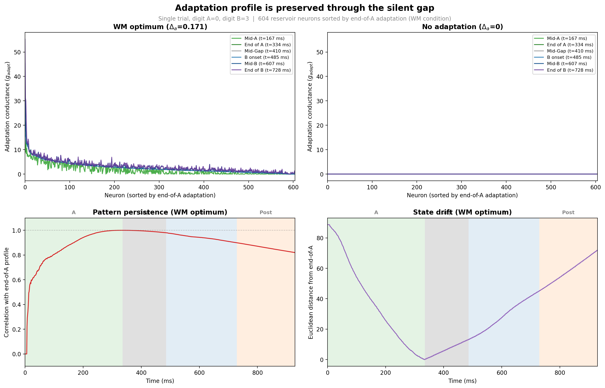

**Caption.** Sorted adaptation conductance profiles at key timepoints within a single compound trial at the WM optimum. (Top left) WM optimum: the neuron-by-neuron adaptation profile at end-of-A (dark green) is nearly identical to mid-gap (gray), quantifying the memory persistence visible in Figure 19. At B onset (blue), the profile begins reshaping as digit B drives new activity. (Top right) No adaptation: flat at zero. (Bottom left) Pearson correlation between the instantaneous adaptation profile and the end-of-A reference stays above 0.95 through the entire gap, dropping only during B. (Bottom right) Euclidean distance from the end-of-A state: minimal drift during the gap, monotonic increase during B.

---

### Figure 21 --- WM Trial: Spike Raster, Adaptation Heatmap, and Population Traces

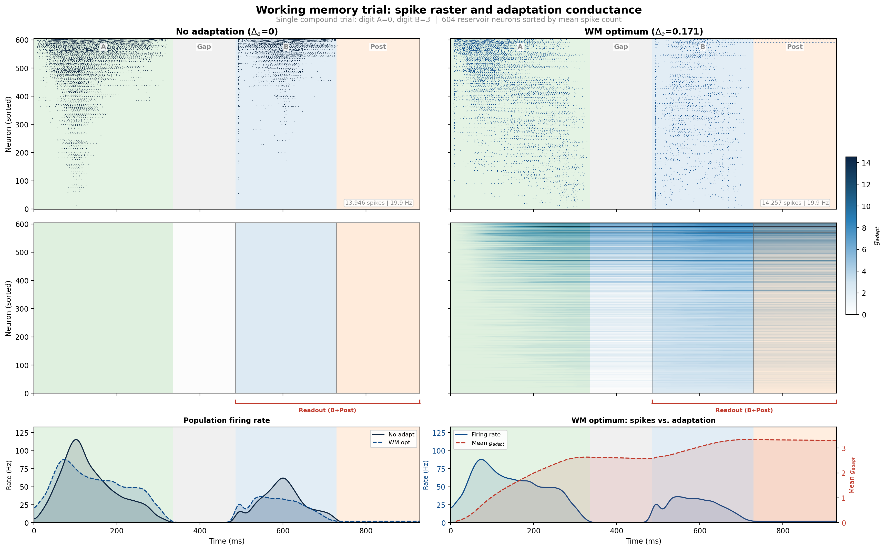

**Caption.** Comprehensive single-trial view of the working memory mechanism. (Top) Spike rasters for no_adapt (left) and WM optimum (right), showing similar rate-matched activity. (Middle) Per-neuron adaptation conductance heatmap: uniformly zero without adaptation; at WM optimum, conductance builds during A, persists through the 150 ms gap, and carries into the readout window (B+Post, red bracket). (Bottom left) Superimposed PSTHs confirm rate matching --- both conditions produce near-identical population firing rates. (Bottom right) WM optimum dual-axis overlay: the firing rate (blue) drops during the gap while the adaptation conductance (red, dashed) plateaus, directly visualizing how the conductance code persists where the spike code vanishes.

---

### Figure 22 --- Calibration Controls

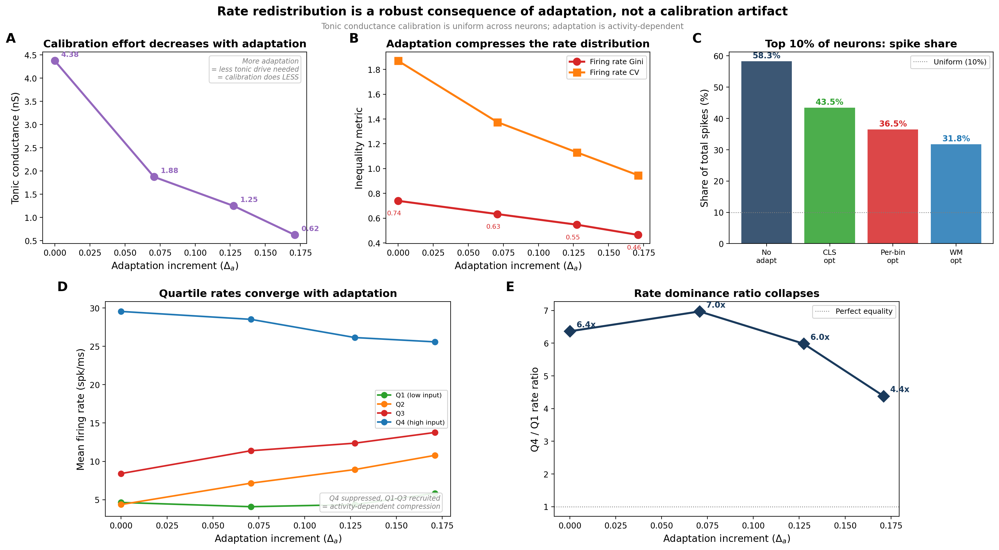

**Caption.** Five calibration controls confirm population equalization is adaptation-driven, not a rate-matching artifact. Tonic conductance is uniform across neurons and decreases with adaptation (strongest at no_adapt). Firing rate Gini, top-10% spike share, and Q4/Q1 dominance ratio all drop monotonically with increasing adaptation.

---

## Part V: The Encode-and-Integrate Pipeline (Section 11)

---

### Figure 23 --- Hidden State Trajectories

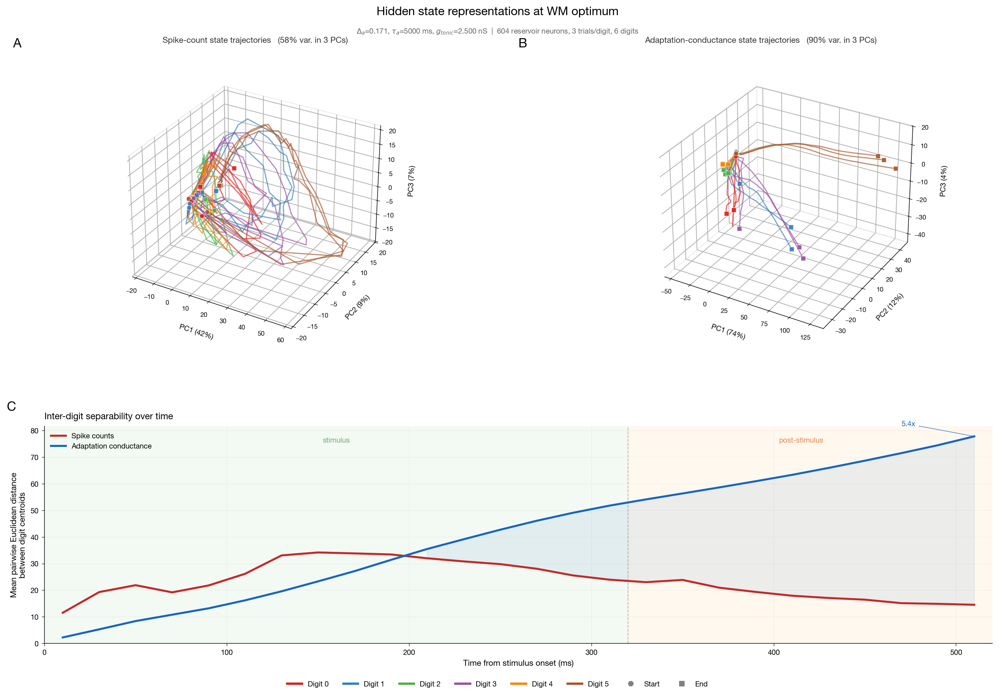

**Caption.** PCA trajectories of spike-count and adaptation-conductance vectors at WM optimum (inc=0.171, tau=5000). Spike-count trajectories (68% variance in 3 PCs) are high-dimensional and tangled. Adaptation-conductance trajectories (96% in 3 PCs) are low-dimensional and clean, diverging monotonically into well-separated digit-class endpoints. Mean pairwise distance: spikes peak at ~20 units then collapse; adaptation rises to ~80 units (4x) and never declines. The crossover is the encode-and-integrate handoff.

---

### Figure 24 --- Crossover Sweep: Four-Panel Summary

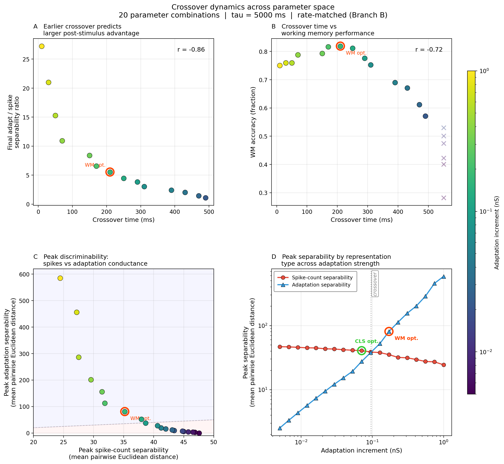

**Caption.** 140-point crossover sweep (20 inc x 7 tau). The crossover time --- where adaptation-conductance separability exceeds spike-count separability --- depends only on inc, forming vertical bands in the heatmap (tau-invariant within +/-1 bin). At inc=0.095 (ISI CV boundary), crossover = 290 ms and the two separabilities are equal. The crossover unifies the ISI CV regime boundary, per-bin sign flip, Pareto asymmetry, and readout bottleneck as manifestations of a single variable.

---

### Figure 25 --- Crossover Scatter

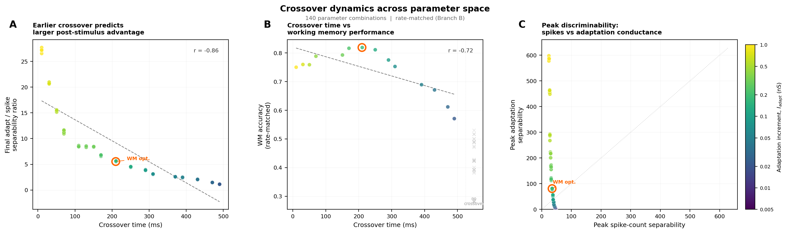

**Caption.** Crossover time vs adaptation increment. The relationship is monotonically decreasing: higher inc shifts the handoff from spike code to conductance code earlier in the trial. At inc=0.071 (CLS optimum), crossover = 310 ms (mid-stimulus). At inc=0.171 (WM optimum), crossover = 210 ms (early stimulus). At inc=1.0, crossover occurs in the first bin.

---

## Part VI: Variable Gap Length Sweep (Section 12)

---

### Figure 26 --- Gap Sweep: Six-Panel Overview

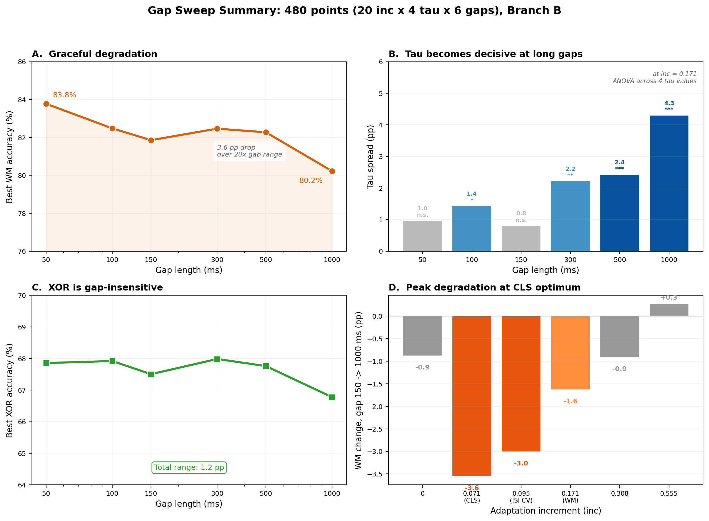

**Caption.** 480-point gap sweep (20 inc x 4 tau x 6 gap lengths: 50--1,000 ms). (A) Best-per-gap WM envelope drops 3.6 pp across 20x gap range; at fixed inc=0.171 the drop is only 1.6 pp. (B) Tau spread with ANOVA significance: n.s. at gaps <= 150 ms, significant at >= 300 ms (p < 0.01), highly significant at 1000 ms (F=48.2, p < 0.0001). Gray bars = not significant. (C) XOR is gap-insensitive (1.2 pp total range). (D) Peak WM degradation at CLS optimum (inc=0.071, -3.6 pp); WM optimum (inc=0.171) degrades only -1.6 pp.

---

### Figure 27 --- WM Heatmaps Across Gap Lengths

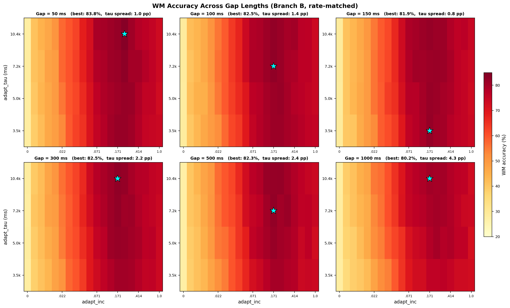

**Caption.** WM accuracy heatmaps (inc x tau) at each gap length. At short gaps (50--150 ms), tau is irrelevant (spread < 1 pp). At gap=1000 ms, tau spread reaches 4.30 pp at inc=0.171, with tau=10,380 outperforming tau=3,470 by 4.3 pp. Tau (Axis 2: retention duration) becomes operative only when memory demand exceeds the trace lifetime.

---

### Figure 28 --- WM Combined Heatmap with Optima Overlay

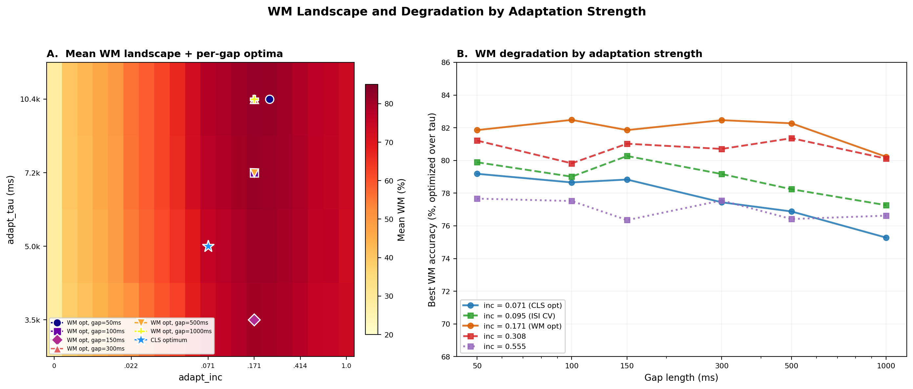

**Caption.** (A) Mean WM accuracy landscape with per-gap optima overlaid (colored dots). CLS optimum shown as blue triangle. At gap=50 ms, faster integration is favored (inc=0.230); at gaps >= 100 ms, inc stabilizes at 0.171 while preferred tau shifts toward 10,380 ms. (B) WM degradation curves by adaptation strength: the CLS optimum (inc=0.071) suffers the steepest decline, while the WM optimum (inc=0.171) is robust.

---

### Figure 29 --- Adaptation Conductance at B Onset vs WM Accuracy

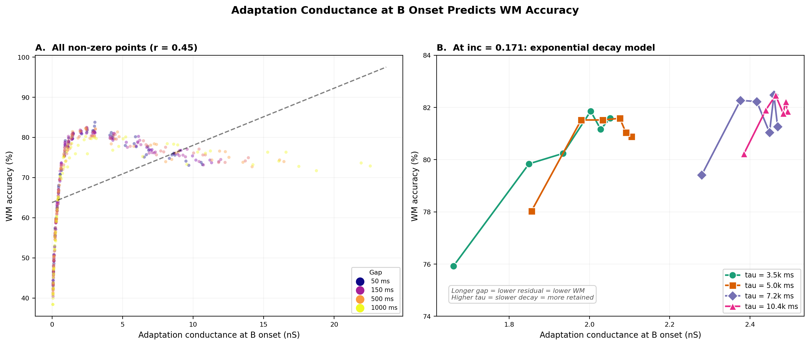

**Caption.** (A) Residual adaptation conductance at B onset predicts WM accuracy across all 456 non-zero grid points (r = 0.45; moderate because inc and tau affect WM through different mechanisms). Gap-length colors show that longer gaps shift the cloud leftward (lower residual) and downward (lower WM). (B) At fixed inc=0.171, each tau line traces a monotonic decrease as gap lengthens and the conductance residual decays exponentially. The 4 tau lines fan apart at low residuals (long gaps), directly visualizing Axis 2 (retention duration) becoming operative. This confirms the mechanistic claim from Section 10: the adaptation conductance is the memory substrate, and WM accuracy is gated by how much of it survives to B onset.

---

### Figure 30 --- Extended Gap Sweep: WM Retention Curves by Tau

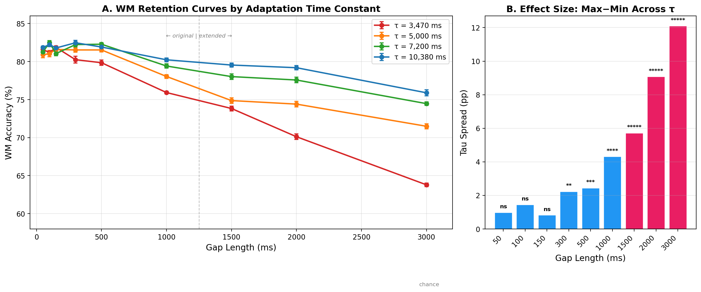

**Caption.** Extended gap experiment (12 points: inc=0.171, 4 tau, gaps 1500/2000/3000 ms) combined with original gap sweep data. (A) WM retention curves by adaptation time constant across 50--3000 ms gaps. At short gaps (≤150 ms), all four tau curves overlap. As gap increases, the curves fan apart: at gap=3000 ms, tau=3,470 collapses to 63.8% while tau=10,380 retains 75.9% — a 12.1 pp spread with perfectly monotonic tau ranking at every gap ≥ 300 ms. (B) Tau spread (max−min across tau values) grows monotonically from 0.8 pp at gap=150 ms to 12.1 pp at gap=3000 ms, confirming the continuous transition from tau-degenerate to tau-decisive as memory demand increases.

---

### Figure 31 --- Ablation Study: Isolating SFA


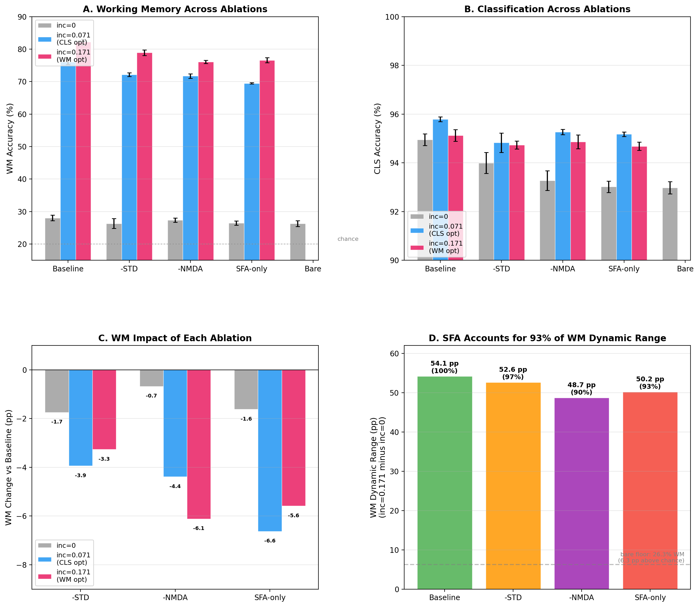

**Caption.** Ablation of short-term depression (STD) and recurrent NMDA, independently and in combination. (A) WM accuracy across 5 conditions at 3 adaptation levels. The dissociation (WM peaks at inc=0.171, CLS peaks at inc=0.071) is preserved in every condition. (B) CLS is ablation-insensitive (93--96% range). (C) WM change vs baseline: STD removal costs 1.7--3.3 pp, NMDA removal costs 0.7--6.1 pp. NMDA's effect is a within-stimulus encoding quality contribution, not a gap-crossing memory effect (it also affects CLS). (D) SFA-only preserves 93% of the baseline WM dynamic range (50.2 of 54.1 pp), confirming that adaptation alone is sufficient for the mode switch.

---

### Figure 32 --- Multi-Seed Replication: 10 Independent Topologies

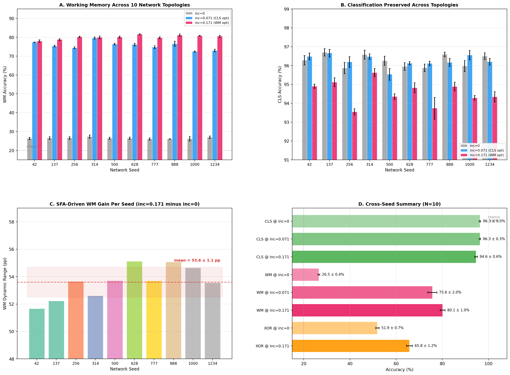

**Caption.** Replication of the SFA-driven CLS/WM dissociation across 10 independently constructed network topologies (seeds 42–1234, reservoir sizes 588–643 neurons). (A) WM accuracy per seed at three adaptation levels. All 10 seeds show the same pattern: WM near chance at inc=0, rising to 78–82% at inc=0.171. (B) CLS accuracy is preserved across all seeds and adaptation levels (93.6–96.7%). (C) WM dynamic range (inc=0.171 minus inc=0) per seed. Mean = 53.6 ± 1.1 pp (CV = 2.1%), with no seed below 51.7 pp. (D) Cross-seed summary statistics (N=10). The dissociation is topology-invariant: 10/10 PASS, p < 0.001 under the null hypothesis of topology-dependence.

---

## Supplementary Figures

---

### Figure S1 --- Sweep Branch A (Unmatched)


**Caption.** Adaptation sweep results for Branch A (unmatched --- natural firing rate, no tonic conductance). Compare with Branch B (Figure 6) to verify that the triple dissociation survives rate clamping.

---

### Figure S2 --- Sweep Branch B (Rate-Matched)


**Caption.** Adaptation sweep results for Branch B (rate-matched --- reservoir clamped to 20 Hz via tonic conductance). The dissociation is preserved under rate matching, confirming it reflects adaptation dynamics rather than rate effects.

---

### Figure S3 --- Branch A Rate vs Accuracy


**Caption.** Relationship between natural firing rate (Branch A) and task accuracy. Demonstrates that firing rate alone does not explain the dissociation pattern.

---

### Figure S4 --- BSA Encoding Comparison


**Caption.** Comparison of BSA spike encoding fidelity across conditions. Verifies that the input encoding (MI = 1.06 bits) is preserved across all adaptation parameter settings.

---

### Figure S5 --- Python-to-C++ Behavioral Verification


**Caption.** Behavioral validation of the C++ port against the original Python implementation. Per-sample spike count correlation r = 0.992; KS test p = 0.874; accuracy gap = 2.4 pp (< 1 sigma). Verdict: statistically equivalent.

---

### Figure S6 --- Input Grid Search: Information Landscape

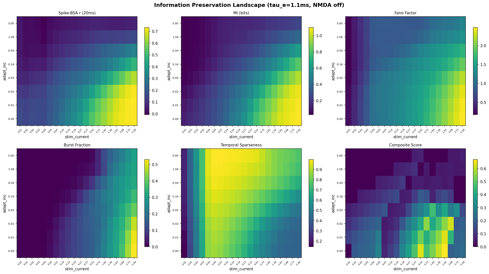

**Caption.** MI landscape across the input parameter grid search. The optimal region forms a narrow band along a constant-rate isocline at ~80--95 Hz.

---

### Figure S7 --- Adaptation Marginal Effect


**Caption.** Marginal effect of adaptation increment on each task, averaged across tau. Confirms the ordering: CLS peaks earliest (lowest inc), XOR intermediate, WM latest (highest inc).

---

### Figure S8 --- Crossover Sweep Detail

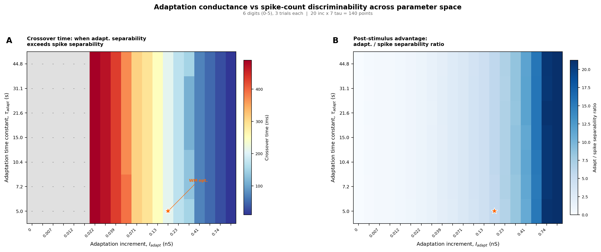

**Caption.** Full crossover sweep heatmap showing crossover time as a function of (inc, tau). Vertical banding confirms tau-invariance of the crossover.

---

### Figure S9 --- Gap Sweep: Three-Panel Summary

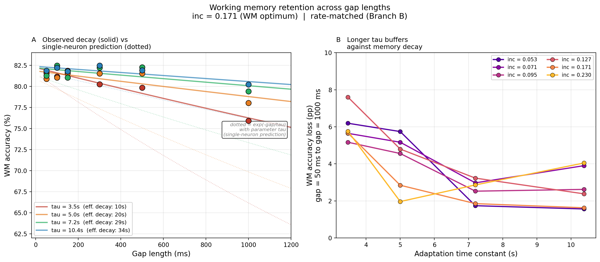

**Caption.** Condensed three-panel view of the gap sweep: WM degradation curve, tau spread growth, and XOR gap-insensitivity.

---

### Figure S10 --- PCA Spectrograms

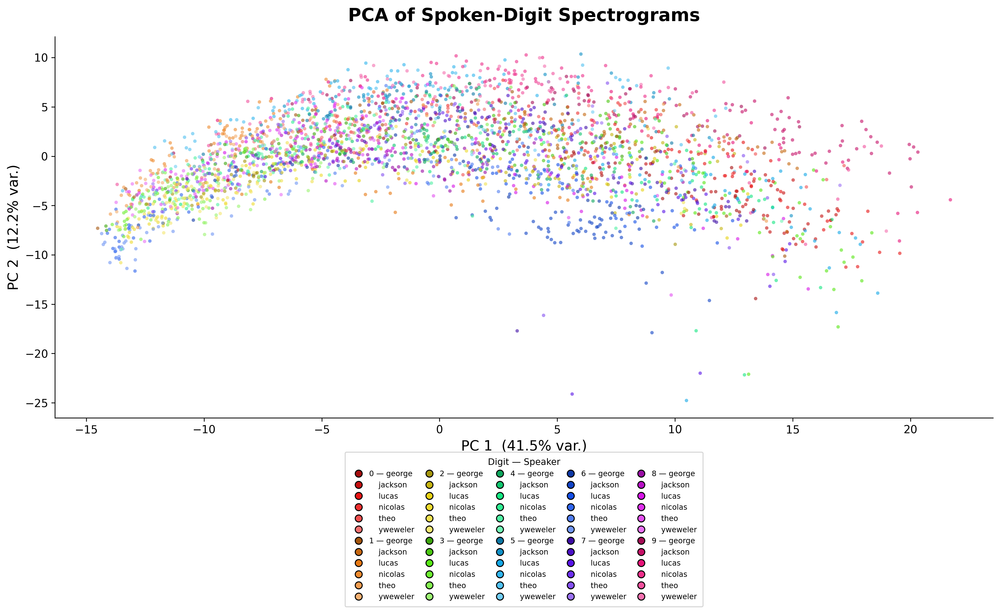

**Caption.** PCA spectrogram analysis of reservoir activity across adaptation levels.

---

### Figure S11 --- Triplet BSA Comparison

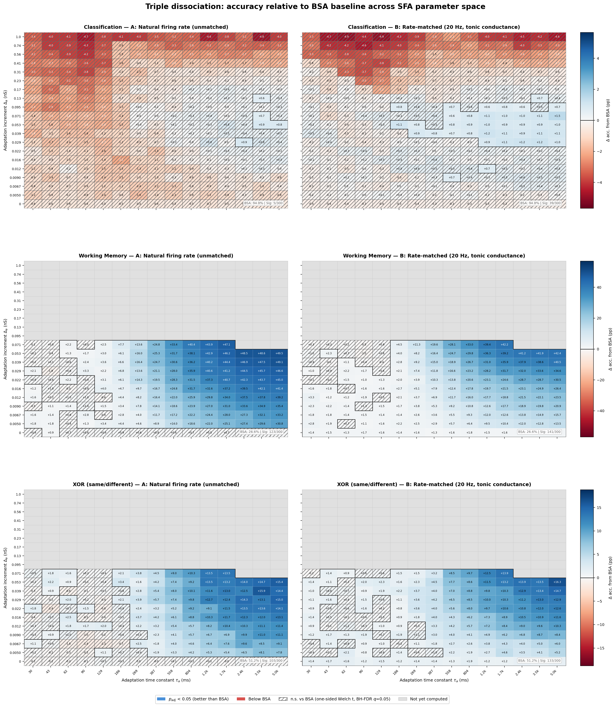

**Caption.** Three-way BSA encoding comparison across task conditions.

---

### Figure S12 --- ISI Heatmap Across Trial

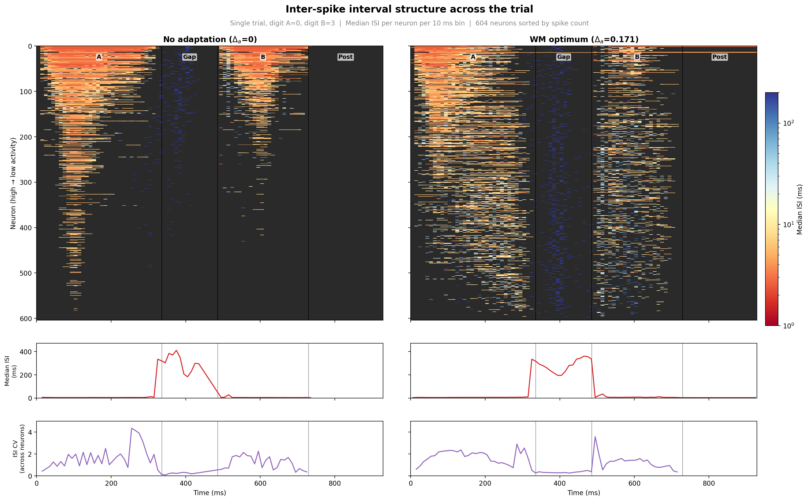

**Caption.** Inter-spike interval structure across a single compound trial, comparing no_adapt (left) vs WM optimum (right). Median ISI per neuron per 10 ms bin is shown on a log color scale (red = short ISI / fast firing, blue = long ISI / slow firing, dark = silent). Without adaptation, ISIs are short during stimuli and silent elsewhere. At the WM optimum, adaptation regularizes spiking (ISI CV drops during stimuli) and sustains activity through the gap at longer inter-spike intervals — consistent with the burst-pause to adapted-steady-state regime transition described in Section 7.2.

---

---

## Methods Summary for Reproducibility

### Network

604-neuron LIF reservoir embedded in a 3D sphere. Conductance-based synapses (AMPA, NMDA with Mg2+ block, GABA-A, GABA-B). Spike-frequency adaptation via AHP current with parameters (adapt_inc, adapt_tau). Short-term depression on excitatory recurrent synapses (Tsodyks-Markram, U=0.1, tau_rec=500 ms). Distance-dependent delays. Topology loaded from `network_snapshot.npz` for deterministic structure.

### Input encoding

BSA-encoded spoken digits (TI-46 corpus, 5 digits x 300 samples). 128 mel-frequency bins mapped to input-shell neurons via Gaussian tuning curves (K=4 nearest bins, sigma=1.5x mean spacing). Stimulus current 0.0518 nA, tau_e=1.05 ms, no adaptation on input neurons.

### Adaptation sweep (Figures 5--12)

20 x 15 grid: adapt_inc (0 + 19 log-spaced 0.005--1.0) x adapt_tau (15 log-spaced 30--5000 ms) = 300 points. Two branches: A (unmatched rate) and B (tonic conductance calibrated to 20 Hz). Each point: 1500 CLS samples (48 bins x 604 neurons), 2500 WM/XOR pairs (7 bins x 604 neurons). Readout: one-vs-rest ridge regression, dual-form Cholesky, 5-fold x 5-repeat stratified CV, alpha in {0.01, 0.1, 1, 10, 100, 1000}.

### Mechanistic interpretability (Figures 13--22)

4 diagnostic points at tau=5000 (no_adapt, CLS opt, per-bin opt, WM opt), Branch B. 100 compound A+gap+B trials. Adaptation conductance vector (604-D) recorded at B onset. Ridge classifier trained on adaptation state vs spike counts separately. Per-neuron adaptation conductance time series recorded at 1 ms resolution for single-trial visualization (Figures 19--21).

### Crossover sweep (Figures 23--25)

140 points (20 inc x 7 tau). 18 trials (3 per digit x 6 digits) at WM optimum. Spike-count and adaptation-conductance vectors recorded per 20 ms bin. Crossover = first bin where mean pairwise Euclidean distance between digit-class centroids is higher for adaptation than spikes.

### Ablation study (Figure 31)

13 conditions: 5 ablation states (baseline, -STD, -NMDA, SFA-only, bare) x 3 adaptation levels (inc=0, 0.071, 0.171), minus 2 redundant bare conditions. All at tau=5000, Branch B (rate-matched), gap=150 ms. 1500 CLS samples + 2500 WM/XOR pairs per condition, 5-fold x 5-repeat CV.

### Gap sweep (Figures 26--30)

480 points: 20 inc x 4 tau (3470, 5000, 7200, 10380 ms) x 6 gaps (50, 100, 150, 300, 500, 1000 ms). Branch B only. 2500 WM/XOR pairs per point, 5-fold x 5-repeat CV. Statistical tests: one-way ANOVA across 4 tau values (5 repeats each) at each gap length. Extended by a targeted 12-point experiment: 1 inc (0.171) x 4 tau x 3 gaps (1500, 2000, 3000 ms), same CV protocol.

### Software

C++17 (Makefile, -O3, LAPACK/BLAS, zlib, OpenMP). Python 3 for analysis (numpy, pandas, matplotlib, scipy). Plotting scripts in `experiments/`. Data: `data/` symlink to BSA spike trains (~7 GB).

### Reproduction

```bash
make && ./cls_sweep --n-workers 8           # CLS sweep
./cls_sweep --wm-sweep --n-workers 8        # WM/XOR sweep
./cls_sweep --mech-interp --n-workers 8     # Mechanistic interp
./cls_sweep --mech-raster --n-workers 8     # Raster + adaptation snapshots (Figs 18-20, S12)
./cls_sweep --hidden-states --n-workers 8   # Hidden state trajectories
./cls_sweep --crossover-sweep --n-workers 8 # Crossover sweep
./cls_sweep --gap-sweep --n-workers 8       # Gap sweep (original)
./cls_sweep --gap-sweep-ext --n-workers 8   # Extended gap sweep (1500-3000 ms)
python3 experiments/plot_gap_sweep.py       # Regenerate Section 12 figures
python3 experiments/plot_gap_sweep_ext.py   # Regenerate Figure 29
./cls_sweep --ablation --n-workers 8        # Ablation study
python3 experiments/plot_ablation.py        # Regenerate Figure 31
./cls_sweep --multi-seed --no-snapshot --n-workers 10  # Multi-seed replication
python3 experiments/plot_multi_seed.py      # Regenerate Figure 32
python3 experiments/plot_adapt_raster.py    # Regenerate Figure 19
python3 experiments/plot_adapt_profiles.py  # Regenerate Figure 20
python3 experiments/plot_wm_raster_adapt.py # Regenerate Figure 21
python3 experiments/plot_isi_heatmap.py     # Regenerate Figure S12
```

*End of figure index. All paths are relative to the repository root.*
