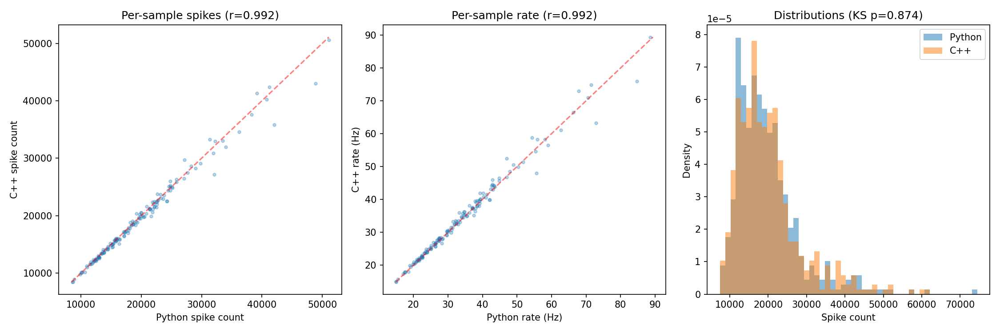

# Classification Adaptation Sweep (C++ Port)

A high-performance C++ port of a Liquid State Machine (LSM) reservoir computing system for spoken digit classification. Sweeps across spike-frequency adaptation (SFA) parameters to study how adaptation dynamics affect classification accuracy.

## What it does

1. Loads BSA-encoded audio spike trains (digits 0-4, 500 samples per digit)
2. Builds a 1000-neuron LIF spiking network arranged in a 3D sphere with conductance-based synapses (AMPA, GABA, NMDA)
3. Establishes a baseline firing rate from an LHS-021 reference configuration
4. Sweeps a 159-point grid over `(adaptation_increment, adaptation_tau)`, rate-matching each point via binary search calibration
5. Classifies reservoir activity using SVD-based ridge regression (one-vs-rest, 60/40 stratified split x 5 repeats)
6. Outputs per-point accuracy, ISI CV, participation ratio, and per-bin accuracy as JSON

## The network

The reservoir is a **1000-neuron Leaky Integrate-and-Fire (LIF)** spiking network embedded in a 3D sphere. Neurons are positioned uniformly inside the sphere, and connection probability falls off with Euclidean distance.

**Neuron model.** Each neuron has conductance-based synapses with three excitatory channels (fast AMPA, slow NMDA with voltage-dependent Mg2+ block) and two inhibitory channels (fast GABA-A, slow GABA-B for designated slow-inhibitory neurons). Spike-frequency adaptation (SFA) is modeled as a potassium-like afterhyperpolarization current with per-neuron `adaptation_increment` and `tau_adaptation`. All biophysical parameters (resting potential, threshold, time constants, etc.) are jittered across neurons using Gaussian or log-normal distributions and clipped to biologically plausible ranges.

**Topology.** The sphere is divided into two functional zones:

- **Input shell** — excitatory neurons on the outer surface, arranged into an arc spanning 300 degrees of azimuthal angle. These are tonotopically mapped to 128 mel-frequency bins using k=5 nearest-neighbor overlap, receiving BSA-encoded audio spike trains as excitatory current injections.
- **Reservoir core** — all interior neurons. These receive feedforward input from the shell but do not project back (no feedback in the default connectivity regime). Intra-shell connections are also removed, forcing signal flow inward.

After construction, non-arc shell neurons are compacted out, leaving only the arc input neurons and the reservoir core.

**Synaptic dynamics.** Excitatory recurrent connections in the reservoir undergo short-term depression (STD) with Tsodyks-Markram dynamics (`U = 0.1`, `tau_rec = 500 ms`), reducing synaptic efficacy with repeated presynaptic firing. Transmission delays are distance-dependent, delivered via a ring buffer.

**Snapshot loading.** By default, the network is loaded from a Python-exported `.npz` snapshot (`network_snapshot.npz` next to the binary), bypassing all RNG-dependent construction for bit-identical topology across implementations. Use `--no-snapshot` to build from RNG instead, or `--snapshot <path>` to specify a different snapshot file.

## The task

The system performs **5-class spoken digit classification** (digits 0-4) using reservoir computing.

**Input.** Audio recordings are pre-processed offline into BSA (Ben's Spiker Algorithm) spike trains — each sample is a set of spike times with associated mel-frequency bin indices. 500 samples per digit (2500 total) are loaded from `.npz` files.

**Simulation.** Each audio sample is presented to the network by injecting excitatory current into the mapped input neurons at the corresponding spike times. The network runs for the audio duration plus a 200 ms post-stimulus window (dt = 0.1 ms). Reservoir neuron spikes are recorded at each timestep.

**Feature extraction.** Reservoir spike activity is binned into 20 ms time windows, producing a `(n_bins x n_reservoir)` spike count matrix per sample. These are flattened into a single feature vector for classification.

**Classification.** An SVD-based ridge classifier (one-vs-rest with {-1, +1} targets) is trained on 60% of samples and tested on 40%, using stratified shuffle splits repeated 5 times. Ridge regularization alpha is selected from {0.01, 0.1, 1, 10, 100, 1000} by best test accuracy.

**Rate matching.** To isolate the effect of adaptation parameters from trivial firing rate changes, each grid point is calibrated via binary search over stimulus current to match the baseline LHS-021 firing rate (within ±2 Hz).

**Metrics.** Per grid point: classification accuracy (mean/std over 5 repeats), gap vs BSA baseline (paired t-test, bootstrap CI, Cohen's d), firing rate, ISI coefficient of variation, mean adaptation conductance at stimulus end, PCA participation ratio, and per-bin accuracy curves.

## Project structure

```
├── src/
│   ├── inc/
│   │   ├── common.h          # Shared utilities (RNG, Mat, SVD, JSON helpers)
│   │   ├── network.h         # SphericalNetwork (LIF neurons, CSR connectivity, ring buffer)
│   │   ├── builder.h         # Network construction, zone topology, simulation driver
│   │   ├── ml.h              # Ridge classifier, StandardScaler, stratified split, stats
│   │   └── npz_reader.h      # NumPy .npz file reader (ZIP + zlib)
│   └── src/
│       ├── main.cpp           # Sweep driver
│       ├── network.cpp        # Spiking network dynamics and connectivity
│       ├── builder.cpp        # Ring-zone topology, weight overrides, STD, compaction
│       ├── ml.cpp             # ML pipeline and statistical tests
│       └── npz_reader.cpp     # NPZ/NPY parsing
├── docker/
│   └── Dockerfile             # Debian Trixie slim build environment
├── Makefile                   # C++17, -O3, LAPACK/BLAS, zlib, OpenMP
├── dev.sh                     # Docker dev container launcher
└── data/                      # (not tracked) BSA spike train .npz files
    ├── preprocessing_config_bsa.json
    └── spike_trains_bsa/      # ~7 GB, 3000 .npz files
```

## Dependencies

- C++17 compiler (g++ or clang++)
- LAPACK/BLAS (Accelerate on macOS, liblapack/libblas on Linux)
- zlib
- OpenMP (optional, for parallel simulation)

## Build

```bash
make            # produces ./cls_sweep
make clean      # remove binary and object files
```

On macOS, the Makefile auto-detects Accelerate and Homebrew's libomp. On Linux it links against liblapack, libblas, and libgomp.

## Docker (recommended for Linux builds)

```bash
./dev.sh        # builds image and drops you into a dev container
make -j$(nproc) # build inside the container
```

## Usage

```bash
./cls_sweep --arms all --n-workers 8
./cls_sweep --arms original --n-workers 4 --output-dir results/test
```

### Options

| Flag | Description | Default |
|------|-------------|---------|
| `--arms` | Grid arms to run: `all`, `original`, `A`, `E` (comma-separated) | `all` |
| `--n-workers` | Number of OpenMP threads (use ~half your cores) | `8` |
| `--output-dir` | Output directory for results JSON | `results/classification_adaptation_sweep/` |
| `--snapshot` | Path to Python-exported `.npz` network snapshot | `network_snapshot.npz` (auto-detected next to binary) |
| `--no-snapshot` | Force building the network from RNG instead of loading a snapshot | _(off)_ |

## Output

Results are checkpointed after every grid point to `classification_adaptation_sweep_checkpoint.json`, so you can kill and resume safely. The final output is `classification_adaptation_sweep.json`.

Each grid point records: classification accuracy (mean/std), gap vs BSA baseline (with p-value, Cohen's d, CI), firing rate, ISI CV, adaptation level, participation ratio, and per-bin accuracy.

## Estimated time

~5-10 min per grid point at 4 workers. 159 points total ≈ 15-25 hours depending on CPU.

## Behavioral verification (Python vs C++)

Because C++'s `std::mt19937_64` and NumPy's MT19937 produce different random sequences even with identical seeds, the network topology diverges when built from RNG. To verify behavioral equivalence, the Python-built network is exported as an `.npz` snapshot and loaded directly in C++, bypassing all C++-side network construction. Both implementations then apply identical LHS-021 parameter overrides at runtime.

Runtime noise (voltage and current) still differs between implementations (different RNG libraries), so exact spike-by-spike match is impossible. The verification instead compares aggregate statistics across 500 audio samples (100 per digit, digits 0-4).

### Results

```
Metric                         Python        C++
------------------------------------------------------
n_samples                         500        497
n_reservoir                       604        604
mean_firing_rate_hz             34.33      35.34
classification_accuracy         88.0%      85.6%
classification_std              0.019      0.020
```

On 155 filename-matched samples (processed by both implementations):

| Metric | Pearson r | KS p-value |
|--------|-----------|------------|
| Per-sample spike count | 0.992 | 0.874 |
| Per-sample firing rate | 0.992 | 0.465 |

The 2.4pp classification gap is within statistical noise (< 1 sigma of the combined classifier variance). The near-perfect per-sample correlation (r = 0.992) confirms that the same audio through the same network produces nearly identical spike counts despite different runtime noise.


