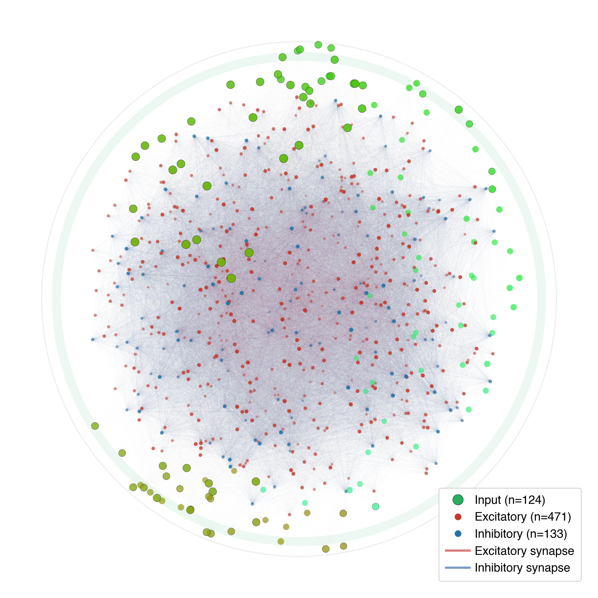

# Liquid State Machine — C++ Port

<p align="center">
  
</p>

A high-performance C++ implementation of a biologically-detailed Liquid State Machine (LSM) for spoken digit classification. This port replicates and extends the Python-based reservoir computing system from `phase_1_Networks_of_LIF_neurons/liquid_state_machine_expanded/`, providing ~100x speedup for parameter sweeps and grid searches.

## The network

The reservoir is a **604-neuron LIF spiking network** (compacted from 1000) embedded in a 3D sphere. Neurons have conductance-based synapses with three excitatory channels (fast AMPA, slow NMDA with voltage-dependent Mg2+ block) and two inhibitory channels (fast GABA-A, slow GABA-B). Spike-frequency adaptation is modeled as a potassium-like afterhyperpolarization current. All biophysical parameters are jittered across neurons.

The sphere is divided into two functional zones:

- **Input shell** — excitatory neurons on the outer surface, arranged into a 300-degree azimuthal arc. These are tonotopically mapped to 128 mel-frequency bins via Gaussian tuning curves (see below).
- **Reservoir core** — interior neurons receiving feedforward input from the shell. Intra-shell and feedback connections are removed, forcing signal flow inward.

Excitatory recurrent connections undergo short-term depression (Tsodyks-Markram, U=0.1, tau_rec=500ms). Transmission delays are distance-dependent via ring buffer.

The network is loaded from a deterministic Python-exported snapshot (`network_snapshot.npz`) for bit-identical topology across implementations.

## Input encoding pipeline

The input encoding pipeline transforms raw audio (WAV files) into spatiotemporally patterned current injection across the reservoir's input shell. Each stage is designed to preserve frequency-specific temporal information while respecting the biological constraints of the spiking network.

### Pipeline stages (WAV to reservoir)

**1. BSA encoding (offline preprocessing)** — Raw WAV files are converted to spike trains via the Ben's Spiker Algorithm (BSA). Each spike has a time (ms) and frequency bin index (0-127, mel-scale). Stored as `.npz` files with arrays `spike_times_ms` and `freq_bin_indices`.

**2. Warmup period** — BSA spike times are shifted forward by 50 ms (`warmup_ms = 50.0` in `run_raster_dump`) to allow the network to settle before stimulus onset.

**3. Tonotopic mapping via Gaussian tuning curves** — Input neurons on the surface shell are mapped to frequency bins through a multi-step process:

- **Quantile-based channel centers.** 128 mel-frequency bin centers are placed at evenly-spaced quantiles of the input neuron phi (azimuthal angle) distribution. This compresses the full frequency spectrum onto the populated arc, eliminating coverage gaps from irregular neuron spacing.
- **K-nearest bins.** Each input neuron selects its K=4 nearest frequency bin centers (by phi distance), guaranteeing uniform receptive field size.
- **Gaussian weighting.** Each mapping gets weight `w = exp(-d² / (2σ²))` where d is the phi-distance between neuron and channel center, and σ = 1.5 × avg_neuron_spacing. Resulting weights: center = 1.0, 1 channel away = 0.80, 2 channels = 0.41, 3 channels = 0.14.
- **Coverage.** K=4 with quantile centers achieves 128/128 bin coverage (every bin has at least one mapped neuron), with mean weight 0.859.
- **Constants** in `src/inc/builder.h`: `OVERLAP_K = 4`, `TUNING_SIGMA_CHANNELS = 1.5`.

**4. Current injection** — During simulation, BSA spikes in frequency bin `m` are injected into all neurons mapped to bin `m`, scaled by their tuning weight: `I = stim_current × w`. The stimulus current is 0.0518 nA (optimized via grid search). NMDA is disabled on input injection (`skip_stim_nmda = true`).

**5. Input neuron dynamics** — Input neurons are LIF neurons with optimized parameters:

- `tau_e = 1.05 ms` — excitatory synaptic time constant; fast decay prevents conductance saturation while preserving temporal structure.
- `adaptation_increment = 0.0` — no spike-frequency adaptation; adaptation destroys temporal information.
- No short-term depression on input (STD U = 0.0).
- These are applied via `apply_input_neuron_regime()` in `builder.cpp`.

**6. Feedforward to reservoir** — Input shell neurons project to reservoir core neurons through the existing distance-dependent connectivity. Shell-to-core weights are scaled by 4.85x (`LHS021_SHELL_CORE_MULT`). Intra-shell and feedback connections are removed.

### Parameter selection

The input neuron parameters (`stim_current`, `tau_e`, `adaptation_increment`, STD) were selected via an 8,000-point grid search (`--input-grid` mode) optimizing mutual information between BSA input and input neuron spike output while enforcing biological plausibility constraints.

**Grid search axes:** `stim_current` (20 log-spaced, 0.01-5.0) × `tau_e` (10 log-spaced, 0.05-12.0 ms) × `adapt_inc` (8 values, 0-5.0) × STD pairs (5 combinations) = 8,000 points × 30 audio samples = 240,000 simulations.

**Scoring:** `score = MI + 0.15 × r@20ms + 0.05 × modulation_depth` with hard biological gates (rate 5-150 Hz, ISI CV 0.3-2.0, refractory fraction < 10%, burst fraction < 15%).

**Optimal parameters** (rank 1, composite score 1.236):

| Parameter | Value | Rationale |
|-----------|-------|-----------|
| `stim_current` | 0.0518 | Drives ~85 Hz firing rate with tau_e=1.05 |
| `tau_e` | 1.05 ms | Fast decay prevents conductance saturation while preserving temporal structure |
| `adapt_inc` | 0.0 | Adaptation smooths spike response, destroying temporal MI; steep drop-off above 0.05 |
| `input_std_u` | 0.0 | STD is weakly harmful at input stage; top 4 configs all have no STD |
| Input NMDA | disabled | Removes slow NMDA dynamics that would blur temporal information |

The top 50 configurations occupy a narrow performance band (score 1.172-1.236) along a constant-rate isocline at ~80-95 Hz, confirming the optimum is robust. MI peaks at ~1.06 bits out of 3.0 theoretical maximum (8-quantile), representing the fundamental information bottleneck of 124 neurons encoding 128 channels through overlapping Gaussian tuning curves.

MI refinement with 20 samples/digit confirmed the initial grid search rankings and showed MI estimates are binning-limited: q8=1.19, q16=1.50, q32=1.93 bits at the top configurations.

### Frequency selectivity verification

Analysis of a single digit presentation (digit 0, "george_0") confirms frequency information propagates through the input layer:

- **Band-rate correlation:** r = 0.982 between BSA and input spike rates across 16 frequency bands.
- **Per-neuron selectivity:** 121/129 neurons (94%) show higher correlation with matched BSA bins than with random unmatched bins.
- **Mean matched r:** 0.91 vs mean unmatched r: 0.50.

**Figures:**

- `results/raster/raster_spike_train_0_george_0.png` — 5-panel figure: mel spectrogram, BSA raster, input shell raster (tonotopically sorted), reservoir raster (sorted by dominant input neuron), population PSTH.
- `results/raster/selectivity_spike_train_0_george_0.png` — 2-panel selectivity analysis: frequency band rates + per-neuron selectivity scatter.
- `results/gaussian_tuning_curves/` — Gaussian tuning coverage overview and single-neuron detail.
- `results/input_grid_search/` — Full grid search results, heatmaps, t-SNE embedding.
- `results/neuron_diagnostics/` — Single-neuron state traces (BSA → conductance → spikes chain).

### Code references

| Component | File | Key constants/functions |
|-----------|------|------------------------|
| Tuning curve construction | `src/src/builder.cpp` | `create_ring_zone_network()`, `load_network_snapshot()` |
| Tuning constants | `src/inc/builder.h` | `OVERLAP_K=4`, `TUNING_SIGMA_CHANNELS=1.5` |
| Input regime defaults | `src/inc/builder.h` | `INPUT_STIM_CURRENT=0.0518`, `INPUT_TAU_E=1.05`, `INPUT_ADAPT_INC=0.0` |
| Input regime application | `src/src/builder.cpp` | `apply_input_neuron_regime()` |
| BSA-to-neuron injection | `src/src/builder.cpp` | `run_sample_with_std()` |
| Grid search | `src/src/input_grid.cpp` | `run_input_grid()`, `run_mi_refine()` |
| Raster dump | `src/src/classification.cpp` | `run_raster_dump()` |
| Selectivity analysis | `experiments/plot_selectivity.py` | Reads from raster dump |
| Raster figure | `experiments/plot_raster.py` | 5-panel publication figure |

## Experiments

### 1. Python-to-C++ behavioral verification

Confirms the C++ port is behaviorally equivalent to the Python implementation — a prerequisite for trusting all downstream experiments. Both implementations run 500 samples through identical topology; per-sample spike count correlation is r = 0.992 and the 2.4pp accuracy gap is within classifier variance.

**Results:** C++ fires at 35.3 Hz (vs 34.3 Hz Python), classifies at 85.6% (vs 88.0%). Statistically equivalent.

**Files:** `results/verification_python_to_cpp/`

### 2. Input neuron regime grid search

The input shell converts continuous BSA spike trains into the reservoir's spiking language — if it destroys frequency information, no downstream processing can recover it. This 8,000-point grid search over `(stim_current, tau_e, adapt_inc, STD params)` finds the input neuron dynamical regime that maximizes mutual information between BSA input and output spikes while staying in a biologically plausible firing regime.

**Results:** Optimal params are `stim=0.0518, tau_e=1.05ms, adapt_inc=0.0, no STD` (composite score 1.236, MI=1.057 bits, r@20ms=0.884, 85 Hz). MI refinement at higher quantile counts (q16: ~1.50, q32: ~1.93) shows the estimate is binning-limited. The top 50 configs form a broad plateau with <0.05 bit spread — the optimum is robust, not fragile.

**Files:** `results/input_grid_search/`

### 3. Top configuration comparison

Visual sanity check — traces a single input neuron (493) through 6 candidate configurations on the same audio sample to verify that the grid search optimum produces qualitatively reasonable membrane dynamics rather than a degenerate regime.

**Files:** `results/top_config_comparison/`

### 4. Single-neuron diagnostics

Detailed state-variable traces (V, g_e, g_i, g_nmda, adaptation, all currents) for input and reservoir neurons at the optimal grid search parameters. Confirms the full BSA→conductance→spike transformation chain works as expected.

**Results:** Input neuron 493 achieves r(g_e, BSA) = 0.920 and r(spike, BSA)@20ms = 0.906 — excitatory conductance faithfully tracks BSA input, and spike output preserves most of that correlation.

**Files:** `results/neuron_diagnostics/`

### 5. Classification adaptation sweep (main experiment)

The core scientific question: does spike-frequency adaptation improve reservoir computation? This 300-point sweep over `(adaptation_increment × adaptation_tau)` — 20 inc × 15 tau — measures 5-class spoken digit classification accuracy. Two branches are run: unmatched (natural rate) and tonic-conductance-matched (rate-controlled at 20 Hz), isolating adaptation dynamics from firing rate confounds.

**Readout:** Dual-form ridge regression (one-vs-rest), 20ms time bins × ~604 reservoir neurons = 36,240 features flattened per sample, 5-fold stratified CV × 5 repeats, best alpha from {0.01, 0.1, 1, 10, 100, 1000}.

**Dual-form ridge:** When n << p (typical for reservoir readout: 1200 train samples × 36,240 features), solving the n×n dual system K = XX^T via Cholesky decomposition (`dposv_`) is ~16.7× faster than the p×p SVD, with identical predictions. The Gram matrix K and test projection K_test are precomputed once per fold; each alpha only requires a Cholesky solve and matrix multiply. See `src/src/ml.cpp` for implementation.

**Files:** `results/classification_adaptation_sweep/`

### 6. Readout method benchmark

Comprehensive comparison of 30+ readout methods on BSA-encoded spike train data to validate the choice of ridge regression for LSM readout. Tests linear methods (Ridge variants, Logistic Regression, Linear SVM, LDA), nonlinear methods (Extra Trees, Random Forest, KNN, HistGBM), and dimensionality reduction pipelines (Truncated SVD + Ridge, PCA + Ridge, coarser time bins).

**Key findings:** Nonlinear methods achieve higher accuracy (Extra Trees 97.1%, KNN k=1 96.5%) but linear readout is the scientifically correct choice for LSM papers — the reservoir should do the nonlinear transformation. Among linear methods, dual-form ridge is optimal: identical accuracy to SVD-based ridge at 3.8–16.7× speedup depending on feature dimensionality.

**Files:** `experiments/readout_benchmark.py`

## Project structure

```
├── src/
│   ├── inc/
│   │   ├── common.h          # RNG, matrix ops, LAPACK (SVD, Cholesky), JSON helpers
│   │   ├── network.h         # SphericalNetwork: LIF dynamics, CSR connectivity, ring buffer
│   │   ├── builder.h         # Network construction, zone topology, tuning curves, sim driver
│   │   ├── ml.h              # Dual-form ridge classifier, StandardScaler, stratified CV, stats
│   │   ├── npz_reader.h      # NumPy .npz file reader (ZIP + zlib)
│   │   └── experiments.h     # Shared constants, types, and helpers for all experiment modes
│   └── src/
│       ├── main.cpp           # CLI parsing and dispatch (~120 lines)
│       ├── input_grid.cpp     # Input neuron grid search + MI refinement
│       ├── classification.cpp # Adaptation sweep, trace, verify, classify, calibrate
│       ├── network.cpp        # Spiking dynamics, conductance updates, stimulation
│       ├── builder.cpp        # Ring-zone topology, Gaussian tuning, weight overrides, STD
│       ├── ml.cpp             # Dual-form ridge (Cholesky), ML pipeline, statistical tests
│       └── npz_reader.cpp     # NPZ/NPY parsing
├── docker/
│   └── Dockerfile             # Debian Trixie slim build environment
├── Makefile                   # C++17, -O3, LAPACK/BLAS, zlib, OpenMP
├── dev.sh                     # Docker dev container launcher
├── network_snapshot.npz       # Deterministic Python-exported network topology
├── experiments/               # Python analysis and figure generation scripts
│   ├── gen_input_diagnostic.py    # 10-panel input neuron diagnostic generator
│   ├── gen_3panel_diagnostic.py   # 3-panel BSA→conductance→spikes diagnostic
│   ├── gen_top_configs.py         # Top grid search config comparison figure
│   ├── plot_input_grid.py         # Grid search results visualization
│   ├── plot_tuning_curves.py      # Gaussian tuning coverage overview figure
│   ├── plot_tuning_detail.py      # Single-neuron tuning detail figure
│   ├── plot_adaptation_heatmap.py # Publication-quality adaptation sweep heatmap
│   └── readout_benchmark.py       # 30+ readout method comparison on BSA data
├── data/                      # symlink → external BSA spike train data (see below)
└── results/
    ├── verification_python_to_cpp/    # Experiment 1
    ├── gaussian_tuning_curves/        # Gaussian frequency tuning curve figures
    ├── network_snapshot/              # Deterministic network topology
    ├── neuron_diagnostics/            # Experiment 4
    ├── input_grid_search/             # Experiments 2 & 3
    └── classification_adaptation_sweep/ # Experiment 5
```

## Build and run

```bash
make                    # produces ./cls_sweep
./dev.sh                # or: build in Docker container

# Adaptation sweep (main experiment)
./cls_sweep --arms all --n-workers 8

# Input neuron grid search (outputs to results/input_grid_search/)
./cls_sweep --input-grid --n-workers 8

# MI refinement of top grid search configs
./cls_sweep --mi-refine --mi-refine-top 50 --mi-refine-samples 20 --n-workers 8

# Single neuron trace (uses optimized input params by default)
./cls_sweep --trace-neuron 493 --trace-file data/spike_trains_bsa/spike_train_0_george_0.npz \
    --trace-output trace.csv --no-noise

# Behavioral verification
./cls_sweep --verify-only --verify-output verify_cpp.json --samples-per-digit 100
```

## Data dependency

The `data/` directory is a symlink to the BSA-encoded audio spike train data produced by the Python preprocessing pipeline in `Spiking-Neural-Network-Experiments/phase_1_Networks_of_LIF_neurons/liquid_state_machine_expanded/data/`. It contains ~3000 `.npz` files (~7 GB) with 500 samples per digit (digits 0-9).

Each `.npz` file has two arrays:
- `spike_times_ms` — spike times in milliseconds
- `freq_bin_indices` — mel-frequency bin indices (0-127), parallel to spike_times_ms

Both the C++ binary and all experiment scripts resolve data through `data/` relative to the project root. To set up on a new machine:

```bash
ln -sf /path/to/liquid_state_machine_expanded/data ./data
```

## Dependencies

- C++17 compiler (g++ or clang++)
- LAPACK/BLAS (Accelerate on macOS, liblapack/libblas on Linux)
- zlib
- OpenMP (optional, for parallel simulation)
- Python 3 with numpy, pandas, matplotlib, scipy (for experiment scripts)
