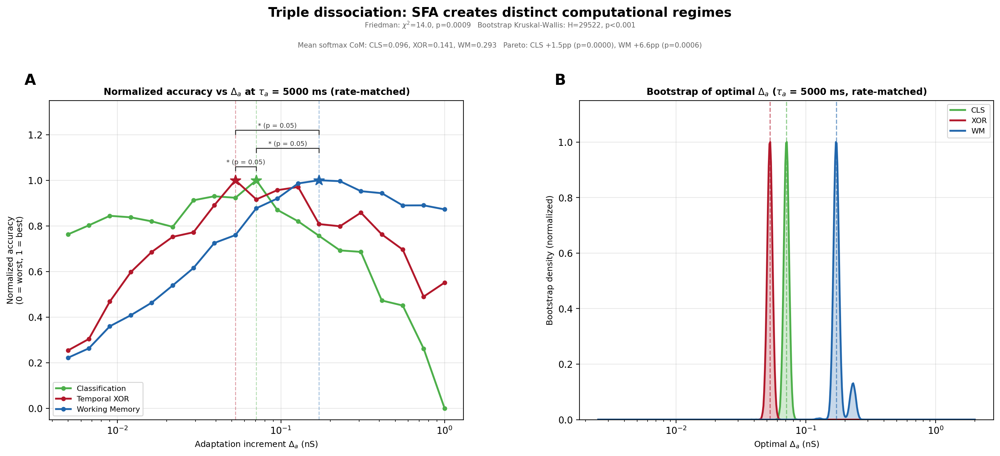
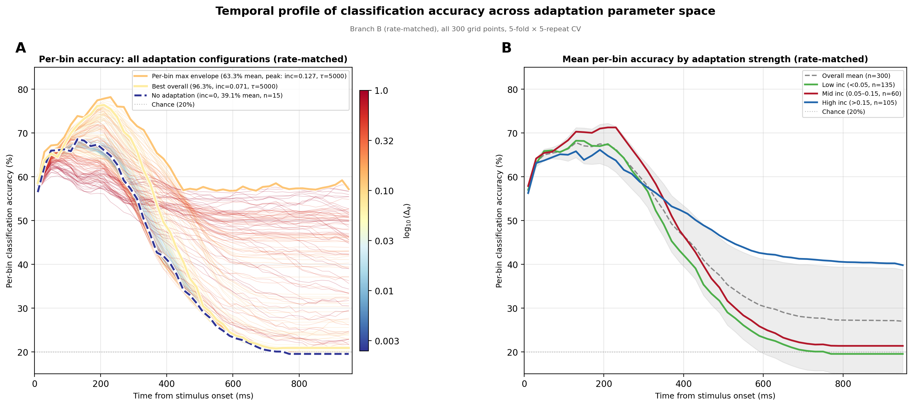

# Spike-frequency adaptation modulates computational mode in a static spiking reservoir

## Results of a joint analysis across classification, working memory, and temporal XOR adaptation sweeps

---

## Statistical verification of the triple dissociation

### Bootstrap of optimal inc (tau=5000 slice, Branch B)

For each of the three tasks, the 5 CV-repeat accuracies at each of the 20 inc values were resampled with replacement 10,000 times. Each bootstrap iteration computes the mean accuracy at every inc value and identifies the argmax. This produces a distribution of "which inc is optimal" per task. CLS landed at inc=0.0707 in 100% of iterations, XOR at 0.0527 in 99.8%, and WM at 0.171 in 87.8% (remainder at 0.2295). No overlap between any pair. Kruskal-Wallis on the three bootstrap distributions: H=29,522, p~0. This test is almost too powerful -- it confirms the optima are distinct but the confidence intervals are artificially locked to grid resolution because the accuracy gaps between adjacent grid points exceed the repeat-to-repeat noise.

### Friedman test with softmax center-of-mass (Branch B, tau >= 558 ms)

This is the more principled test. At each of 7 tau values (558-5000 ms), a softmax-weighted center-of-mass (temperature=50) in inc-space was computed for each task, producing a continuous estimate of the optimal adaptation strength that reflects the shape of the peak rather than just its location. The design is a nonparametric repeated-measures ANOVA: tau is the repeated measure (N=7), task is the within-subject factor (3 levels), and the dependent variable is the softmax CoM of optimal inc. Friedman chi2=14.0, p=0.0009. Post-hoc Wilcoxon signed-rank tests, Bonferroni-corrected for 3 comparisons (alpha=0.0167): CLS vs WM W=0, p=0.016; CLS vs XOR W=0, p=0.016; XOR vs WM W=0, p=0.016. All significant. The ordering CLS < XOR < WM held at every one of the 7 tau slices. Mean softmax CoM: CLS=0.096, XOR=0.141, WM=0.293.

### Friedman test on raw argmax (same design)

Same repeated-measures structure but using the raw argmax inc at each tau instead of softmax CoM. Friedman chi2=12.3, p=0.0021. The full ordering CLS < XOR < WM held at 6 of 7 tau slices (at tau=5000, XOR's argmax of 0.0527 fell below CLS's 0.0707, but the CoM version correctly resolves this as the two tasks' peaks being close but CLS narrower).

### Pareto frontier paired t-tests (Branch B, tau=5000)

At the CLS-optimal point (inc=0.0707, tau=5000) and the WM-optimal point (inc=0.171, tau=5000), the 5 per-repeat accuracies were compared directly. CLS advantage at CLS-optimal vs WM-optimal: 1.49 pp, paired t=59.3, df=4, p<0.0001. WM advantage at WM-optimal vs CLS-optimal: 6.61 pp, paired t=10.0, df=4, p=0.0006. Both gaps are statistically significant and in opposite directions, confirming the Pareto frontier is non-degenerate.

### What each test establishes

The bootstrap confirms that each task's argmax is robust to resampling noise and the three optima don't overlap. The Friedman test establishes that the inc ordering (CLS < XOR < WM) is consistent across tau values -- it's not a fluke of one slice. The paired t-tests on the Pareto frontier confirm that you cannot simultaneously maximize CLS and WM at any single point, with effect sizes large enough to resolve at 5 CV repeats.

---

## 1. Experimental overview

Three tasks are evaluated on the same LHS-021 spiking reservoir network across a shared 20 × 15 grid of spike-frequency adaptation parameters (adapt_inc × adapt_tau = 300 grid points). Each grid point is run in two branches: Branch A (unmatched — natural firing rate) and Branch B (tonic-conductance-matched — reservoir rate clamped to 20 Hz). Input encoding is held fixed at the grid-search optimum (stimulus_current = 0.0518 nA, MI = 1.06 bits) across all conditions. Readout is a linear ridge classifier (5-fold × 5-repeat stratified CV). Per-grid-point diagnostics include firing rate, ISI coefficient of variation (measured during the task-relevant epoch), participation ratio (SVD-based dimensionality), adaptation state at key timepoints, and per-bin (20 ms) classification accuracy profiles.

The three tasks share the same reservoir and adaptation parameters but differ in what they ask the readout to extract:

- **Classification (CLS)**: Identify which of 5 digits was presented, using all temporal bins during a single stimulus. This is a pure stimulus-discrimination task with no memory requirement.
- **Working memory (WM)**: Identify digit A from reservoir activity during the B+Post epoch, after a 150 ms silent gap and an interfering digit B. Only different-digit pairs are used, so digit B identity cannot trivially reveal A. This requires persistent stimulus information across a temporal gap.
- **Temporal XOR**: Classify whether a digit pair is same or different, reading out from the B+Post epoch. The label depends on the relationship between A and B — neither alone is sufficient. This requires a comparison between the current stimulus and a trace of the prior one.

All analyses below use Branch B (rate-matched) unless stated otherwise, to remove firing-rate confounds. Branch A results are checked for consistency at each stage.

## 2. Task optima occupy distinct regions of adaptation parameter space

### 2.1 Global optima

For each task, the peak grid point and the centroid of the top-5 configurations were identified in both branches.

| Task | Branch | Peak inc | Peak tau (ms) | Peak accuracy | Top-5 centroid inc | Top-5 centroid tau |
|------|--------|----------|---------------|---------------|--------------------|--------------------|
| CLS  | B      | 0.0707   | 5000          | 96.33%        | 0.042              | 3102               |
| WM   | B      | 0.1710   | 5000          | 81.90%        | 0.186              | 4391               |
| XOR  | B      | 0.0527   | 5000          | 67.57%        | 0.095              | 4389               |
| CLS  | A      | 0.0292   | 2408          | 95.75%        | 0.043              | 2741               |
| WM   | A      | 0.1710   | 5000          | 83.07%        | 0.194              | 3876               |
| XOR  | A      | 0.0707   | 5000          | 67.24%        | 0.057              | 4693               |

All three tasks prefer long adaptation time constants (tau = 3000–5000 ms). They separate primarily along adapt_inc: CLS peaks at low adaptation strength (inc ≈ 0.03–0.07), XOR at weak-to-moderate (inc ≈ 0.05–0.07), and WM at moderate-to-strong (inc ≈ 0.17). The WM optimum is identical across branches (inc = 0.171, tau = 5000 in both A and B).

### 2.2 Consistency of the inc ordering across tau

To verify that the inc separation is not an artifact of a single tau value, the optimal inc for each task was identified at every tau level in Branch B, restricting to tau ≥ 558 ms where all tasks are well above chance. Across these 7 tau values, the mean optimal inc is 0.043 for CLS, 0.104 for XOR, and 0.264 for WM. The ordering CLS < XOR < WM holds at every tau slice. WM requires roughly 6.6× stronger adaptation than CLS.

### 2.3 The inc × tau interaction

For WM, the optimal inc shifts systematically with tau: at tau = 558 ms, the WM argmax is inc = 0.41; at tau = 5000 ms, it falls to inc = 0.17. The center-of-mass of the top quartile follows the same trajectory. This is consistent with a constraint on the equilibrium adaptation *state* rather than on the parameter values per se — multiple (inc, tau) combinations can reach a similar adaptation level at stimulus offset, but long-tau / moderate-inc routes achieve it more stably.

The product inc × tau is not a sufficient statistic. Along iso-product lines (holding inc × tau constant), WM accuracy varies by 15–32 pp. At product ≈ 855 (the WM optimum), inc = 0.171 / tau = 5000 yields 82% WM while inc = 1.0 / tau = 804 yields only 67%. An additive model log(inc) + log(tau) explains 84% of WM variance with a tau/inc beta ratio of 1.87 (tau contributes about twice as much as inc), compared to tau/inc = 9.0 for XOR and a negative inc coefficient for CLS.

## 3. The Pareto frontier between CLS and WM

### 3.1 Frontier structure

In Branch B, only 5 of the 300 grid points are Pareto-optimal for CLS × WM (i.e., not dominated on both axes). They span CLS from 96.33% to 94.84% and WM from 75.30% to 81.90%:

| Rank | inc    | tau  | CLS    | WM     | CLS rank | WM rank |
|------|--------|------|--------|--------|----------|---------|
| 1    | 0.0707 | 5000 | 96.33% | 75.30% | 1/300    | 30/300  |
| 2    | 0.0949 | 5000 | 95.54% | 77.58% | 34/300   | 19/300  |
| 3    | 0.1274 | 3470 | 95.51% | 79.92% | 36/300   | 9/300   |
| 4    | 0.1274 | 5000 | 95.23% | 81.15% | 70/300   | 3/300   |
| 5    | 0.1710 | 5000 | 94.84% | 81.90% | 125/300  | 1/300   |

### 3.2 Statistical reality

The CLS gap between the CLS-optimal point and the WM-optimal point (1.49 pp) is 12× the standard error and yields p < 0.0001 on a paired t-test over the 5 CV repeats (t = 59.3, df = 4). The WM gap (6.61 pp) is similarly significant (t = 10.0, p = 0.0006). Both branches reproduce the same qualitative frontier.

### 3.3 Asymmetry

The frontier is deeply asymmetric. Moving from CLS-optimal to WM-optimal costs CLS 1.49 pp (2.4% of its above-chance range) while gaining WM 6.61 pp (10.7% of its above-chance range). CLS at the WM optimum (94.84%) still exceeds CLS at zero adaptation (94.50%). The total CLS dynamic range across the 300-point grid is only 6.4 pp, compared to 57 pp for WM.

## 4. Per-bin temporal decomposition of classification accuracy

### 4.1 Two quantities with opposite names

The classification sweep reports two distinct accuracy measures. `classification_accuracy` is the readout from all 48 temporal bins concatenated into a single 48 × 604 feature matrix — this is the overall accuracy. `per_bin_accuracy` is 48 independent single-bin classifiers, each using only the 604 features from one 20 ms time bin. At the CLS-optimal point, the overall accuracy is 96.33% while the per-bin mean is only 43.02%, a difference (the "integration bonus") of 53.31 pp. The overall classifier vastly outperforms the per-bin mean because it exploits temporal structure across bins.

### 4.2 The sign flip

Regressing on log(inc) across the 285 Branch B grid points (inc > 0):

| Metric                     | R²    | Slope     | Direction |
|----------------------------|-------|-----------|-----------|
| classification_accuracy    | 0.51  | −0.0154   | NEGATIVE  |
| per_bin_mean (all 48 bins) | 0.52  | +0.0681   | POSITIVE  |
| peak (bins 6–15)           | 0.05  | −0.0144   | NEGATIVE  |
| late (bins 30–47)          | 0.57  | +0.1294   | POSITIVE  |

More adaptation increases the *average* per-bin accuracy (by boosting late bins) but *decreases* the overall classification accuracy. This sign flip reveals two opposing effects.

### 4.3 Two opposing effects of adaptation on classification

**Effect 1 — Improved peak discrimination (positive).** Peak-epoch accuracy (bins 6–15, 120–300 ms) rises from 63.6% at inc = 0 to 74.8% at inc = 0.1274 (the peak-accuracy optimum). Adaptation enhances temporal contrast during the stimulus, improving per-bin discriminability. This effect is shared with WM: both tasks benefit from moderate adaptation in the peak window.

**Effect 2 — Destroyed temporal feature diversity (negative).** The temporal profile standard deviation collapses from 19.1% (inc = 0) to 1.9% (inc = 1.0). Late bins go from chance (∼20%, uninformative, ignorable by the classifier) to 43–57% (informative but mutually redundant). The integration bonus shrinks from 55.5 pp to 31.8 pp. The full-feature classifier needs *diverse* temporal patterns across bins; adaptation makes the profile flat, reducing the effective feature dimensionality.

The overall CLS accuracy is the net of these two effects. At low inc (0–0.07), Effect 1 slightly dominates and CLS rises. At moderate inc (0.07–0.13), the effects roughly cancel and CLS plateaus. At high inc (> 0.13), Effect 2 dominates and CLS declines monotonically.

### 4.4 The CLS optimum is not where peak discrimination is best

At tau = 5000, peak-bin accuracy is maximized at inc = 0.1274 (74.80%), not at the overall-CLS-optimal inc = 0.0707 (72.62%). The overall CLS optimum is the point where *decent* peak accuracy and *high* temporal diversity are jointly maximized. If the CLS readout were hypothetically restricted to the peak bins only, its optimal inc would shift to 0.1274 — adjacent to the WM optimum at 0.171 — and the CLS/WM Pareto frontier would nearly collapse.

### 4.5 Bin-by-bin correlation structure

Each bin's per-bin accuracy was correlated with the overall `classification_accuracy` across all 300 grid points. Bins 0–15 (0–300 ms) correlate positively (r up to +0.87 at bin 7). Bins 18 onward (360+ ms) correlate negatively (r ≈ −0.67 across the late window), with the crossover near bin 16–17 (320–340 ms). This confirms that the overall classifier is *hurt* by elevated late-bin accuracy — a signature of adaptation-induced temporal homogenization rather than added useful information.

### 4.6 Epoch-by-epoch comparison at CLS-optimal vs WM-optimal

At tau = 5000, Branch B:

| Epoch             | Bins   | Time (ms) | CLS-opt (inc=0.07) | WM-opt (inc=0.17) | Delta    |
|-------------------|--------|-----------|---------------------|--------------------|----------|
| Early rise        | 0–5    | 0–100     | 64.92%              | 65.04%             | +0.12 pp |
| Peak              | 6–15   | 120–300   | 72.62%              | 73.69%             | +1.06 pp |
| Transition        | 16–24  | 320–480   | 47.39%              | 60.66%             | +13.27 pp|
| Late              | 25–47  | 500–940   | 22.73%              | 43.72%             | +20.99 pp|
| **Overall accuracy** | all | all       | **96.33%**          | **94.84%**         | **−1.49 pp** |

The WM-optimal configuration wins in every temporal epoch by per-bin accuracy, yet loses the overall classification by 1.49 pp. The +21 pp late-bin gain adds redundant, not complementary, features.

### 4.7 Within-trial migration of optimal adaptation strength

The adaptation strength that maximizes classification accuracy is not constant across the stimulus duration. At each 20 ms time bin, the optimal adapt_inc (measured as the softmax-weighted center-of-mass across the 20-point inc axis, Branch B rate-matched, tau=5000 ms) migrates from moderate values during the stimulus peak to maximal values in the post-stimulus tail:

- **Peak epoch (120–300 ms):** optimal inc ≈ 0.10–0.14 — squarely in the burst-pause spiking regime (ISI CV > 2.1). This is adjacent to the WM task optimum (inc = 0.17) and well above the overall CLS optimum (inc = 0.07).
- **Transition (320–440 ms):** optimal inc rises sharply from 0.14 to 0.50, crossing the ISI CV regime boundary around 380–400 ms.
- **Late epoch (500–940 ms):** optimal inc saturates near 0.89–0.94, locked near the grid maximum. The adapted-steady-state regime dominates — only strong adaptation maintains any above-chance signal this long after stimulus onset.

The same pattern appears in the WM sweep's 13 epoch bins. During digit A's stimulus (bins A1–A5), the WM-optimal inc is 0.13–0.20. During the silent gap it jumps to 0.95. During the B+Post readout epoch it ranges from 0.19 to 0.80, with the earliest B bins (where A's trace is freshest) favoring lower inc than the late B and post-stimulus bins.

The optimal inc was estimated two ways: (1) argmax — the inc value yielding the highest per-bin accuracy, noisy due to grid discretization but confirming the trend; (2) softmax center-of-mass (T=50) — a continuous, shape-sensitive estimate. Both methods agree on the three-phase trajectory.

No single static adaptation strength serves all temporal phases of computation within a trial. The overall CLS optimum at inc=0.07 is a compromise: it prioritizes the peak epoch (where temporal diversity across bins matters for the concatenated-feature classifier) at the cost of the late epoch (which falls to chance). The overall WM optimum at inc=0.17 is a different compromise: slightly lower peak encoding quality in exchange for readable persistence in the late/B+Post bins.

The within-trial migration of optimal inc directly demonstrates that the CLS/WM Pareto frontier is a consequence of forcing a time-varying computational demand through a static adaptation parameter. During encoding (peak epoch), the network benefits from burst-pause dynamics — moderate adaptation that creates stimulus-specific temporal structure. During maintenance (late epoch / gap / B+Post), the network benefits from adapted-steady-state dynamics — strong adaptation that stamps a persistent, stimulus-dependent DC level into the reservoir state. If adaptation strength could be modulated within a trial (weak during stimulus presentation, strong during maintenance), the trade-off between CLS and WM would be dissolved. This is biologically plausible: neuromodulatory inputs (e.g., cholinergic or noradrenergic) operate on timescales of hundreds of milliseconds and are known to modulate the afterhyperpolarization currents that mediate SFA.

The ISI CV regime boundary identified below (ISI CV ≈ 2.1, inc ≈ 0.10–0.15 at long tau) maps onto a temporal boundary within the trial. During the peak epoch, the optimal operating point sits just above this boundary — in the burst-pause regime. During the late epoch, the optimal point is far into the adapted-steady-state regime. The regime transition isn't just a spatial boundary in parameter space; it's a temporal boundary within the dynamics of a single stimulus presentation.

All data is from the existing classification and WM adaptation sweep JSONs (`per_bin_accuracy` arrays already saved at each grid point). No new simulations were required.

## 5. ISI coefficient of variation reveals two spiking regimes

### 5.1 ISI CV as a mediator, not a proxy

ISI CV is only 17% explained by log(inc) + log(tau) in Branch B, meaning it captures residual spike-pattern variation that the adaptation parameters themselves do not pin down. Adding ISI CV to an inc+tau regression model for CLS temporal structure yields large incremental R² values:

| CLS temporal feature | Base R² (inc+tau) | R² with ISI CV | Δ R²   |
|----------------------|-------------------|----------------|--------|
| Peak accuracy        | 0.305             | 0.700          | +0.395 |
| Profile std          | 0.590             | 0.939          | +0.349 |
| Late accuracy        | 0.666             | 0.884          | +0.218 |
| Overall CLS accuracy | 0.549             | 0.761          | +0.211 |

For comparison, participation ratio adds at most Δ R² = 0.06 beyond inc+tau for any feature — it is effectively a proxy for adaptation strength (R² = 0.59 from log(inc) alone) and carries no independent mechanistic information.

### 5.2 The within-inc test

At fixed inc, ISI CV varies across tau by up to 0.6 units. Within-inc correlation of ISI CV with peak accuracy across the 15 tau values reaches r = +0.97 at inc = 0.009, confirming that ISI CV is a genuine mediator of the adaptation→performance link, not merely absorbing nonlinear residuals.

### 5.3 The sign reversal defines two regimes

The within-inc correlation between ISI CV and peak accuracy flips sign:

| Inc range     | ISI CV range  | r(ISI CV, peak)  | r(ISI CV, profile std) |
|---------------|---------------|------------------|------------------------|
| 0.007–0.095   | 2.1–2.4       | +0.73 to +0.97   | +0.77 to +0.97         |
| 0.17–1.0      | 1.3–2.1       | −0.40 to −0.98   | +0.59 to +0.99         |

The same biophysical variable predicts peak accuracy in opposite directions depending on the adaptation regime. This sign flip marks a qualitative boundary between two computational modes:

**Regime 1 — Burst-pause (ISI CV > 2.1, inc ≈ 0.01–0.10 at long tau).** Adaptation is strong enough to create burst-pause cycles but not to clamp neurons to a steady adapted rate. Different stimuli drive different burst timing and magnitude, producing high ISI CV and high temporal diversity in the binned spike counts. Profile std is high (19–22%). Late bins decay to chance. The integration bonus is maximal because early and late bins carry qualitatively different information. The overall CLS classifier thrives on this diversity.

**Regime 2 — Adapted steady-state (ISI CV < 2.0, inc > 0.15 at long tau).** Adaptation dominates and neurons converge toward a regularized equilibrium. ISI CV drops toward 1.0. The temporal profile flattens — late bins rise to 40–57% but become mutually redundant. Stimulus history is encoded in the *level* of the adapted state (a DC signal across neurons) rather than in temporal patterning. The integration bonus shrinks because bins carry overlapping rather than complementary information. This is the regime where WM excels: the adaptation state persists through the gap and into the B epoch.

### 5.4 Stimulus-epoch ISI CV vs B-epoch ISI CV

The CLS sweep measures ISI CV during the stimulus; the WM sweep measures ISI CV during the B epoch. These two measurements diverge systematically:

| Inc    | CLS ISI (stim) | WM ISI (B-epoch) | Gap    | Interpretation                          |
|--------|----------------|------------------|--------|-----------------------------------------|
| 0.0    | 1.83           | 1.78             | +0.05  | No adaptation, both epochs similar      |
| 0.05   | 2.35           | 2.08             | +0.27  | Stimulus burstiness decays by B epoch   |
| 0.17   | 2.09           | 1.66             | +0.43  | Network transitioning to adapted SS     |
| 0.55   | 1.50           | 1.68             | −0.19  | Reversed: stimulus more suppressed      |
| 1.0    | 1.26           | 1.75             | −0.49  | Fully reversed: stimulus nearly silent  |

At extreme adaptation, stimulus-epoch ISI CV drops *below* B-epoch ISI CV. During the stimulus, massive adaptation immediately suppresses firing (low CV). During the B epoch, the new stimulus B partially reactivates the network against a deep adaptation background, producing more variable firing than the suppressed stimulus epoch.

The CLS ISI peaks at inc ≈ 0.03–0.05 (stimulus-epoch burstiness), while the WM ISI peaks at inc ≈ 0.005–0.02 (B-epoch burstiness). These peaks occur at different adaptation strengths, reflecting the temporal evolution of the adaptation variable across the trial.

## 6. Participation ratio is a proxy, not a mediator

Participation ratio (PR, rescaled to effective dimensionality as PR × N_reservoir) ranges from approximately 2 to 12 dimensions across the grid. In Branch B, CLS PR rises monotonically with inc (from 2.0 to 10.2 at tau = 5000), while WM PR shows an inverted-U peaking at moderate inc.

However, PR adds negligible incremental predictive power beyond inc+tau for any task or temporal feature (Δ R² < 0.025 in all cases). CLS PR is 59% explained by log(inc) alone. This means PR in this system is essentially a readout of adaptation strength — it measures how many neurons participate in activity rather than how those neurons coordinate — and does not capture an independent dynamical variable.

The PR → CLS correlation is negative (R² = 0.61, slope = −0.003): higher dimensionality predicts *worse* CLS. This seemingly paradoxical result follows from the temporal homogenization story. Higher PR accompanies strong adaptation, which produces persistent activity across more neurons (higher dimensionality in the static-snapshot sense) but collapses temporal diversity (lower effective dimensionality of the time × neuron feature matrix that the classifier actually uses).

## 7. Variance decomposition summary

For Branch B, inc > 0, the linear prediction of each task from adaptation parameters, ISI CV, and PR:

| Predictor(s)        | CLS R²  | WM R²  | XOR R² |
|---------------------|---------|--------|--------|
| log(inc)            | 0.513   | 0.194  | 0.010  |
| log(tau)            | 0.037   | 0.649  | 0.747  |
| log(inc) + log(tau) | 0.549   | 0.843  | 0.756  |
| + CLS ISI CV        | 0.761   | —      | 0.803  |
| + WM ISI CV         | 0.673   | 0.850  | 0.775  |
| + CLS PR            | 0.684   | —      | 0.765  |
| + WM PR             | 0.552   | 0.866  | 0.760  |

CLS variance is dominated by inc (negative slope: more adaptation hurts), with ISI CV adding substantial independent signal. WM variance is dominated by tau (positive slope: longer memory helps). XOR is almost entirely driven by tau alone (R² = 0.75 from log(tau)).

## 8. Trade-off costs at each task's optimum

At the CLS-optimal configuration (inc = 0.0707, tau = 5000), WM accuracy is 75.30% — 6.61 pp below its achievable best of 81.90%. At the WM-optimal configuration (inc = 0.171, tau = 5000), CLS accuracy is 94.84% — 1.49 pp below its best of 96.33%. XOR is near its peak at both: 66.32% at CLS-opt and 64.71% at WM-opt, versus a maximum of 67.57%.

---

## Discussion: One network, multiple computational modes

### The static network as a substrate for adaptation-gated computation

These results demonstrate that a single, structurally frozen spiking reservoir can support qualitatively different computational strategies by modulating only two parameters of spike-frequency adaptation. The network weights, connectivity, neuron model, and input encoding are identical across all 600 conditions. Yet the *type* of computation that the readout can extract — instantaneous pattern discrimination, persistent memory trace, or temporal comparison — shifts systematically with adaptation strength and timescale.

This is not a parametric performance curve where one end is simply "better" than the other. The per-bin analysis reveals that what changes across the sweep is not the *amount* of computation but its *kind*. Low adaptation produces a temporally rich, rapidly evolving representation that is well suited for moment-by-moment stimulus discrimination. High adaptation produces a temporally persistent, slowly evolving representation that carries stimulus history across gaps and interfering inputs. These are distinct coding strategies implemented in the same physical network.

### The burst-pause to adapted-steady-state transition

The ISI CV analysis identifies a qualitative boundary near ISI CV ≈ 2.1 (corresponding to inc ≈ 0.10–0.15 at long tau) that separates two spiking regimes. Below this boundary, adaptation creates stimulus-specific burst-pause patterns: neurons fire vigorous initial responses, adaptation builds and suppresses them, and the temporal structure of this cycle varies with stimulus identity. Above the boundary, adaptation dominates and neurons settle into a regularized, stimulus-dependent equilibrium where information is carried by the sustained firing level rather than the temporal pattern.

The sign reversal in the within-inc correlation between ISI CV and peak accuracy confirms that this is not a smooth continuum but a regime change. In the burst-pause regime, burstier firing improves discrimination (r ≈ +0.95). In the adapted-steady-state regime, residual burstiness indicates a failure to reach equilibrium and *hurts* discrimination (r ≈ −0.95). The same biophysical measure indexes computational quality in opposite directions depending on which regime the network occupies.

### Why the CLS/WM trade-off is mechanistic, not trivial

A naive reading of the overall accuracy numbers would suggest that CLS barely cares about adaptation (6.4 pp total range) while WM cares deeply (57 pp range), and the apparent trade-off is just WM's strong gradient intersecting CLS's near-indifference. The per-bin decomposition rejects this interpretation. CLS is the site of two large, opposing effects: a +11 pp gain in peak-epoch discrimination and a −13 pp loss in temporal integration bonus, netting a modest −1.5 pp. The overall CLS metric conceals an internal conflict between benefiting from adaptation-enhanced contrast during the stimulus and suffering from adaptation-induced temporal homogenization across the full trial.

The competition is specifically between temporal feature diversity (which the concatenated-bin classifier needs) and temporal persistence (which WM needs). These are the same physical phenomenon — persistent activity in late bins — producing opposite effects on the two tasks. For CLS, persistent late bins add redundant features that dilute the classifier's power over the diverse early bins. For WM, those persistent late bins *are* the signal. This is a genuine mechanistic incompatibility, not a measurement artifact.

The asymmetry of the trade-off is informative. WM's gradient is steep because it is reading out a signal (the adaptation-state trace of digit A) that simply does not exist without sufficient adaptation strength. CLS's gradient is shallow because the peak-discrimination gain from moderate adaptation nearly offsets the diversity loss, and the overall classifier is robust enough to tolerate moderate temporal redundancy. If the CLS readout were restricted to peak bins only (a biologically plausible scenario given cortical gating mechanisms), its optimal adaptation strength would shift to inc ≈ 0.13 — nearly coinciding with the WM optimum — and the Pareto frontier would largely collapse. The trade-off thus depends not only on the dynamics of the reservoir but on the readout's temporal integration window.

### XOR as an intermediate computational demand

XOR's optimal adaptation strength sits between CLS and WM (inc ≈ 0.05–0.07), and its accuracy is driven almost entirely by tau (R² = 0.75 from log(tau) alone, inc contributes R² = 0.01). This profile makes sense given the task structure: XOR requires comparing the current stimulus B against a trace of the prior stimulus A, but the comparison itself is a relatively low-dimensional operation (same vs. different). It needs *enough* temporal history to know whether A and B matched, but not the deep stimulus-specific persistence that WM requires. The XOR/WM correlation across the grid is r = 0.94, reflecting shared dependence on temporal persistence, but the residual after regressing out WM is predicted by inc with a negative sign — controlling for memory strength, less adaptation is better for XOR, consistent with a need for sharper stimulus discrimination during comparison.

### Participation ratio as a dimensionality ceiling

The participation ratio data tells a cautionary story about using static-snapshot dimensionality as a proxy for computational capacity. PR increases monotonically with adaptation strength, yet overall CLS accuracy *decreases*. The resolution is that PR measures dimensionality of the instantaneous neural state (how many neurons are co-active), while the CLS classifier operates on the time × neuron feature matrix. Strong adaptation increases instantaneous dimensionality (more neurons contributing to persistent activity) while collapsing temporal dimensionality (all bins carrying the same signal). What matters for the ridge classifier is the dimensionality of the feature matrix, not of any single time bin's neural state. PR's near-zero incremental explanatory power once inc and tau are known confirms that it is not an independent dynamical variable in this system — it is a downstream consequence of adaptation strength acting on the neuron population's activity distribution.

### Biological implications

These results suggest that neuromodulatory control of spike-frequency adaptation — achievable through a single molecular target (e.g., calcium-activated potassium channels mediating the AHP) — could function as a mode-switching mechanism that reconfigures a cortical circuit between temporal discrimination and working memory without requiring synaptic plasticity. The burst-pause regime, with its high temporal diversity and rapid information decay, resembles the stimulus-locked dynamics observed in primary auditory cortex during passive listening. The adapted-steady-state regime, with its persistent activity and reduced temporal variability, is closer to the sustained firing patterns associated with prefrontal working memory maintenance.

The rate-matching analysis (Branch B) is critical for this interpretation. The CLS/WM dissociation, the ISI CV regime boundary, and the per-bin temporal structure all survive rate clamping. The computational mode shift is not a secondary consequence of rate changes — it is intrinsic to the dynamics of the adaptation variable itself. This is consistent with theoretical work showing that SFA introduces an intrinsic timescale into the neuronal dynamics that is independent of the network's membrane time constant and recurrent structure.

### Limitations

The ISI CV is measured as a population average across reservoir neurons and time bins within the relevant epoch, which may obscure heterogeneity in spiking regime across neuron types (excitatory vs. inhibitory) or spatial positions (shell vs. core). The participation ratio, as computed here, is a weak diagnostic — its inability to capture temporal dimensionality, which is the relevant quantity for the concatenated-bin readout, limits its utility. Future work should consider the dimensionality of the unrolled time × neuron state matrix directly. The adaptation parameter grid has finite resolution (1.34× ratio per step in inc, 1.44× in tau), so the exact optimal values carry ±half-step uncertainty. Finally, all readout is linear; nonlinear readouts (which achieve up to 97.1% on BSA classification) could exploit adaptation-induced temporal structure differently, potentially reshaping the trade-off landscape.

## Future directions

### Expanded tau space: testing for a 2D dissociation

The current sweep covers tau from 100 to 5000 ms, but all three tasks converge on the longest available time constants (tau = 3470–5000 ms), with the dissociation occurring primarily along the inc axis. This raises the question of whether the tau ceiling is truncating a second axis of dissociation. If the grid were extended to tau = 10,000–50,000 ms, CLS performance may begin to degrade as ultra-long adaptation time constants push the network into a regime where the adaptation state barely evolves within a single stimulus presentation — effectively freezing the temporal dynamics that CLS relies on for feature diversity. WM, by contrast, might continue to benefit from longer tau (deeper memory traces surviving longer gaps), while XOR could plateau or decline once the adaptation timescale far exceeds the inter-stimulus interval. An expanded tau sweep would test whether the triple dissociation is genuinely one-dimensional (inc-only, with all tasks preferring maximal tau) or whether a second axis of separation emerges along tau, producing distinct 2D clusters in the (inc, tau) parameter plane rather than the current 1D ordering along inc at a shared tau ceiling.

### Variable WM gap length: task-modulated optimal regimes

The current WM task uses a fixed 150 ms silent gap between digit A offset and digit B onset. This single gap length produces a single optimal adaptation regime (inc ≈ 0.17, tau = 5000). However, the adaptation-state trace of digit A decays exponentially with time constant tau, so the amount of adaptation strength needed to maintain a readable trace should scale with gap duration. At shorter gaps (e.g., 50 ms), weaker adaptation may suffice — the trace hasn't had time to decay, so even low-inc configurations could support WM readout. At longer gaps (e.g., 500 ms, 1000 ms), the optimal inc should shift upward to compensate for greater decay, potentially pushing the WM optimum into a regime where CLS performance degrades substantially. Sweeping gap length as a third experimental axis would map out how the WM optimum migrates through the (inc, tau) plane as a function of task demand, turning the static Pareto frontier between CLS and WM into a continuous family of frontiers parameterized by memory load. If the WM optimum tracks a constant adaptation-state-at-gap-end (i.e., the product of inc and the exponential decay factor), this would confirm that the relevant variable is the equilibrium adaptation level rather than the raw parameter values — and would demonstrate that a single neuromodulatory control signal could dynamically retune the network's computational mode to match the temporal demands of the current task.