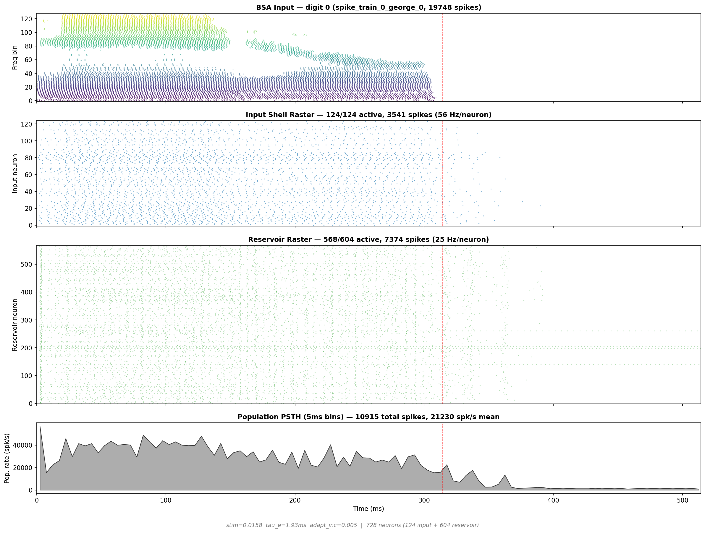

# Classification Adaptation Sweep

<p align="center">
  
</p>

A parameter sweep over spike-frequency adaptation (adapt_inc, adapt_tau) measuring 5-class spoken digit classification accuracy. The central question: **does SFA steer the reservoir into distinct computational modes, independent of trivial firing rate effects?**

## Motivation

The paper claims a triple dissociation of computational modes (stimulus encoding, working memory, temporal integration) controlled entirely by a single biophysical parameter: spike-frequency adaptation. To substantiate this claim, we must isolate the effect of adaptation dynamics from confounding variables — most critically, firing rate.

Changing adaptation changes reservoir firing rate. Without control, a critic can argue: "classification accuracy correlates with adaptation only because adaptation changes rate, and rate determines information capacity." Rate matching is the standard experimental control: hold firing rate constant across the sweep, and any remaining accuracy differences must come from the adaptation dynamics themselves.

## The rate-matching confound

### Previous approach (stimulus current modulation)

The original sweep rate-matched by binary search over `stimulus_current` — the current injected into input neurons when BSA spikes arrive. This is the same parameter optimized in the 8,000-point input grid search (optimal: 0.0518 nA at tau_e=1.05ms, yielding MI=1.06 bits between BSA and input spike output).

**Problem:** Changing stimulus_current changes input neuron firing dynamics, which changes the mutual information between BSA-encoded audio and input layer spike output. The confound is systematic and asymmetric:

| Calibration direction | When | stim_current | Input MI | Confound |
|---|---|---|---|---|
| Decrease stim | Low adaptation (reservoir fires fast, need to reduce drive) | < 0.0518 | Degrades rapidly (-19% at 0.02, -43% at 0.01) | Makes "no adaptation" look worse than it is |
| Increase stim | High adaptation (reservoir fires slow, need more drive) | > 0.0518 | Flat or slight increase (+5-12%) | Relatively benign |

Empirical data from the input grid search at (tau_e=1.05, adapt_inc=0, std_u=0):

```
stim=0.0100  rate= 34 Hz  MI=0.60 bits  (-43% from optimal)
stim=0.0268  rate= 65 Hz  MI=0.91 bits  (-14%)
stim=0.0518  rate= 85 Hz  MI=1.06 bits  (optimal, baseline)
stim=0.1000  rate=101 Hz  MI=1.11 bits  (+5%)
stim=0.5179  rate=126 Hz  MI=1.19 bits  (+12%)
stim=5.0000  rate=136 Hz  MI=1.12 bits  (+6%)
```

This confound is fatal for the paper's central claim: accuracy differences across the adaptation sweep could reflect **input encoding quality covarying with the sweep axis**, not adaptation dynamics.

### Why any single-parameter rate matching has side effects

Rate is an emergent property of the full dynamical system. Clamping it while varying adaptation requires a compensating variable, and any compensating variable will change some aspect of the dynamics:

| Rate-matching knob | What it confounds |
|---|---|
| stimulus_current | Input encoding quality (MI, temporal precision) |
| tonic_conductance (reservoir-only shunting) | Reservoir excitability, effective gain |
| shell_core_mult (input-to-reservoir weights) | Input-reservoir coupling gain |
| core_core_mult (recurrent weights) | Recurrent amplification — directly entangled with adaptation |
| V_threshold | Spike detection threshold, effective gain |

No single-knob rate matching is confound-free. The question is which confound is **least entangled with the variable under study**.

## Two-branch design

We run two complementary sweep branches. If the triple dissociation appears in both, it is robust to rate confounds.

### Branch A: Unmatched (natural rate)

- **stimulus_current**: Fixed at INPUT_STIM_CURRENT (0.0518 nA) for all grid points
- **tonic_conductance**: None (0.0)
- **Rate**: Varies naturally with adaptation parameters
- **Input encoding**: Identical across all grid points (MI = 1.06 bits preserved)
- **Interpretation**: Shows the full effect of adaptation including its natural rate modulation. Vulnerable to the criticism that accuracy differences are "just rate effects."
- **Controls for**: Input encoding confound (eliminated)

### Branch B: Tonic-conductance-matched (shunting inhibition)

- **stimulus_current**: Fixed at INPUT_STIM_CURRENT (0.0518 nA) for all grid points
- **tonic_conductance**: Calibrated per grid point via binary search to match target reservoir firing rate. Applied as `g_tonic * (E_rev - V)` to reservoir neurons only. Reversal is automatically chosen: E_i (-80 mV) if natural rate > target (shunting inhibition), E_e (0 mV) if natural rate < target (tonic excitation).
- **Rate**: Matched to 20 Hz (sensory cortex evoked rate, see below) across all grid points. Only reservoir neuron firing is measured/matched.
- **Input encoding**: Identical across all grid points (MI = 1.06 bits preserved)
- **Interpretation**: Isolates adaptation's computational effect from rate changes. Any accuracy differences cannot be attributed to rate or input encoding.
- **Controls for**: Both input encoding confound and firing rate confound

### Why shunting inhibition, not tonic current

A constant tonic current (i_bg) cannot effectively rate-match a conductance-based network. Excitatory synaptic current is `g_e * (E_e - V)`: as tonic hyperpolarization pushes V lower, the excitatory driving force `(E_e - V)` *increases*, partially compensating. This negative feedback makes rate nearly insensitive to tonic current — empirically, -10 nA only reduced rate from 30.7 to 26.8 Hz.

Tonic conductance `g_tonic * (E_rev - V)` competes with synaptic drive on equal terms: both are conductance-based and scale with the same voltage dependence. The reversal potential is automatically chosen based on the direction needed:

- **Rate too high** (low adaptation): E_rev = E_i (-80 mV) — shunting inhibition, divides membrane gain
- **Rate too low** (high adaptation): E_rev = E_e (0 mV) — tonic excitatory drive, boosts subthreshold depolarization

### Biological interpretation of tonic conductance

Tonic conductance applied to reservoir neurons is biophysically interpretable as:
- **GABAergic neuromodulatory tone** (inhibitory mode) — tonic GABA_A conductance from extrasynaptic receptors, widely documented in cortex (Farrant & Nusser 2005)
- **Shunting inhibition from interneuron populations** (inhibitory mode) — basket/chandelier cells providing divisive normalization
- **Thalamic excitatory drive** (excitatory mode) — tonic glutamatergic input from thalamic relay neurons
- **Cholinergic/noradrenergic modulation** (excitatory mode) — neuromodulatory depolarization increasing network excitability

All of these are standard mechanisms in computational neuroscience for controlling a network's gain and operating point without changing its connectivity or input encoding.

### Rate target: 20 Hz (sensory cortex evoked rate)

Branch B calibrates reservoir firing rate to a fixed 20 Hz target. This value is independently motivated by sensory cortex electrophysiology, not derived from any parameter of the model:

- **Auditory cortex evoked rates** during stimulus presentation range from ~10-40 Hz in rodent and primate recordings (Hromadka et al. 2008; DeWeese et al. 2003; Sakata & Harris 2009)
- **20 Hz** sits at the center of this range, avoiding extremes where network dynamics might become degenerate (too sparse at 5 Hz, too saturated at 50+ Hz)
- **Literature-grounded targets are reviewer-proof**: the justification is a single sentence citing established physiology, with no dependency on model-specific calibration runs

Only reservoir neuron firing rates are measured and matched. Input neuron rates are left untouched (they are determined entirely by BSA encoding + fixed stimulus_current).

### Calibration convergence

Calibration runs until reservoir firing rate is within +/-2 Hz of the 20 Hz target. There is no iteration limit — binary search continues indefinitely. If the search interval collapses, it is automatically widened and the search continues.

### What convergence between branches demonstrates

| Branch A result | Branch B result | Conclusion |
|---|---|---|
| Dissociation present | Dissociation present | **Robust**: adaptation steers computation independent of rate |
| Dissociation present | Dissociation absent | Rate modulation is part of the mechanism (not a confound, but a feature) |
| Dissociation absent | Dissociation present | Rate masking was hiding the effect (unlikely but informative) |
| Dissociation absent | Dissociation absent | No evidence for adaptation-driven mode switching |

## Fixed parameters

All parameters below are held constant across all grid points in both branches. They originate from the LHS-021 network configuration and the input grid search optimum.

### Network

| Parameter | Value | Source |
|---|---|---|
| n_neurons | 1000 | `make_base_config()` |
| inhibitory_fraction | 0.185 | `make_base_config()` |
| weight_scale | 0.55 | `make_base_config()` |
| distance_lambda | 0.18 | `make_base_config()` |
| lambda_decay_ie | 0.15 | `make_base_config()` |
| layout | sphere | `make_base_config()` |
| v_noise_amp | 0.1 | `make_base_config()` |
| i_noise_amp | 0.001 | `make_base_config()` |
| e_reversal | 0.0 mV | `make_base_config()` |
| i_reversal | -80.0 mV | `make_base_config()` |
| nmda_ratio | 0.5 | `make_base_config()` |
| tau_nmda (base) | 100.0 ms | `make_base_config()` |
| connection_probabilities | ee=0.10, ei=0.15, ie=0.25, ii=0.15 | `make_base_config()` |

### LHS-021 overrides (applied to all sweep points)

| Parameter | Value | Constant |
|---|---|---|
| shell_core_mult | 4.8497 | `LHS021_SHELL_CORE_MULT` |
| core_core_mult | 0.8275 | `LHS021_CORE_CORE_MULT` |
| lambda_connect | 0.003288 | `LHS021_LAMBDA_CONNECT` |
| nmda_tau | 50.0 ms | `FIXED_NMDA_TAU` |

### Input encoding (from input grid search optimum)

| Parameter | Value | Constant |
|---|---|---|
| stimulus_current | 0.0518 nA | `INPUT_STIM_CURRENT` |
| input_tau_e | 1.05 ms | `INPUT_TAU_E` |
| input_adapt_inc | 0.0 | (zero adaptation on input neurons) |
| input_std_u | 0.0 | `INPUT_STD_U` (STD disabled on input) |
| input NMDA | disabled | `skip_stim_nmda = true` |
| MI at optimum | 1.06 bits | Input grid search result |

### Recurrent short-term dynamics

| Parameter | Value | Constant |
|---|---|---|
| STD U (reservoir E->E) | 0.1 | `STD_U` |
| STD tau_rec | 500.0 ms | `STD_TAU_REC` |

### Simulation

| Parameter | Value |
|---|---|
| dt | 0.1 ms |
| post_stimulus_ms | 200.0 ms |
| bin_ms (readout) | 20.0 ms |

## Sweep grid

### Grid axes

Both axes are log-spaced for uniform resolution per octave across their dynamic range.

| Axis | Points | Range | Spacing | Ratio |
|---|---|---|---|---|
| adapt_inc | 20 | 0.0 + 19 values from 0.005 to 1.0 | log | ~1.34x per step |
| adapt_tau | 15 | 30 to 5000 ms | log | ~1.44x per step |

**adapt_inc**: 0.0, 0.005, 0.0067, 0.009, 0.0121, 0.0162, 0.0218, 0.0292, 0.0392, 0.0527, 0.0707, 0.0949, 0.1274, 0.171, 0.2295, 0.3081, 0.4135, 0.555, 0.745, 1.0

**adapt_tau** (ms): 30, 43.2, 62.3, 89.8, 129.4, 186.5, 268.7, 387.3, 558.1, 804.4, 1159.2, 1670.6, 2407.5, 3469.5, 5000

Full grid: 20 x 15 = **300 points**, every combination evaluated. No holes.

### Per grid point

**Branch A (unmatched):**
1. Set reservoir adaptation to (adapt_inc, adapt_tau)
2. stimulus_current = INPUT_STIM_CURRENT (fixed)
3. tonic_conductance = 0.0 (none)
4. Simulate all 1500 samples (300 per digit x 5 digits)
5. Classify and record

**Branch B (tonic-conductance-matched):**
1. Set reservoir adaptation to (adapt_inc, adapt_tau)
2. stimulus_current = INPUT_STIM_CURRENT (fixed)
3. Measure natural rate. If > 20 Hz: binary search g_tonic with E_i reversal (shunting inhibition). If < 20 Hz: binary search g_tonic with E_e reversal (tonic excitation). Calibration uses a 200-sample subset for speed. Runs until within +/-2 Hz — no iteration limit.
4. Simulate all 1500 samples at calibrated tonic_conductance
5. Classify and record

## Readout

- **Feature matrix**: 20ms time bins × ~604 reservoir neurons = 36,240 features, flattened per sample
- **Classifier**: One-vs-rest ridge regression (dual-form Cholesky), best alpha from {0.01, 0.1, 1, 10, 100, 1000}
- **Solver**: Dual-form ridge — precomputes Gram matrix K = XX^T (1200×1200) and solves (K + αI)α = Y via LAPACK `dposv_` (Cholesky decomposition). ~16.7× faster than SVD on the full 1200×36,240 feature matrix, with identical predictions. K and K_test are computed once per fold; each alpha sweep only requires a Cholesky solve + matrix multiply.
- **Cross-validation**: 5-fold stratified × 5 repeats (seed=42 + repeat)
- **Statistical test**: Paired comparison against BSA baseline (gap in pp, 95% CI, Cohen's d, p-value)
- **Per-bin accuracy**: Independent classification per time bin to resolve temporal accuracy profiles

### Readout method validation

A comprehensive benchmark of 30+ readout methods on BSA-encoded spike train data (`experiments/readout_benchmark.py`) confirms ridge regression is the appropriate choice:

| Method | Accuracy | Notes |
|---|---|---|
| Extra Trees | 97.1% | Best overall, but nonlinear |
| KNN k=1 | 96.5% | Nonlinear |
| Random Forest | 96.2% | Nonlinear |
| Logistic Regression (L2) | 95.8% | Linear, competitive |
| **Dual Ridge (ours)** | **95.2%** | **Linear, 16.7× faster than SVD** |
| Full SVD Ridge | 95.2% | Linear, identical accuracy, slower |
| Linear SVM | 94.8% | Linear |
| LDA | 93.6% | Linear |

Nonlinear methods outperform linear, but linear readout is the scientifically correct choice for LSM: the reservoir must perform the nonlinear transformation; a nonlinear readout would conflate readout power with reservoir computation.

### Statistical power

With 5 CV repeats and observed fold-to-fold sd_diff ≈ 0.47pp:

| Metric | Value |
|---|---|
| SE of gap estimate | ~0.21pp |
| Minimum detectable effect (80% power, uncorrected) | ~0.8pp |
| MDE with BH-FDR correction (300 tests) | ~1.0pp |
| Gaps < 0.6pp | Can never reach significance |

Increasing to 10 repeats would halve the SE but double readout time. At current dimensions (1200×36,240), dual-form ridge processes all 25 folds × 6 alphas in ~4.8s per grid point — readout is no longer the bottleneck.

## JSON output schema

### Top-level fields

| Field | Description |
|---|---|
| `experiment` | Experiment identifier string |
| `total_time_s` | Total wall-clock time |
| `task` | `"5-class digit classification"` |
| `digits` | `[0, 1, 2, 3, 4]` |
| `n_samples` | 1500 (300 per digit x 5 digits; FSDD has 6 speakers x 50 recordings = 300 per digit) |
| `rate_matching` | `{target_rate_hz, tolerance_hz}` |
| `grid` | `{unified_inc, unified_tau, n_inc, n_tau}` |
| `bsa_baseline` | BSA-only classification result |
| `lhs021_baseline` | LHS-021 baseline classification + firing rate |
| `grid_results` | Array of per-grid-point results (see below) |

### Per grid point (both branches)

Each grid point produces two JSON entries (one per branch) with the following fields:

| Field | Type | Description |
|---|---|---|
| `branch` | string | `"A_unmatched"` or `"B_matched"` |
| `point_id` | string | Grid point identifier |
| `inc_idx` | int | Index into unified adapt_inc axis |
| `tau_idx` | int | Index into unified adapt_tau axis |
| `adapt_inc` | float | Spike-frequency adaptation increment |
| `adapt_tau` | float | Adaptation time constant (ms) |
| `stimulus_current` | float | Input stimulus current (nA), fixed at INPUT_STIM_CURRENT |
| `tonic_conductance` | float | Tonic conductance: 0.0 for Branch A, calibrated for Branch B |
| `tonic_reversal` | float | Reversal potential (mV): -80 (inhibitory) or 0 (excitatory) for Branch B |
| `calibration_rate_hz` | float | Reservoir firing rate achieved during calibration |
| `classification_accuracy` | float | Mean accuracy across 5-fold x 5-repeat CV |
| `classification_accuracy_std` | float | Std of per-repeat accuracies |
| `classification_gap_pp` | float | Accuracy gap vs BSA baseline (percentage points) |
| `classification_ci_lo_pp` | float | 95% CI lower bound of gap |
| `classification_ci_hi_pp` | float | 95% CI upper bound of gap |
| `classification_p_value` | float | Paired t-test p-value vs BSA |
| `classification_cohens_d` | float | Cohen's d effect size vs BSA |
| `classification_stars` | string | Significance stars (`*`, `**`, `***`, or empty) |
| `firing_rate_hz` | float | Mean reservoir firing rate across all 1500 samples (Hz) |
| `firing_rate_std` | float | Std of per-sample reservoir firing rates |
| `n_reservoir` | int | Number of reservoir neurons |
| `sim_time_s` | float | Wall-clock simulation time (seconds) |
| `isi_cv_mean` | float/null | Mean inter-spike-interval coefficient of variation (reservoir only, during stimulus) |
| `adapt_at_stim_end_mean` | float | Mean adaptation variable at stimulus offset (reservoir only) |
| `participation_ratio_mean` | float | SVD-based dimensionality of reservoir activity |
| `per_bin_accuracy` | float[] | Classification accuracy per 20ms time bin |
| `classification_per_repeat_accuracy` | float[] | Per-repeat accuracy (length = 5) |

## Code references

| Component | File | Key functions/constants |
|---|---|---|
| Sweep entry point | `src/src/classification.cpp` | `run_classification_sweep()` |
| Grid construction | `src/src/classification.cpp` | `build_grid_points()`, `UNIFIED_INC`, `UNIFIED_TAU` |
| Rate calibration | `src/src/classification.cpp` | `calibrate_tonic_conductance()` |
| Rate target | `src/inc/experiments.h` | `RATE_TARGET_HZ = 20.0`, `RATE_TOLERANCE_HZ = 2.0` |
| Shunting inhibition | `src/src/network.cpp` | `update_network()` — `i_tonic = g_tonic * (E_i - V)` in membrane equation |
| Tonic conductance field | `src/inc/network.h` | `SphericalNetwork::tonic_conductance` |
| Network base config | `src/src/builder.cpp` | `make_base_config()` |
| LHS-021 overrides | `src/inc/experiments.h` | `LHS021_SHELL_CORE_MULT`, `LHS021_CORE_CORE_MULT`, etc. |
| Input regime (fixed) | `src/src/builder.cpp` | `apply_input_neuron_regime()` |
| Optimized input constants | `src/inc/builder.h` | `INPUT_STIM_CURRENT`, `INPUT_TAU_E`, `INPUT_STD_U` |
| CV/readout constants | `src/inc/experiments.h` | `N_CV_FOLDS=5`, `N_CV_REPEATS=5`, `RIDGE_ALPHAS`, `BIN_MS=20` |
| Input grid search evidence | `results/input_grid_search/` | MI vs stim_current empirical data |
| Adaptation heatmap | `experiments/plot_adaptation_heatmap.py` | Publication-quality heatmap from sweep JSON |
| Readout benchmark | `experiments/readout_benchmark.py` | 30+ method comparison on BSA data |
| Dual-form ridge | `src/src/ml.cpp` | `ridge_fold_prepare()`, `ridge_fold_solve()` |
| LAPACK declarations | `src/inc/common.h` | `dposv_` (Cholesky), `dgesdd_` (SVD) |

## Reproduction

```bash
# Run full 300-point grid x 2 branches
./cls_sweep --n-workers 8

# Results saved to:
#   results/classification_adaptation_sweep/classification_adaptation_sweep.json
# Checkpoint saved after each grid point:
#   results/classification_adaptation_sweep/classification_adaptation_sweep_checkpoint.json

# Generate publication-quality heatmap from results
python experiments/plot_adaptation_heatmap.py
# Or from checkpoint (for in-progress sweeps):
python experiments/plot_adaptation_heatmap.py -i results/classification_adaptation_sweep/classification_adaptation_sweep_checkpoint.json
# Outputs: adaptation_heatmap.pdf (300dpi) + adaptation_heatmap.png (200dpi)
```
