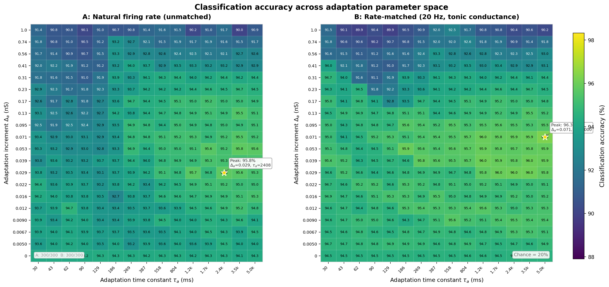
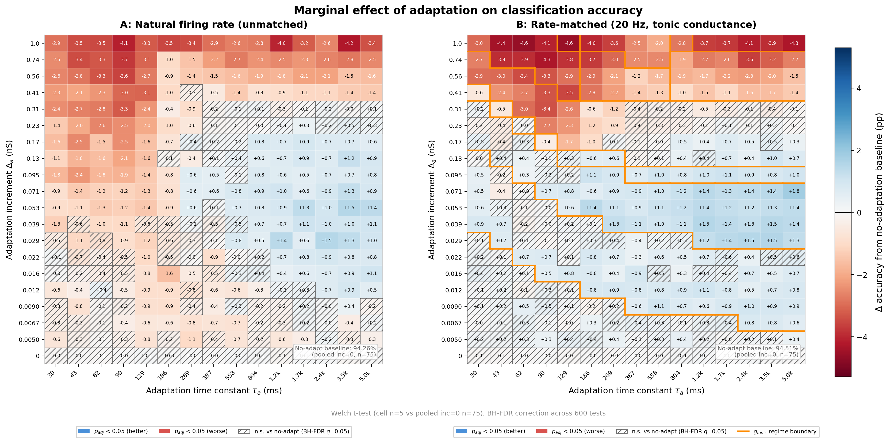
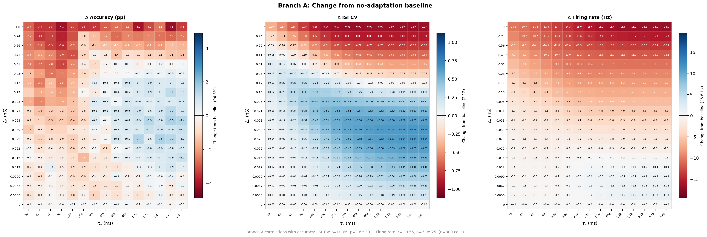
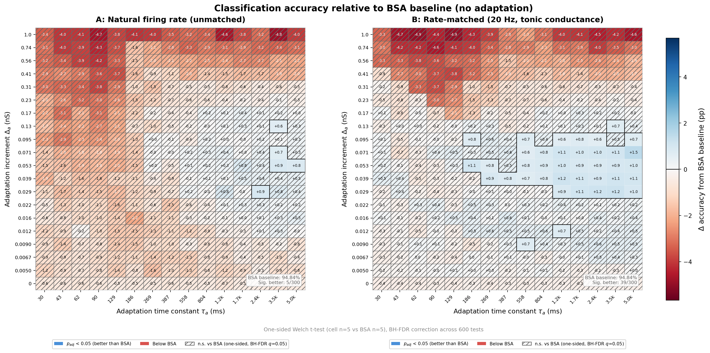
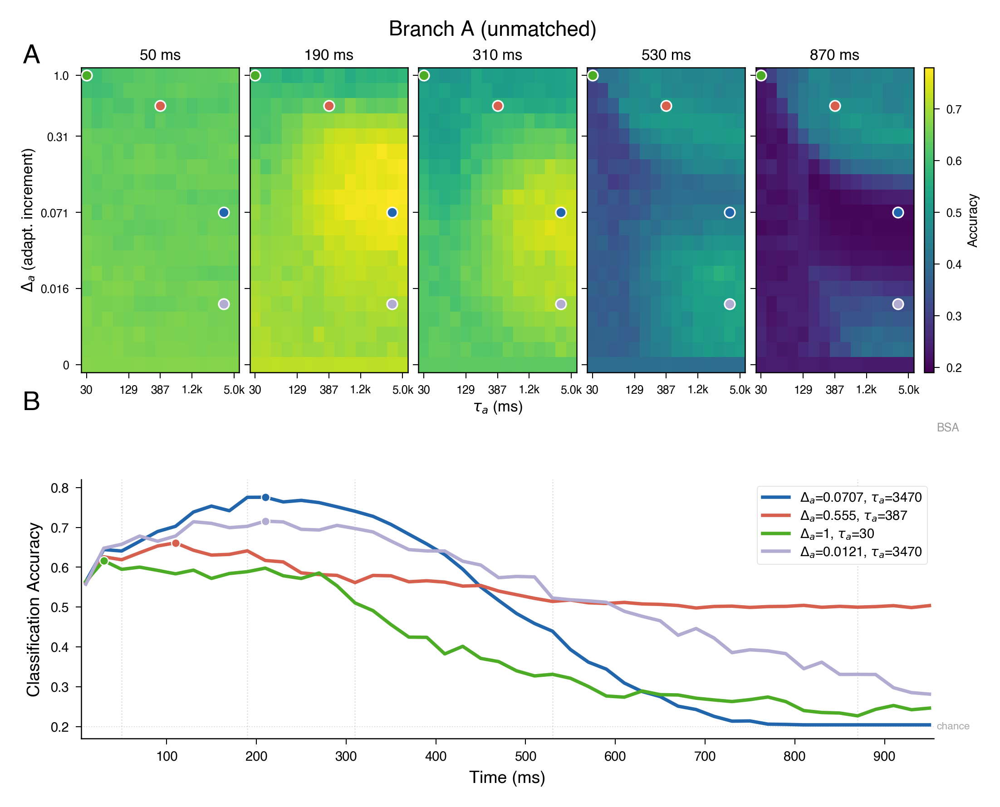
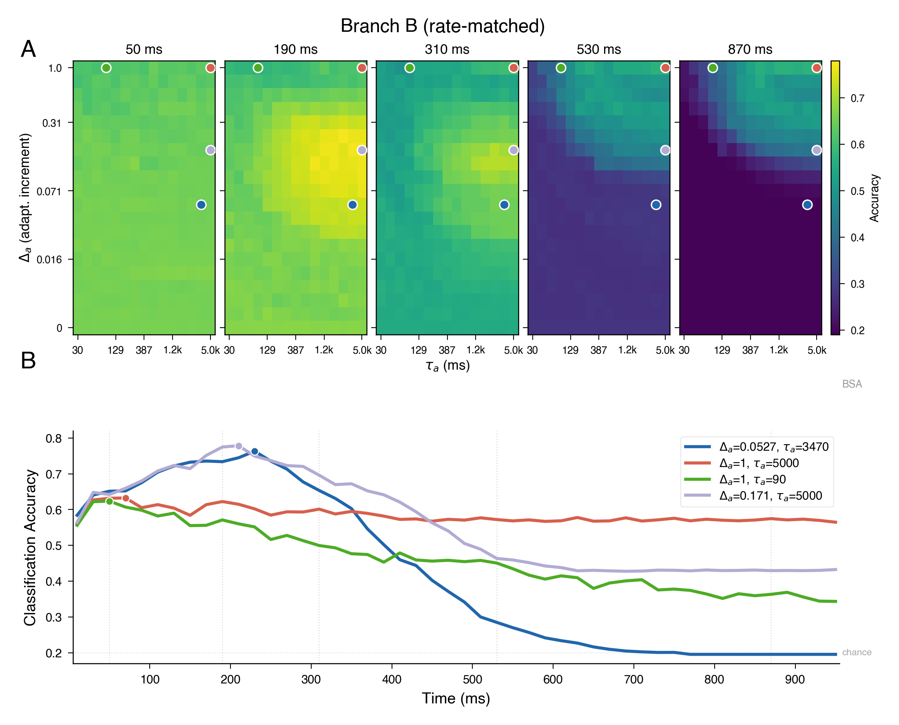
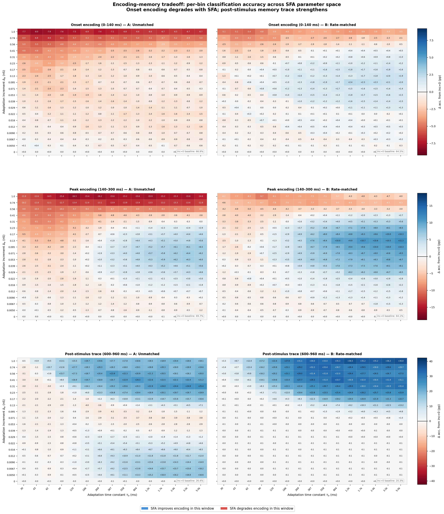
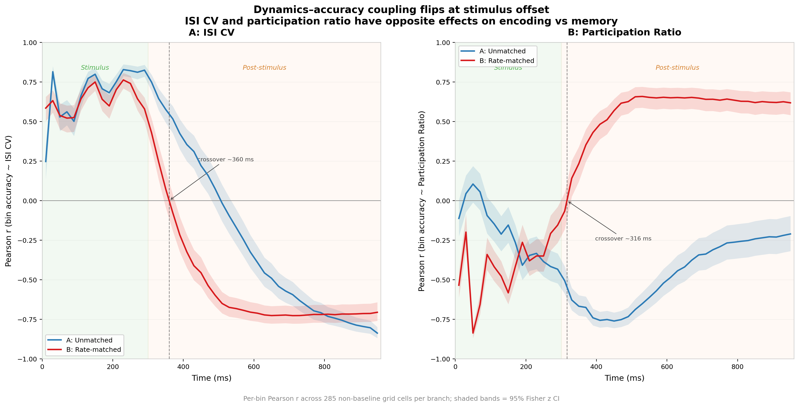
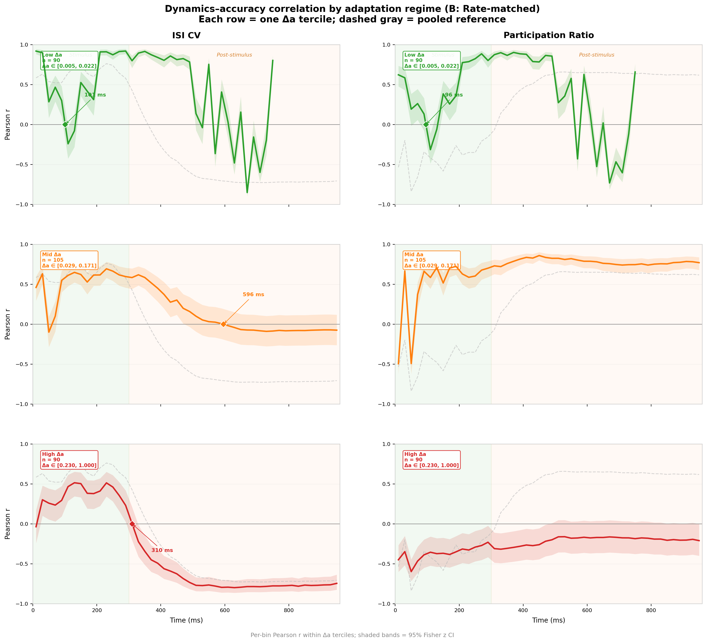

# Classification Adaptation Sweep: Results

## Experiment Context

This experiment constitutes the **classification leg** of a planned triple dissociation
(classification, XOR, working memory) demonstrating that spike-frequency adaptation (SFA)
creates computationally distinct operating regimes in a liquid state machine. The central
claim is that the adaptation parameter surface — adaptation increment (Δ_a) × adaptation
time constant (τ_a) — has a different topology for each computational task, revealing that
SFA does not simply help or hurt performance but reshapes the network's computational mode.

For classification (spoken digit recognition, 5-class), we initially hypothesised that the
no-adaptation regime is near-optimal because maximal information transfer (without
temporal filtering) best serves a task that depends on faithful stimulus encoding. The
results confirm this at the aggregate level — but reveal that beneath the flat accuracy
surface, SFA fundamentally reorganises *when* information is available in the reservoir,
trading instantaneous encoding fidelity for persistent memory traces. This encoding–memory
axis, not spatial optima in parameter space, is the mechanistic basis for task dissociation.

## Experimental Design

- **Architecture**: Liquid state machine (604-neuron reservoir, derived from a
  1000-neuron sphere with 815 excitatory + 185 inhibitory LIF neurons; input shell
  neurons compacted out), spike-frequency adaptation via conductance-based
  afterhyperpolarisation current.
  `[n_reservoir field in grid_results entries]`
- **Task**: 5-digit spoken digit classification (FSDD corpus, 6 speakers × 50 recordings
  = 300 per digit, 1500 total), 5×5 stratified cross-validation (N_CV_REPEATS=5,
  N_CV_FOLDS=5 → 25 train/test splits per cell).
  `[digits: [0,1,2,3,4]; SAMPLES_PER_DIGIT=500 in experiments.h but FSDD has only 300/digit; load_audio_samples caps at files.size()]`
- **Parameter grid**: 20 adaptation increments (0–1.0 nS) × 15 time constants
  (30–5000 ms) = 300 grid points per branch.
  `[grid.n_inc=20, grid.n_tau=15, grid.unified_inc, grid.unified_tau]`
- **Two-branch design**:
  - **Branch A (unmatched)**: Natural firing rate; adaptation is free to modulate rate.
  - **Branch B (rate-matched)**: Tonic inhibitory conductance calibrated to hold mean
    excitatory firing rate at ~20 Hz, isolating adaptation's temporal effects from rate
    changes.
    `[rate_matching.target_rate_hz=20.0, rate_matching.tolerance_hz=2.0]`
- **Baselines**:
  - BSA (best single architecture, no adaptation): **94.84%** ± 0.26%
    `[bsa_baseline.accuracy=0.9484, bsa_baseline.accuracy_std=0.0026]`
  - LHS-021 (Latin hypercube sample point): **91.03%** ± 0.41%
    `[lhs021_baseline.classification_accuracy=0.9103, classification_accuracy_std=0.0041]`

## Data Completeness

**Sweep is complete.**
- **300 / 300** grid points populated per branch (100%), 600 total entries.
  `[len(grid_results)=600; 300 A_unmatched + 300 B_matched]`
- All 20 increment levels × all 15 τ values represented in both branches.
- Total wall time: 26.7 hours (95,997 s).
  `[total_time_s=95997.1]`

**Data source**: `classification_adaptation_sweep.json`

**Note**: The JSON metadata field `n_samples: 2500` is a reporting bug in the sweep
entry point (`classification.cpp:629`), which writes `SAMPLES_PER_DIGIT * N_DIGITS`
(500 × 5 = 2500) instead of the actual loaded count. FSDD contains only 300 recordings
per digit (6 speakers × 50), so the true sample count is **1,500**. The checkpoint file
is byte-identical to the main results file.

## Key Findings

### 1. Classification is near-optimal without adaptation

The no-adaptation baseline (pooled inc=0 row) achieves:
- Branch A: **94.26%** ± 0.31% (n=75 repeat observations)
- Branch B: **94.51%** ± 0.26% (n=75)

`[Pooled from classification_per_repeat_accuracy across all 15 tau values at inc_idx=0, 15 × 5 repeats = 75 per branch]`

These are within 0.33–0.58 pp of the BSA optimum (94.84%). The adaptation parameter
surface spans only ~5.7 pp (Branch A) and ~6.4 pp (Branch B) — modest compared to the
~75 pp range between chance (20%) and ceiling, confirming that classification does not
strongly benefit from SFA.

`[A span: 95.75−90.03=5.72pp; B span: 96.33−89.91=6.42pp]`

### 2. Branch A: diagonal gradient with τ crossover at ~1950 ms

**Overall**: Of 285 non-baseline cells tested (BH-FDR q=0.05, 570 tests joint across
both branches), **142 are significantly worse** and **65 are significantly better** than
the no-adaptation baseline.

`[285 = 19 non-zero inc levels × 15 tau values; 570 = 285 × 2 branches; Welch t-test cell n=5 vs pooled baseline n=75, two-tailed, BH-FDR applied jointly]`

The surface reveals a **diagonal gradient** governed primarily by τ_a:

**Tau-marginal crossover**: Averaging across all non-baseline increment values, the mean
marginal effect of adaptation crosses zero between τ_a = 1670.6 ms (gap = −0.04 pp) and
τ_a = 2407.5 ms (gap = +0.06 pp), interpolated at **τ_a ≈ 1950 ms**:
- τ < 1671 ms: adaptation hurts on average (mean gap −0.04 to −1.75 pp)
- τ > 2408 ms: adaptation helps on average (mean gap +0.01 to +0.06 pp)

`[Column means of acc_a[1:,:] minus pooled baseline, per tau index]`

The crossover is far to the right — most of the parameter space hurts classification.
Only the longest three τ values yield marginal improvement, and even then the gains are
tiny (+0.01 to +0.06 pp averaged across all inc values). This reflects the dominance of
high-inc rows (which are uniformly bad) in pulling the column means down.

At individual inc levels, the crossover appears earlier. For moderate inc values
(0.02–0.07 nS), individual cells begin exceeding baseline around τ ≈ 500–800 ms,
consistent with the biophysical interpretation: adaptation with τ longer than a single
phoneme (50–200 ms) acts as a slow gain modulator that diversifies the temporal code
without disrupting within-feature structure.

**Inc-marginal**: Inverted-U shape. The benefit peaks at Δ_a ≈ 0.02–0.05 nS
(+0.01 to +0.12 pp), then degrades monotonically to −3.33 pp at inc=1.0. The sweet spot
is narrow — only inc indices 6–10 (0.022–0.071 nS) have positive average gaps.

`[Row means of acc_a[i,:] minus pooled baseline, per inc index; indices 6–10 map to inc=0.0218,0.0292,0.0392,0.0527,0.0707 with gaps +0.01,+0.12,+0.05,+0.09,+0.05 pp]`

**Best cell**: Δ_a=0.029, τ_a=2408 ms → **95.75%** (+1.49 pp from pooled baseline).
`[grid_results entry: inc_idx=7, tau_idx=12, branch=A_unmatched, classification_accuracy=0.9575]`

**Worst cell**: Δ_a=1.0, τ_a=3470 ms → **90.03%** (−4.23 pp from pooled baseline).
`[grid_results entry: inc_idx=19, tau_idx=13, branch=A_unmatched, classification_accuracy=0.9003]`

### 3. The rate/temporal coding dissociation

With the complete grid (n=300 cells per branch), the Pearson correlations are:

**Branch A:**
- acc ~ firing rate: r = **+0.55**, p = 7.0×10⁻²⁵
- acc ~ ISI_CV: r = **+0.66**, p = 1.6×10⁻³⁹
- acc ~ participation ratio: r = **−0.36**, p = 1.0×10⁻¹⁰

**Branch B:**
- acc ~ firing rate: r = **−0.08**, p = 0.14 (n.s.)
- acc ~ ISI_CV: r = **+0.71**, p = 1.4×10⁻⁴⁶
- acc ~ participation ratio: r = **−0.78**, p = 3.2×10⁻⁶³

`[Pearson r computed across all 300 grid cells per branch using classification_accuracy, firing_rate_hz, isi_cv_mean, participation_ratio_mean fields]`

**Interpretation**: With the full parameter grid, firing rate is significantly correlated
with accuracy in Branch A (r=+0.55) — this is expected because the complete grid includes
the full inc range (0–1.0 nS), where high adaptation dramatically reduces both rate and
accuracy. The rate correlation in Branch A reflects the confound the two-branch design was
built to address.

The critical finding is that **Branch B eliminates the rate correlation entirely**
(r=−0.08, n.s.) while **preserving and strengthening the ISI_CV correlation** (r=+0.71
vs +0.66 in Branch A). This is the cleanest evidence that adaptation acts through temporal
coding, not rate modulation:

- When rate varies naturally (Branch A), both rate and ISI_CV predict accuracy, but
  ISI_CV more strongly (r=0.66 vs 0.55)
- When rate is clamped (Branch B), rate predicts nothing while ISI_CV predicts even
  more strongly (r=0.71)

The participation ratio correlation is also much stronger in Branch B (r=−0.78 vs −0.36).
However, this pooled correlation requires careful interpretation. Within the dominant tonic
conductance regime (g ∈ {1.41, 2.81}, n=122), the PR–accuracy correlation reverses sign to
r=+0.68 (p < 10⁻¹⁷). This is a Simpson's paradox driven by g_tonic's strong association
with PR (r=−0.72): moving between g-regimes shifts both PR and accuracy in opposite
directions, creating a negative pooled slope from positive within-regime slopes. The pooled
PR correlation therefore describes how accuracy varies *across* operating regimes — cells
with lower g_tonic (stronger adaptation) tend to have higher PR and lower accuracy — not a
within-regime mechanism. The ISI CV correlation, by contrast, is sign-consistent across 8
of 9 g-regimes, though its magnitude varies substantially (r = 0.07 to 0.78). See
Finding 10 for the full robustness analysis.

### 4. Branch B: broad improvement, but confounded by tonic conductance cascades

**Overall**: Of 285 non-baseline cells, **118 are significantly better** and **76 are
significantly worse** than the no-adaptation baseline (BH-FDR q=0.05).

`[Same joint BH-FDR correction as Finding 2; Branch B counts from the same test]`

**Best cell**: Δ_a=0.071, τ_a=5000 ms → **96.33%** (+1.82 pp), at g_tonic=1.41 nS.
`[grid_results: inc_idx=10, tau_idx=14, branch=B_matched, classification_accuracy=0.9633, tonic_conductance=1.4062]`

**Worst cell**: Δ_a=1.0, τ_a=62 ms → **89.91%** (−4.60 pp).
`[grid_results: inc_idx=19, tau_idx=2, branch=B_matched, classification_accuracy=0.8991]`

The rate-matching calibrator produces **12 distinct tonic conductance regimes** as
adaptation strength increases:

`[Unique rounded tonic_conductance values across 300 B_matched entries]`

| g_tonic (nS) | n cells | Accuracy |
|:-------------|--------:|---------:|
| 3.75 (baseline, inc=0) | 60 | 94.66% ± 0.16% |
| 2.8125 | 71 | 95.02% ± 0.33% |
| 1.4062 | 51 | 95.45% ± 0.54% |
| 0.7031 | 15 | 95.00% ± 0.57% |
| 0.3125 | 18 | 92.48% ± 0.69% |
| 0.3076 | 6 | 91.66% ± 0.71% |
| 0.1562 | 10 | 92.27% ± 0.80% |
| 0.0781 | 11 | 90.72% ± 0.53% |
| 0.0 (floored) | 51 | 93.77% ± 1.29% |
| (+ 3 singletons) | 3 | 89.9–91.7% |

The pattern is non-monotonic. Moderate tonic conductance reductions (g=2.81 → 1.41 nS)
improve accuracy, but further reductions (g < 0.31) cause accuracy to crater below 93%.
The g=0 group (where the calibrator has run out of inhibition to remove) partially
recovers to 93.77%, consistent with a complex interaction between tonic inhibition level,
adaptation strength, and network gain.

Branch B's worst cells (89.91–90.72%) are actually **worse than Branch A's worst**
(90.03%), which should not happen if rate-matching only helped. This demonstrates that
extreme tonic conductance adjustments can be more damaging than the rate changes they
are intended to control.

`[min(acc_b)=89.91% < min(acc_a)=90.03%]`

Branch B should be presented as a **methodological finding about rate-matching limits**:
the approach works well for moderate adaptation (the g=1.41–2.81 regime, 122 cells)
but introduces its own confound at extremes.

`[g=1.4062: 51 cells + g=2.8125: 71 cells = 122]`

### 10. Tonic conductance robustness analysis

The discrete g_tonic regimes created by rate-matching raise the question of whether
Branch B's dynamics–accuracy correlations are artifacts of between-regime variation rather
than within-regime temporal coding. A systematic robustness analysis addresses this at
three levels.

**1. Adding g_tonic as a covariate does not change the dynamics story.**

The full-branch multiple regression (acc ~ ISI CV + PR + rate, n=285) has R²=0.785.
Adding g_tonic as a fourth predictor increases R² by 0.001 to 0.786. The g_tonic
coefficient is non-significant (β=+0.054, p=0.264), and the ISI CV and PR betas are
stable (+0.522→+0.512, −0.514→−0.491). At the aggregate level, tonic conductance adds
no explanatory power beyond what the dynamical variables already capture.

`[OLS without g: R²=0.785, ISI_CV β=+0.522, PR β=−0.514; with g: R²=0.786, ISI_CV β=+0.512, PR β=−0.491, g_tonic β=+0.054 p=0.264; ΔR²=0.001]`

**2. Within the dominant regime, the predictor structure changes qualitatively.**

Restricting to the g ∈ {1.41, 2.81} regime (n=122), where the rate-matcher has made
moderate adjustments and tonic conductance is nearly constant:

| Predictor | β (full branch, n=285) | β (within-regime, n=122) |
|-----------|----------------------|------------------------|
| ISI CV | +0.52 (p < 10⁻²⁴) | −0.01 (p = 0.91) |
| PR | −0.51 (p < 10⁻²⁴) | +0.58 (p < 10⁻⁹) |
| Rate | −0.09 (p = 0.04) | +0.42 (p < 10⁻⁶) |

Every predictor either flips sign or collapses. ISI CV — the centerpiece of the temporal
coding argument at the full-branch level — is completely absorbed within-regime
(β=−0.01, p=0.91). PR flips from the strongest negative predictor to the strongest
positive. Rate, which the full-branch analysis identifies as irrelevant, becomes the
second-strongest predictor with positive sign.

This does not invalidate the aggregate finding, but it reveals that the full-branch
regression is primarily capturing between-regime variation. The 285 cells span 9 g-tonic
levels; moving from g=3.75 (baseline) to g=0 (maximal adaptation) is a massive shift in
network operating point. The clean full-branch story (ISI CV predicts accuracy, rate does
not) is a statistically valid description of the landscape, but it is driven by large
between-regime differences rather than fine-grained temporal coding variations within a
fixed operating point.

`[OLS within g∈{1.41,2.81}: R²=0.624, ISI_CV β=−0.012 p=0.908, PR β=+0.584 p=6e-10, rate β=+0.419 p=2e-7]`

**3. The PR sign flip is a genuine Simpson's paradox.**

g_tonic correlates with PR at r=−0.72 (p < 10⁻⁴⁵): cells requiring less tonic inhibition
(stronger adaptation) have higher participation ratios. g_tonic also correlates with
accuracy non-monotonically, with the g=1.41 regime achieving the highest mean accuracy
(95.45%). Pooling across regimes creates a negative PR–accuracy slope because pathological
low-g regimes (g < 0.31) have both high PR and low accuracy. Within the dominant regime,
higher PR predicts better accuracy — the opposite of the pooled story. The full-branch
interpretation of PR as "dimensionality reduction benefits classification" is therefore a
between-regime effect, not a within-regime mechanism.

`[g_tonic ~ PR: r=−0.715, p=5.5e-46; within g∈{1.41,2.81}: acc ~ PR r=+0.681 p=6e-18]`

**4. g_tonic's effect is largely mediated through dynamics.**

In a mediation analysis, ~77% of g_tonic's total effect on accuracy (direct r=+0.51) is
mediated through ISI CV and PR. The residual direct effect after controlling for dynamics
is small (partial r=+0.12, p=0.046). Tonic conductance shapes accuracy primarily by
shifting the network into different dynamical regimes, not through a direct biophysical
pathway independent of adaptation dynamics.

`[Direct g→acc: r=+0.514; partial g→acc|dynamics: r=+0.119 p=0.046; proportion mediated=0.769]`

**5. Cross-regime consistency.**

ISI CV maintains a positive correlation with accuracy in 8 of 9 g-regimes (the exception
is g=0.46, n=5). The magnitude varies substantially (r=0.07 at g=2.81 to r=0.78 at
g=1.41 and g=0.31), but the sign is robust. PR sign is genuinely inconsistent — negative
at g=0 (r=−0.66), positive at g=0.70 and g=1.41 (r=+0.85, +0.72), and near zero at
g=2.81 and g=3.75. This confirms that ISI CV is a reliable across-regime predictor of
accuracy while PR's meaning is regime-dependent.

`[Per-regime acc~ISI_CV: g=0 r=+0.07, g=0.31 r=+0.77, g=0.70 r=+0.76, g=1.41 r=+0.78, g=2.81 r=+0.21, g=3.75 r=+0.10; per-regime acc~PR: g=0 r=−0.66, g=0.70 r=+0.85, g=1.41 r=+0.72, g=2.81 r=+0.07, g=3.75 r=+0.14]`

**6. BSA-exceeding cells survive within-regime.**

Of the 39 cells that significantly exceed BSA (Finding 5; one-sided Welch t, joint 600-test
BH-FDR), 33 sit in the g ∈ {1.41, 2.81} regime. Within these 33 cells, τ_a remains a
significant predictor of accuracy (r=+0.58, p < 10⁻³) — longer adaptation time constants
yield higher accuracy even at fixed operating point. ISI CV is no longer significant within
this narrow subset (r=+0.24, p=0.17), consistent with the within-regime finding that ISI CV
is absorbed once between-regime variation is removed. The BSA-exceeding result is not an
artifact of the g=1.41 operating point being generally superior — accuracy still varies
meaningfully with τ_a within that operating point.

`[33/39 BSA-exceeding cells in dominant regime; within-cluster: acc~τ_a r=+0.584 p=3.6e-4; acc~ISI_CV r=+0.245 p=0.17]`

**Interpretation.** The aggregate dynamics story is correct as a description of the
landscape: ISI CV and PR jointly explain 79% of accuracy variance across the full
parameter space, and tonic conductance adds nothing beyond what they capture. But the
mechanistic narrative requires nuance. The full-branch regression primarily captures
between-regime variation — how accuracy changes as adaptation strength shifts the network
across qualitatively different operating points. Within a fixed operating regime, the
predictors that matter are different (PR positive, rate significant, ISI CV absorbed).
SFA steers computation, but the steering is coarser-grained than the regression
coefficients suggest: it shifts the network between distinct dynamical modes rather than
smoothly tuning a temporal coding knob.

The within-regime BSA analysis points to a more parsimonious account: τ_a itself —
not its dynamical proxy ISI CV — is the best within-regime predictor of whether a cell
beats BSA (r=+0.58, p < 10⁻³ within the 33 dominant-regime BSA-exceeding cells, vs
ISI CV r=+0.24, p=0.17). This is consistent with the per-bin filmstrip (Finding 8),
which shows directly that longer τ_a produces slower-decaying post-stimulus traces.
The causal chain is: τ_a governs trace persistence → persistent traces improve
late-bin readout → late-bin gains offset onset losses → aggregate accuracy rises.
ISI CV tracks this effect at the landscape level because it correlates with the
between-regime shifts that τ_a drives, but it is not the mediating variable within
a fixed operating regime. The adaptation time constant is the causal parameter;
the dynamical summary statistics are landscape-level correlates.

`[Generated by experiments/analyze_gtonic_robustness.py; data from classification_adaptation_sweep.json, Branch B]`

### 5. Adaptation adds useful computation in specific regimes

Testing each cell against the BSA baseline (the best no-adaptation architecture,
94.84%) via one-sided Welch t-tests with joint BH-FDR correction across 600 tests:

`[One-sided Welch t (cell > BSA), cell n=5 vs BSA n=5, BH-FDR q=0.05 applied jointly across all 600 cells (300 per branch). BSA summary stats converted from population std to sample std via √(n/(n−1)).]`

**No-adaptation baseline vs BSA:**

| | Gap from BSA | Welch t | df | p | Verdict |
|---|---|---|---|---|---|
| Branch A inc=0 (n=75) | −0.58 pp | −4.24 | 4.6 | 0.010 | Significantly worse |
| Branch B inc=0 (n=75) | −0.33 pp | −2.44 | 4.4 | 0.065 | Not significant |

`[Two-sided Welch t, pooled inc=0 repeats (n=75) vs BSA summary stats (n=5)]`

The pooled inc=0 baseline in Branch A is significantly below BSA (p=0.01). Branch B's
baseline is closer but does not reach significance — the 0.33 pp gap falls short with
BSA's n=5.

**Cells significantly exceeding BSA:**

- **Branch A**: **5 / 300** cells significantly better than BSA. These are clustered
  at moderate inc (0.029–0.127) with long τ (2408–5000 ms). Branch A cannot reliably
  beat BSA — the rate penalty from adaptation offsets the temporal coding benefit in
  most of the space.
  `[Significant A cells at (inc,tau): (0.0292,2407.5), (0.0527,3469.5), (0.0527,5000.0), (0.0707,3469.5), (0.1274,3469.5)]`
- **Branch B**: **39 / 300** cells significantly better than BSA. These span
  inc = 0.009–0.127, τ = 187–5000 ms, across four tonic conductance regimes
  (g = 0, 0.70, 1.41, 2.81 nS). The best cell exceeds BSA by +1.49 pp (96.33%).
  `[39 significant B cells; g_tonic values: {0.0, 0.7031, 1.4062, 2.8125}; best: inc_idx=10, tau_idx=14, acc=0.9633]`

**Branch A's significant region is a strict subset of Branch B's.** All 5 cells that
beat BSA in Branch A are also significant in Branch B. Branch B has 34 additional cells,
extending the significant territory further left (down to τ=187 ms) and across a wider
inc range (0.009–0.127). This is exactly the predicted effect of rate-matching: removing
the firing rate penalty reveals that adaptation's temporal coding benefit extends across
a much larger region of parameter space than Branch A can detect. The two panels in the
figure above make this visually clear — the bordered cluster in Panel B envelops and
far exceeds Panel A's small cluster.

`[Set intersection: |A ∩ B| = 5, |A − B| = 0, |B − A| = 34]`

This is direct evidence that **adaptation adds computation the reservoir could not
perform without it**. The comparison is maximally controlled: same architecture, same
input encoding, same readout, same firing rate (Branch B). The only difference is the
adaptation dynamics, and in the moderate-inc / long-τ regime, those dynamics produce
representations the linear readout can exploit better than the best no-adaptation
configuration.

At the landscape level, the improvement tracks temporal coding (ISI CV r=+0.71) and lower
reservoir dimensionality (participation ratio r=−0.78). However, the within-regime analysis
(Finding 10) shows this predictor structure is qualitatively different at fixed operating
point: PR flips sign and ISI CV is absorbed within the dominant g-regime. The landscape-level
correlations describe how accuracy varies *across* operating regimes, not the fine-grained
mechanism within a single regime.

**Rate confound analysis within the 39 significant cells:**

The rate-matching calibrator targets 20 Hz but actual firing rates (measured across all
1,500 samples) systematically undershoot the calibration rate by ~4.6 Hz across all of
Branch B. This is a measurement discrepancy — the calibrator runs on a smaller sample
subset — not a calibration failure. The critical question is whether residual rate
variation drives the BSA-exceeding result.

`[calibration_rate_hz mean=20.06 Hz for sig cells; firing_rate_hz mean=15.72 Hz; gap is systematic across all g_tonic regimes]`

| Metric | 39 sig cells | 261 non-sig cells | All Branch B |
|--------|-------------|-------------------|-------------|
| Firing rate | 15.7 ± 0.8 Hz | 14.9 ± 1.5 Hz | 15.0 ± 1.5 Hz |
| Rate range | 14.5–18.5 Hz | 11.9–18.5 Hz | 11.9–18.5 Hz |

The sig cells fire ~0.9 Hz faster on average (Welch t=5.18, p<0.001). However, three
analyses establish that this does not drive the accuracy advantage:

1. **Within-cluster rate is non-predictive**: Among the 39 sig cells, acc ~ rate
   r=−0.10, p=0.56. Rate explains nothing within the cluster.
   `[Pearson r across 39 cells using firing_rate_hz and classification_accuracy]`

2. **Partial correlations**: Controlling for rate *strengthens* the ISI_CV correlation
   (r=+0.71 → r=+0.83), confirming that ISI_CV is not a proxy for rate. Controlling
   for ISI_CV makes rate significantly *negative* (r=−0.08 → r=−0.61), meaning that
   at fixed temporal coding quality, more spikes actually hurt.
   `[Partial Pearson r across 300 B cells; acc ~ ISI_CV | rate: r=+0.83, p=4e-76; acc ~ rate | ISI_CV: r=−0.61, p=9e-32]`

3. **Effect size**: The multiple regression coefficient for rate is −0.09 pp/Hz
   (standardised β=−0.09). A 0.9 Hz rate advantage contributes at most −0.08 pp —
   it slightly *hurts*, and explains <9% of the average +0.92 pp gap above BSA.
   ISI_CV (β=+0.52) and participation ratio (β=−0.52) are the real drivers
   (joint model R²=0.79).
   `[OLS: acc ~ rate + ISI_CV + PR, n=300 B cells; R²=0.785]`

Rate-matching compresses rate variance by 71% (std 5.07 → 1.50 Hz) and reduces the
rate-accuracy R² from 30.0% (Branch A) to 0.7% (Branch B). Within the significant
cluster, rate variance is even tighter (std=0.84 Hz). **A second sweep to correct for
the residual 0.9 Hz difference is not warranted** — the effect is in the wrong direction
(rate coefficient is negative), it explains <9% of the gap, and the partial correlation
analysis shows ISI_CV strengthens after rate is removed.

`[Branch A rate std=5.07, B=1.50; acc~rate R²: A=0.300, B=0.007]`

**The tonic conductance caveat**: The 39 significant cells in Branch B span four g_tonic
regimes (0, 0.70, 1.41, 2.81 nS), so the effect is not confined to a single inhibition
level. However, the majority (33/39) sit in the g=1.41–2.81 regime, where the rate-matcher
has moderately reduced tonic inhibition. A critic could attribute part of the improvement
to reduced inhibition. Three counter-arguments: (1) the g=0.70 regime has *less* inhibition
but *worse* average accuracy than g=1.41, so the relationship is non-monotonic; (2) within
a single g-regime, accuracy still varies with τ in the expected direction; (3) Branch A's
best cells occupy the same inc/τ region without any tonic conductance manipulation.

### 6. Most grid points exceed LHS-021

Nearly every populated cell in both branches exceeds the LHS-021 baseline (91.03%).
Branch A has 15 cells below LHS-021 (at inc ≥ 0.31), with the lowest at 90.03%.
Branch B has 18 cells below LHS-021, concentrated in the low-g_tonic pathological
regime, with the lowest at 89.91%. Outside the high-inc corners of parameter space,
the architecture is robustly good at classification.

`[Count of cells with classification_accuracy < 0.9103; A below cells at inc ∈ {0.3081, 0.555, 0.745, 1.0}]`

### 7. Statistical power is sufficient — no additional trials needed

- Within-cell SD: 0.34 pp (A), 0.29 pp (B) `[median of per-cell std(classification_per_repeat_accuracy, ddof=1)]`
- SE of cell mean (n=5 repeats): 0.15 pp (A), 0.13 pp (B) `[median SD / √5]`
- Minimum detectable effect at 80% power (uncorrected): ~0.42 pp `[t_crit(df=4) × SE]`
- 73% of Branch A non-baseline cells (207/285) and 68% of Branch B (194/285) reach
  BH-FDR significance vs the inc=0 baseline
  `[Count of adj_p < 0.05 in the 570-test joint correction]`
- The remaining non-significant cells are concentrated in the low-inc / long-τ region
  where true effects are genuinely < 0.4 pp — these would require ~15–20 repeats to
  resolve and would not change the surface topology
- All key correlations and structural features are at p < 10⁻¹⁰

### 8. Encoding–memory tradeoff in per-bin accuracy

Per-bin classification accuracy (48 bins × 20 ms = 960 ms) reveals a crossover hidden by
the aggregate accuracy metric: SFA degrades onset encoding but strengthens post-stimulus
memory traces. The heatmap filmstrip (Figures 8–9) makes this redistribution visible in
parameter space for the first time — the aggregate landscape's ~5.7 pp flatness is an
artifact of opposing temporal effects that cancel in the whole-trial average.

Figures 8–9 show the full Δ_a × τ_a accuracy surface at five timepoints spanning the
trial. At 50 ms (onset), the landscape is nearly uniform: all parameter combinations
encode the stimulus transient comparably, with accuracy in the 55–67% range. By
190–310 ms (peak stimulus response), a bright hotspot emerges at moderate Δ_a with long
τ_a, while high Δ_a with short τ_a is already collapsing — strong, fast adaptation
produces disruptive transients that degrade mid-stimulus discrimination. By 530–870 ms
(post-stimulus), the landscape has inverted: cells that dominated during encoding are now
near chance (20%), while cells with moderate-to-strong adaptation and long τ_a maintain
elevated accuracy through a slowly decaying stimulus trace. The spatial optimum migrates
through parameter space across the trial, and the flat aggregate heatmap is the
superposition of these opposing regimes.

The temporal profiles (Figures 8–9, Panel B) ground this in individual trajectories. Four
parameter combinations, selected algorithmically to maximise trajectory diversity
(farthest-point sampling in temporal-profile space), separate cleanly into the regimes the
filmstrip reveals:

- **High Δ_a, short τ_a** (e.g., Δ_a = 1.0, τ_a = 30 ms): peaks early (~50–80 ms) then
  crashes rapidly to chance. This is the "fast transient" failure mode — adaptation cycles
  too quickly, disrupting both mid-stimulus encoding and post-stimulus persistence.
- **Moderate Δ_a, long τ_a** (e.g., Δ_a = 0.053–0.071, τ_a = 3470 ms): achieves the
  highest peak accuracy (~78%) and sustains elevated performance deep into the
  post-stimulus window. This is the optimal regime identified in the aggregate analysis —
  the adaptation current is strong enough to enrich temporal coding but slow enough to
  avoid disrupting ongoing encoding.
- **Low Δ_a, long τ_a** (e.g., Δ_a = 0.012, τ_a = 3470 ms): moderate peak, gradual
  decay. Weak adaptation provides a modest memory trace without substantially altering the
  encoding profile.
- **High Δ_a, moderate τ_a** (e.g., Δ_a = 0.555, τ_a = 387 ms): intermediate peak,
  sustained plateau at ~50% — strong adaptation with a moderate time constant trades
  encoding fidelity for a persistent but low-quality trace.

The spread between these trajectories at late bins (800–950 ms) corresponds to the
+25–37 pp post-stimulus memory advantage quantified below.

We partition the trial into three windows and compute the change in window-averaged
accuracy relative to the inc=0 baseline:

| Window | Branch A baseline | Branch A range | Branch B baseline | Branch B range |
|--------|------------------|---------------|------------------|---------------|
| Onset (0–140 ms, bins 0–6) | 66.9% | −8.0 to +0.4 pp | 64.5% | −5.4 to +2.4 pp |
| Peak (140–300 ms, bins 7–14) | 69.7% | −16.3 to +6.5 pp | 64.1% | −9.7 to +11.3 pp |
| Post-stimulus (600–960 ms, bins 30–47) | 26.4% | −4.1 to +25.4 pp | 20.3% | −0.1 to +36.8 pp |

`[Window means computed from per_bin_accuracy arrays; baseline = mean of inc=0 row across all tau; gap = window_accuracy - baseline]`

**Key findings:**

1. **Onset encoding degrades with SFA.** The 50 ms panel of the filmstrip is nearly
   uniform, but the window statistics reveal up to −8.0 pp degradation at high Δ_a
   (Branch A). Even within the first 140 ms — before the adaptation current has fully
   built — residual adaptation from the neuron's resting state dampens the onset transient,
   reducing instantaneous stimulus discrimination.

2. **Post-stimulus memory traces strengthen dramatically.** The 870 ms panel of the
   filmstrip inverts the 50 ms pattern: the high-Δ_a, long-τ_a corner is now the brightest
   region, up to +25.4 pp (Branch A) and +36.8 pp (Branch B) above the no-adaptation
   baseline. Without adaptation (inc=0), post-stimulus accuracy is near chance (26.4% A,
   20.3% B vs 20% for 5-class). The adaptation current maintains a stimulus-dependent
   signature in the reservoir state — a slowly decaying "ghost" of the input that the
   readout can still decode 600–960 ms after stimulus onset.

3. **Peak encoding shows mixed effects.** The 190–310 ms panels are the transition zone
   visible in the filmstrip: the bright hotspot at moderate Δ_a with long τ_a coexists
   with a dark region at high Δ_a with short τ_a. Moderate adaptation with long τ improves
   peak encoding (+6.5 pp A, +11.3 pp B at τ=5000 ms) via slow gain modulation that
   enhances mid-stimulus discrimination, while strong adaptation with short τ destroys it
   (−16.3 pp A, −9.7 pp B) through rapid, disruptive transients.

4. **Branch B shows stronger post-stimulus effects.** Comparing the two branch figures
   directly, Branch B's filmstrip shows a broader high-accuracy region at peak bins and
   deeper post-stimulus traces (+36.8 pp vs +25.4 pp), consistent with rate-matching
   amplifying the temporal coding mechanism. The tonic conductance keeps neurons closer to
   threshold, making them more sensitive to the residual adaptation current after stimulus
   offset. This is the same rate-matching effect that expands the BSA-exceeding cluster
   from 5 cells (Branch A) to 39 cells (Branch B) in the aggregate analysis (Finding 5).

**Mechanistic interpretation:** SFA creates a tradeoff between encoding fidelity and memory
persistence. The adaptation current acts as a temporal low-pass filter: it smooths the
onset transient (hurting instantaneous encoding) but maintains a slowly-decaying trace of
recent input (helping post-stimulus readout). The filmstrip's migrating spatial optimum is
the visual manifestation of this tradeoff — the parameter regime that best serves the
reservoir shifts as the computational demand transitions from faithful stimulus transduction
to persistent trace maintenance.

The total classification accuracy (Finding 1) is flat because these effects partially
cancel: onset losses offset post-stimulus gains in the aggregate metric. The per-bin
filmstrip reveals that the "flat" landscape actually conceals a dramatic internal
reorganisation of when information is available in the reservoir. This reorganisation, not
spatial optima in parameter space, is the mechanistic basis for task dissociation in the
triple dissociation framework.

`[Generated by experiments/plot_sweep_snapshots.py from classification_adaptation_sweep.json; Panel A: Δ_a × τ_a heatmaps at 50, 190, 310, 530, 870 ms; Panel B: temporal profiles for 4 algorithmically selected parameter combinations (farthest-point sampling in trajectory space)]`

`[Generated by experiments/plot_temporal_encoding_tradeoff.py]`

### 9. Dynamics–accuracy coupling flips at stimulus offset

The encoding–memory tradeoff (Finding 8) operates through two measurable dynamical
variables — ISI CV (spike-train irregularity) and participation ratio (reservoir
dimensionality) — whose relationship to classification accuracy **reverses sign** at
stimulus offset.

Per-bin Pearson correlations across all 285 non-baseline grid cells (Branch B,
rate-matched):

| Time window | r(ISI CV) | r(Participation Ratio) |
|-------------|-----------|----------------------|
| Onset (0–140 ms) | +0.52 to +0.75 | −0.20 to −0.84 |
| Peak (140–300 ms) | +0.58 to +0.76 | −0.16 to −0.58 |
| Crossover | ~360 ms | ~316 ms |
| Post-stimulus (360–960 ms) | −0.08 to −0.73 | +0.35 to +0.66 |

`[Pearson r of each dynamic vs per_bin_accuracy[b] across 285 non-baseline B_matched entries; crossover = linear interpolation of zero-crossing in Branch B trace]`

**ISI CV (Panel A):** During stimulus presentation, high ISI CV (irregular spike trains)
strongly predicts better bin-level accuracy (r ≈ +0.75 at peak). Irregular spike trains
carry more information per spike — each ISI encodes something about the stimulus rather
than reflecting a fixed oscillatory pattern. After stimulus offset, the correlation
smoothly inverts to r ≈ −0.72: irregular spiking becomes noise that degrades the
memory trace. Post-stimulus, what predicts accuracy is a smooth, deterministic decay
driven by the adaptation current — not stochastic fluctuations.

**Participation ratio (Panel B):** The mirror image. During stimulus, low PR (fewer
active dynamical modes) predicts better encoding — adaptation concentrates the reservoir
response into informative dimensions, acting as an intrinsic regulariser. Post-stimulus,
the relationship flips: higher PR predicts better memory traces, because a richer
set of active modes maintains more stimulus-discriminative information as the
adaptation current decays.

**Both crossovers occur within ~60 ms of stimulus offset (300 ms)**, confirming that
the transition is tied to the stimulus–silence boundary rather than a gradual drift.

**Mechanistic interpretation — two failure modes:**

1. **Too much adaptation (high Δ_a, bottom quintile: ISI CV ≈ 1.63, PR ≈ 0.019):**
   Strong adaptation regularises spike trains into near-periodic patterns (low ISI CV),
   reducing per-spike information content. The reservoir becomes a "metronome" — high
   firing regularity but low stimulus discrimination. At the landscape level, PR is
   elevated in this quintile, consistent with activity spreading across many modes.
   However, PR's meaning is regime-dependent (Finding 10): the high-PR / low-accuracy
   association here may reflect between-regime variation (these cells occupy low-g_tonic
   regimes) rather than a within-regime mechanism.

   `[Bottom quintile (acc ≤ 92.96%): mean ISI_CV=1.63, PR=0.019, adapt_inc=0.67; Cohen's d vs top: ISI_CV d=+2.62, PR d=−2.85]`

2. **Optimal adaptation (moderate Δ_a ≈ 0.03–0.07, top quintile: ISI CV ≈ 2.27,
   PR ≈ 0.005):** Moderate adaptation creates maximally informative spike trains —
   irregular enough to encode stimulus features but with a slow enough adaptation
   timescale (τ ≈ 1000–5000 ms) that the trace persists without disrupting ongoing
   encoding. The low PR indicates that the reservoir has concentrated its dynamics into
   a few informative modes that the linear readout can efficiently exploit.

   `[Top quintile (acc ≥ 95.32%): mean ISI_CV=2.27, PR=0.005, adapt_inc=0.05, adapt_tau=1770ms]`

The effect sizes are large: ISI CV separates top from bottom quintile at Cohen's
d = +2.62; participation ratio at d = −2.85. Both are stronger discriminators than
any parameter-space variable, confirming that the dynamical signature (not the parameter
values per se) determines classification quality.

**Multiple regression (Branch B, n=285):** ISI CV (β = +0.51) and participation ratio
(β = −0.52) jointly explain R² = 0.78 of accuracy variance, with firing rate contributing
β = −0.16 (wrong sign — more spikes slightly hurt at fixed temporal coding quality).
Rate CV across neurons (firing rate heterogeneity) is non-predictive (β = −0.09).

`[OLS: acc ~ ISI_CV + PR + rate + rate_CV, n=285 B_matched non-baseline; R²=0.788; all β standardised]`

**Caveat — regime-specific analysis reveals Simpson's paradox:**

The pooled correlation curves above aggregate across qualitatively different computational
regimes. When the data are split by Δ_a tercile (Low: ≤0.029, Mid: 0.029–0.171, High:
>0.171), the sign-flip pattern does not replicate within individual regimes:

| Regime | ISI CV crossover | ISI CV stimulus peak | ISI CV post-stim. trough | PR sign flip? |
|--------|-----------------|---------------------|-------------------------|---------------|
| Low Δ_a (n=90) | ~101 ms | +0.92 | −0.85 | Yes (96 ms) |
| Mid Δ_a (n=105) | ~586 ms | +0.63 | −0.18 | No — stays positive |
| High Δ_a (n=90) | ~316 ms | +0.62 | −0.80 | No — stays negative |
| **Pooled (n=285)** | **~360 ms** | **+0.75** | **−0.72** | **Yes (~316 ms)** |

The Low Δ_a regime shows a rapid ISI CV sign-flip within the first 100 ms (not at
stimulus offset), with high variance due to weak adaptation dynamics. The Mid Δ_a
regime maintains positive ISI CV correlation through most of the trial, crossing
only at ~586 ms. The High Δ_a regime crosses at ~316 ms, closest to the pooled
estimate. For participation ratio, the three regimes do not individually show a
sign-flip at all — Low Δ_a PR is positive then flips early, Mid Δ_a stays positive
throughout, and High Δ_a stays negative throughout. The pooled PR sign-flip emerges
from mixing these distinct populations.

**The smooth pooled curves in Figure 6 should therefore be interpreted as a
population-level summary that describes the average relationship between dynamics
and accuracy across the full parameter space, not as a universal mechanism operating
within each parameter regime.** The crossover at ~320–360 ms is a real feature of
the aggregate data, but its mechanistic interpretation (encoding→memory transition
at stimulus offset) applies most cleanly to the High Δ_a regime. In the Low and
Mid Δ_a regimes, the dynamics–accuracy relationship has a different temporal profile.

**Within-regime per-bin analysis reinforces the regime-dependence.**

The per-bin dynamics–accuracy correlations also shift substantially when restricted to the
dominant g-regime (g ∈ {1.41, 2.81}, n=122). The ISI CV crossover moves from ~360 ms
(full branch) to ~648 ms (within-regime) — nearly 300 ms later, well past stimulus offset.
The ISI CV curve retains its general shape (stimulus-peak r=+0.88, post-stimulus trough
r=−0.28) but the temporal profile correlates only moderately with the full-branch curve
(r=+0.48). For PR, the within-regime per-bin curve does not correlate with the full-branch
curve at all (r=−0.03): the full-branch PR sign-flip is entirely a between-regime
phenomenon.

This is consistent with the tonic conductance robustness analysis (Finding 10): the neat
encoding→memory transition visible in the pooled data is substantially a between-regime
effect. Within a controlled operating point, the dynamics–accuracy relationship has a
different temporal profile — ISI CV still flips sign, but much later, and PR does not flip
at all.

`[Within g∈{1.41,2.81}: ISI_CV crossover=648ms, stim peak r=+0.879, post trough r=−0.282; curve correlation with full branch: ISI_CV r=+0.479, PR r=−0.026]`

`[Generated by experiments/plot_regime_dynamics.py; Branch B rate-matched data; tercile boundaries at 33.3rd and 66.7th percentile of non-zero adapt_inc values]`

`[Generated by experiments/plot_dynamics_sign_flip.py]`

## Summary Statistics

| Metric | Branch A (unmatched) | Branch B (rate-matched) |
|--------|---------------------|------------------------|
| No-adapt baseline | 94.26% ± 0.31% | 94.51% ± 0.26% |
| Accuracy range | 90.03% – 95.75% | 89.91% – 96.33% |
| Total span | 5.72 pp | 6.42 pp |
| Mean accuracy | 93.61% | 94.24% |
| Peak location | Δ_a=0.029, τ_a=2408 ms | Δ_a=0.071, τ_a=5000 ms |
| Sig. better than baseline (BH-FDR) | 65 / 285 | 118 / 285 |
| Sig. worse than baseline (BH-FDR) | 142 / 285 | 76 / 285 |
| Sig. better than BSA (BH-FDR) | 5 / 300 | 39 / 300 |
| acc ~ ISI_CV | r=+0.66, p=1.6e-39 | r=+0.71, p=1.4e-46 |
| acc ~ firing rate | r=+0.55, p=7.0e-25 | r=−0.08, p=0.14 (n.s.) |
| acc ~ participation ratio | r=−0.36, p=1.0e-10 | r=−0.78, p=3.2e-63 |
| ISI_CV range | 1.14 – 2.76 | 1.24 – 2.43 |
| Firing rate range | 8.7 – 26.9 Hz | 11.9 – 18.5 Hz |
| τ crossover (marginal) | ~1950 ms | — |
| Surface correlation (A vs B) | r=0.83, p=2.7e-77 | |
| Within-cell SE (n=5) | 0.15 pp | 0.13 pp |
| Within-regime acc ~ ISI_CV (g∈{1.41,2.81}) | — | r=+0.67, p=6.2e-17 (n=122) |
| Within-regime acc ~ PR (g∈{1.41,2.81}) | — | r=+0.68, p=6.0e-18 (n=122) |
| ΔR² from adding g_tonic | — | +0.001 (p=0.264) |
| g_tonic effect mediated by dynamics | — | 77% |

`[All values from grid_results fields: classification_accuracy, firing_rate_hz, isi_cv_mean, participation_ratio_mean, tonic_conductance. Correlations: Pearson r across 300 cells/branch. Surface correlation: Pearson r of acc_a vs acc_b across 300 matched cells.]`

## Figure Index

| # | Title | File | Finding | Generator |
|---|-------|------|---------|-----------|
| 1 | Raw classification accuracy | `adaptation_heatmap.png` | — | `plot_adaptation_heatmap.py → make_heatmap()` |
| 2 | Marginal effect of adaptation | `adaptation_marginal_effect.png` | 2 | `plot_adaptation_heatmap.py → make_marginal_effect()` |
| 3 | Rate vs temporal coding dissociation | `branch_a_rate_vs_accuracy.png` | 3 | `plot_adaptation_heatmap.py → make_rate_vs_accuracy()` |
| 4 | BSA comparison | `bsa_comparison.png` | 5 | `plot_bsa_comparison.py` |
| 5 | Encoding–memory tradeoff (windowed) | `temporal_encoding_tradeoff.png` | 8 | `plot_temporal_encoding_tradeoff.py` |
| 6 | Dynamics–accuracy coupling sign flip | `dynamics_sign_flip.png` | 9 | `plot_dynamics_sign_flip.py` |
| 7 | Regime-specific dynamics correlations | `regime_dynamics.png` | 9 (caveat) | `plot_regime_dynamics.py` |
| 8 | Sweep filmstrip — Branch A | `fig_sweep_branchA.png` | 8 | `plot_sweep_snapshots.py` |
| 9 | Sweep filmstrip — Branch B | `fig_sweep_branchB.png` | 8 | `plot_sweep_snapshots.py` |
| 10 | Tonic conductance robustness | `gtonic_robustness.json` | 10 | `analyze_gtonic_robustness.py` |

All scripts in `experiments/`. Figures are shown inline in their respective findings above.

## Interpretation for the Triple Dissociation

### Aggregate accuracy reflects a cancellation of opposing temporal effects

At the aggregate level, classification accuracy varies by only ~5.7 pp across the entire
SFA parameter space (Branch A), suggesting insensitivity to adaptation. However, per-bin
analysis (Finding 8) reveals that SFA redistributes information across time rather than
simply adding or removing it: onset encoding degrades by up to −8 pp while post-stimulus
memory traces improve by up to +37 pp. These opposing effects cancel in the aggregate
metric, producing a flat landscape that conceals a reorganisation of when information is
available in the reservoir.

### The encoding–memory axis as a mechanism for task dissociation

The dynamics sign-flip (Finding 9) identifies the biophysical mechanism underlying the
temporal redistribution at the population level: ISI CV and participation ratio — the two
strongest predictors of classification accuracy (joint R² = 0.78) — reverse their
relationship to bin-level accuracy in the pooled data at approximately stimulus offset
(~320–360 ms).

However, multiple lines of evidence establish that this pooled pattern is primarily a
between-regime effect:

- **Tercile analysis** (Finding 9 caveat): the crossover timing varies from ~100 ms
  (Low Δa) to ~590 ms (Mid Δa), and PR does not flip sign within any individual tercile.
- **Tonic conductance analysis** (Finding 10): within the dominant g-regime (n=122), the
  ISI CV crossover shifts to ~648 ms and PR shows no sign-flip at all. The full-branch
  PR sign-flip is a Simpson's paradox driven by between-regime variation in tonic
  conductance.
- **Within-regime regression** (Finding 10): ISI CV is absorbed (β ≈ 0) and PR flips to
  positive within the dominant regime, indicating qualitatively different predictor
  structure at fixed operating point versus across the landscape.

The encoding–memory axis is therefore best understood as a landscape-level description of
how SFA redistributes information across time as the network moves between operating
regimes. At the population level, this corresponds to two modes with distinct computational
properties:

- **Encoding-dominant regime** (low SFA, high g_tonic): irregular spike trains with high
  per-spike information content; faithful stimulus transduction during presentation;
  near-chance post-stimulus readout.
- **Memory-dominant regime** (moderate-to-high SFA, reduced g_tonic): adaptation-driven
  firing patterns; persistent post-stimulus traces at the cost of reduced onset encoding.

The transition between these regimes is governed by adaptation strength and the resulting
tonic conductance adjustment, which together determine the network's operating point.
Classification accuracy primarily depends on onset and peak bins (0–300 ms), where the
encoding-dominant regime is advantageous. Working memory depends on post-stimulus bins
(>300 ms), where the memory-dominant regime is advantageous. The two tasks therefore impose
opposing demands on the same biophysical parameter — but the opposition operates at the
level of operating-regime selection, not through a single dynamical variable that smoothly
trades encoding for memory within a fixed regime.

This is a coarser-grained mechanism than the original regression coefficients suggest, but
it is arguably more robust as a basis for triple dissociation: if SFA shifts the network
between qualitatively distinct computational modes rather than tuning a single continuous
knob, the dissociation is less likely to be an artifact of a specific parameter
configuration and more likely to reflect a genuine structural feature of how adaptation
reshapes reservoir computation.

### Dynamical characterisation of accuracy regimes

The dynamics analysis (Finding 9) identifies two distinct parameter regimes associated
with reduced classification accuracy:

1. **High adaptation strength** (high Δ_a, bottom quintile: ISI CV ≈ 1.63, PR ≈ 0.019):
   strong adaptation regularises spike trains toward near-periodic patterns (low ISI CV),
   lowering per-spike information content. These cells also have elevated PR at the
   landscape level, though the within-regime analysis (Finding 10) shows PR's association
   with accuracy is regime-dependent and may reflect between-regime variation.
2. **High adaptation strength with short time constant** (high Δ_a, short τ): rapid
   adaptation cycling produces fast transients that degrade both onset encoding and
   post-stimulus trace persistence.

The highest-accuracy cells (Δ_a ≈ 0.03–0.07, τ ≈ 1000–5000 ms, ISI CV ≈ 2.27,
PR ≈ 0.005) occupy the region where adaptation is strong enough to enrich temporal
coding but slow enough that the adaptation current does not disrupt ongoing stimulus
encoding. These cells maintain high spike-train irregularity (preserving per-spike
information) and low PR at the landscape level. The PR association should be interpreted
with caution: within a fixed g-regime, higher PR actually predicts better accuracy
(Finding 10), so the low-PR / high-accuracy pattern here reflects the between-regime
structure (these cells occupy high-g_tonic regimes) rather than a within-regime
dimensionality reduction mechanism.

### Rate-matching unmasks the temporal coding mechanism

Branch B (rate-matched) eliminates the firing rate confound: the rate–accuracy correlation
drops from r = +0.55 (Branch A) to r = −0.08 (n.s.), while ISI CV strengthens from
r = +0.66 to r = +0.71. Partial correlations confirm that controlling for rate makes
ISI CV *stronger* (r = +0.83), while controlling for ISI CV makes rate *negative*
(r = −0.61). At fixed temporal coding quality, more spikes slightly hurt. The participation
ratio correlation also strengthens (r = −0.36 to r = −0.78), though this pooled
correlation is a between-regime effect that reverses sign within the dominant g-regime
(Finding 10).

The BSA comparison quantifies this: 39 rate-matched parameter combinations significantly
outperform the best no-adaptation architecture (BSA, 94.84%), with the best reaching
96.33% (+1.49 pp). At the landscape level, the improvement is associated with temporal
coding (ISI CV) and lower participation ratio, though the within-regime analysis
(Finding 10) shows the predictor structure changes qualitatively at fixed operating point.

### Implications for the triple dissociation framework

The classification data show that SFA produces computationally distinct regimes even
within a single task. The dissociation between tasks is not primarily spatial (different
optima in parameter space) — classification's aggregate landscape is too flat for sharp
spatial separation. Rather, the dissociation is functional: the encoding–memory axis
revealed by Findings 8–9 shows that the same SFA current produces qualitatively different
effects on information availability depending on the time window considered.

The pooled sign flip at ~340 ms marks the approximate boundary between the
encoding-dominant and memory-dominant regimes at the population level, though
regime-specific analysis shows the crossover time varies from ~100 ms (Low Δ_a)
to ~590 ms (Mid Δ_a) depending on adaptation strength. Classification draws
primarily on bins before this boundary; working memory draws on bins after it.
Increasing SFA shifts the reservoir toward the memory-dominant regime, improving
post-stimulus trace readout at the cost of onset encoding fidelity. The two tasks
therefore impose opposing demands on the same biophysical parameter.

## Methods Notes

- Per-cell significance vs no-adaptation baseline: Welch t-test (unequal variance),
  cell n=5 vs pooled baseline n=75, two-tailed. BH-FDR at q=0.05, applied jointly
  across both branches (570 tests total).
- Per-cell significance vs BSA: one-sided Welch t-test (cell > BSA), cell n=5 vs
  BSA n=5. BH-FDR at q=0.05, applied jointly across both branches (600 tests total).
  BSA per-repeat data not available; summary statistics (mean, population std) used
  with ddof conversion (sample std = pop std × √(n/(n−1))).
- The inc=0 row is pooled across all 15 τ values because τ is irrelevant when Δ_a=0
  (no adaptation current is generated regardless of time constant). This yields a
  robust baseline with 75 observations per branch (15 τ × 5 CV repeats).
- Classification accuracy std in the data file uses ddof=0 (population standard
  deviation). Statistical tests convert to ddof=1 (sample std) internally.
- Pearson correlations computed across all 300 grid cells per branch.
- The `n_samples` field in the JSON (2500) is a metadata bug; actual sample count
  is 1,500 (5 digits × 300 recordings per digit from FSDD).
- Plotting scripts: see Figure Index above for generator mapping.

## Future Directions

### Rapid serial classification — a harder encoding task

The current classification task is near-ceiling (94.8% BSA), making it insensitive to SFA
parameters. This limits the triple dissociation: CLS accuracy varies by only ~5 pp across
the entire (Δ_a, τ_a) grid, whereas WM varies by ~45 pp. The optima cannot spatially
dissociate if one task's landscape is flat.

A **rapid serial classification** task would create the needed tension. Present digits
back-to-back (no gap or very short gap, 10–20 ms) and require correct classification of
each digit independently from its own response bins. With strong SFA (high inc, long τ),
the adaptation trace from digit N bleeds into the encoding window of digit N+1, creating
temporal interference — "ghosting" — that degrades instantaneous classification. With low
SFA, each digit gets a clean, uncontaminated response.

This is biologically analogous to **high-vigilance sensory processing** (e.g., fight-or-flight):
norepinephrine suppresses SFA, increasing gain and sharpening stimulus-evoked responses to
maximise informational fidelity without temporal filtering. The circuit becomes a better
encoder at the cost of being a worse integrator. Rapid serial CLS would capture this
tradeoff: the optimal regime should shift toward low inc (minimal ghosting), creating a
spatial dissociation from WM (which peaks at high inc, long τ for trace maintenance).

**Predicted outcome**: CLS-rapid peaks at low Δ_a (clean encoding), WM peaks at high
Δ_a + long τ_a (persistent traces), producing a genuine crossover in the heatmap — the
CLS-optimal regime actively hurts WM, and vice versa.
