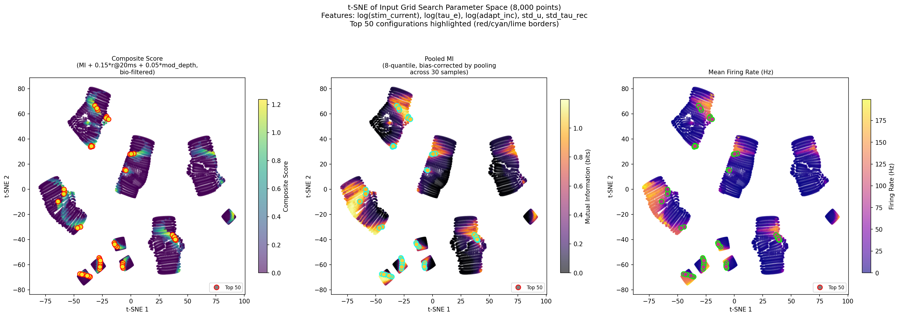

# Input Neuron Regime Grid Search

A 8,000-point parameter sweep over input neuron dynamics to find configurations that maximize **mutual information** between BSA-encoded audio and input neuron spiking output. NMDA is disabled on the input layer.

## Scoring

The composite score prioritizes information preservation with hard biological filters:

```
score = MI + 0.15 * r@20ms + 0.05 * modulation_depth    (if bio_valid)
score = 0                                                 (otherwise)
```

**Hard biological gates** (score = 0 if any violated):
- Firing rate: 5–150 Hz
- ISI CV: 0.3–2.0
- Refractory fraction: < 10%
- Burst fraction: < 15%

**MI estimation**: Per-neuron spike and BSA time series are binned at 20ms, then **pooled across all 30 samples** before computing MI with 8-quantile discretization. Pooling gives ~800 joint observations per neuron (vs. ~27 per sample), reducing Miller-Madow bias from ~1.7 bits to ~0.06 bits. Constant signals (e.g., all-zero spikes) are assigned a single quantile bin, yielding MI = 0 as expected.

## Grid axes

| Axis | Points | Range | Scale |
|------|--------|-------|-------|
| `stim_current` | 20 | 0.01 – 5.0 | log |
| `input_tau_e` | 10 | 0.05 – 12.0 ms | log |
| `input_adapt_inc` | 8 | 0 + 7 log-spaced 0.005 – 5.0 | log |
| `(input_std_u, input_std_tau_rec)` | 5 | pairs incl. no-STD baseline | — |

**Total**: 20 x 10 x 8 x 5 = **8,000 grid points** x 30 samples (6 per digit, digits 0–4) = 240,000 simulations.

**Fixed parameters** (LHS-021 baseline):
- `shell_core_mult = 4.85`
- `core_core_mult = 0.83`
- `adapt_inc = 0.626` (reservoir; input neurons override this)
- `nmda_tau = 50.0`
- Input NMDA: **disabled**
- Recurrent STD: U=0.1, tau_rec=500ms (on reservoir E→E connections)

## Optimal parameters

| Rank | stim_current | tau_e (ms) | adapt_inc | std_u | MI (bits) | r@20ms | Rate (Hz) | Score |
|------|-------------|------------|-----------|-------|-----------|--------|-----------|-------|
| 1 | **0.0518** | **1.05** | **0.0** | 0.0 | 1.057 | 0.884 | 84.7 | **1.236** |
| 2 | 0.2683 | 0.17 | 0.0 | 0.0 | 1.058 | 0.881 | 86.2 | 1.236 |
| 3 | 0.5179 | 0.05 | 0.0 | 0.0 | 1.054 | 0.877 | 87.0 | 1.232 |
| 4 | 0.0268 | 1.93 | 0.0 | 0.0 | 1.052 | 0.880 | 83.7 | 1.231 |
| 5 | 1.9307 | 0.31 | 0.0 | 0.10 | 1.065 | 0.756 | 94.0 | 1.223 |

## Top 50 analysis

The top 50 configurations occupy a narrow performance band (score 1.172–1.236) and share common characteristics:

**Parameter regime:**
- **Adaptation: near-zero dominates.** 23 of the top 50 have `adapt_inc = 0.0`; all 50 have `adapt_inc <= 0.016` (values: 0.0, 0.005, 0.0158). Adaptation destroys temporal information by smoothing the spike response — the MI landscape shows a steep drop-off above adapt_inc = 0.05.
- **stim x tau_e trade-off.** The top configs span a wide range of both stim_current (0.014–5.0) and tau_e (0.05–3.55ms), but along a **constant-rate isocline** at ~80–95 Hz. Low stim requires high tau_e (longer integration window to accumulate enough drive), high stim requires low tau_e (fast decay prevents saturation). The product `stim * tau_e` is roughly constant across the top configs.
- **STD is weakly harmful.** The top 4 configs all have `std_u = 0`. Mild STD (`std_u = 0.10–0.25`) appears in some top-50 entries but always with slightly lower r@20ms, compensated by marginally higher MI from rate redistribution.

**Mutual information capacity:**
- MI peaks at **~1.06 bits** out of a theoretical maximum of 3.0 bits (8-quantile). This reflects the fundamental information bottleneck: 124 input neurons encode 128 mel-frequency channels through overlapping Gaussian tuning curves (K=4 nearest channels per neuron).
- The MI plateau is remarkably flat across the top 50 (1.004–1.066 bits), suggesting the ~1.05 bit ceiling is a property of the network topology and input encoding scheme, not the dynamical parameters. The parameters control *whether* this ceiling is reached (by getting neurons into the right firing regime) but cannot exceed it.
- The r@20ms tiebreaker separates configs within the MI plateau: low-stim/high-tau_e configs achieve r@20ms ~ 0.88 (smooth conductance tracking), while high-stim/low-tau_e configs drop to r@20ms ~ 0.73 (noisier due to faster synaptic dynamics).

**Firing rate regime:**
- All top-50 configs fire at 77–95 Hz. This is well within the bio-valid range (5–150 Hz) and corresponds to mean ISI ~ 10–13ms at CV ~ 0.45–0.52 — regular, stimulus-locked firing.
- Below ~60 Hz, neurons miss temporal features in the BSA input. Above ~100 Hz, neurons begin saturating and lose modulation depth.



*t-SNE embedding of the 8,000-point parameter space (features: log(stim_current), log(tau_e), log(adapt_inc), std_u, std_tau_rec; perplexity=50). Left: composite score. Center: pooled MI. Right: firing rate. Top 50 configurations highlighted with colored borders. The top configs cluster in a narrow region of parameter space corresponding to moderate firing rates (80–95 Hz) with zero or near-zero adaptation.*

## Figures

| File | Description |
|------|-------------|
| `input_grid_results.csv` | Full 8,000-point grid search results |
| `tsne_parameter_space.png` | t-SNE embedding colored by score, MI, and rate |
| `input_grid_results_heatmaps.png` | Composite score heatmaps: stim x tau_e at each adapt_inc |
| `input_grid_results_profiles.png` | 1D metric profiles along each axis |
| `input_grid_results_info_landscape.png` | Information landscape: r@20ms, MI, Fano, burst, sparseness, score |
| `input_grid_results_tau_e.png` | tau_e dependence detail |
| `input_grid_results_timescale_corr.png` | Timescale correlation analysis |

## Single-neuron diagnostics

Generated with optimal parameters (stim=0.0518, tau_e=1.05ms, adapt_inc=0.0, NMDA off, noise off):

| File | Neuron | Description |
|------|--------|-------------|
| `../neuron_diagnostics/diagnostic_input_493.png` | 493 | 10-panel full state diagnostic |
| `../neuron_diagnostics/diagnostic_3panel_493.png` | 493 | BSA -> g_e -> spikes chain (r(g_e,BSA)=0.885, r(spike,BSA)@20ms=0.927) |
| `../neuron_diagnostics/diagnostic_input_362.png` | 362 | 10-panel diagnostic (sparser freq bins) |
| `../neuron_diagnostics/diagnostic_input_290.png` | 290 | 10-panel diagnostic (burst-like response) |

## Reproduction

```bash
# Run grid search (~5 hours on 8-core M-series Mac)
./cls_sweep --input-grid --n-workers 8

# Generate figures from CSV
python experiments/plot_input_grid.py results/input_grid_search/input_grid_results.csv
python experiments/plot_grid_pca.py  # generates tsne_parameter_space.png

# Generate neuron diagnostics with optimal params
python experiments/gen_input_diagnostic.py --neuron 493
python experiments/gen_3panel_diagnostic.py
```
